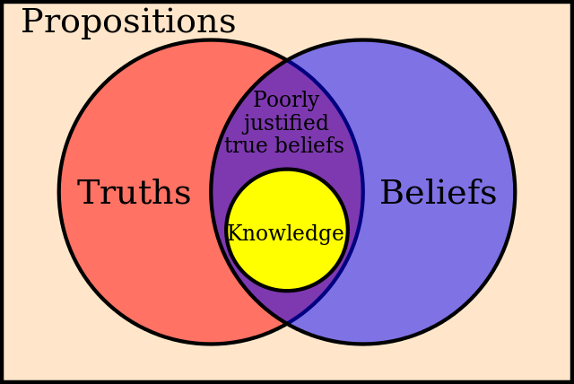
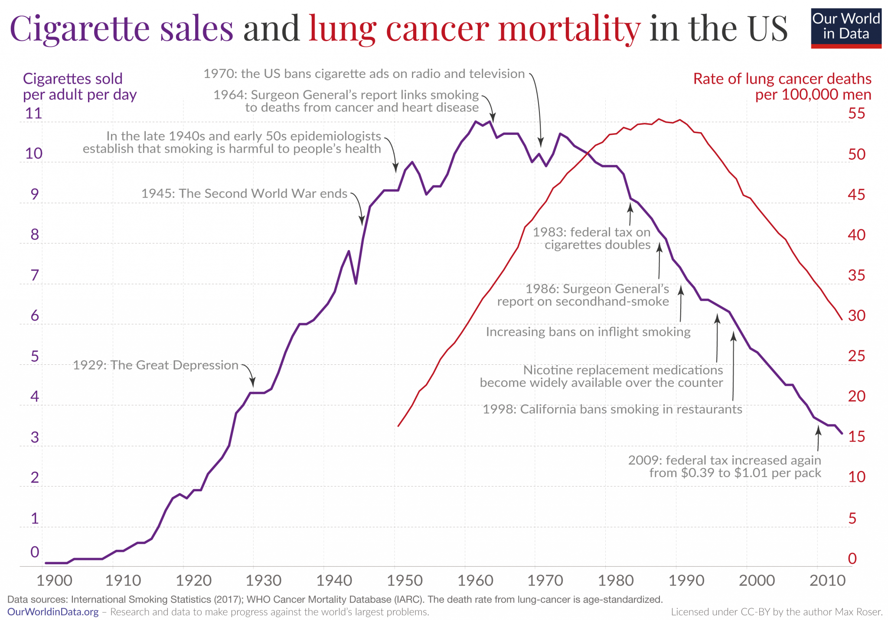
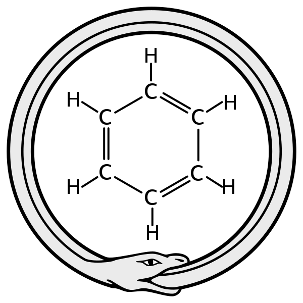

# Scientific Goals, Methods and Knowledge

## Overview

1. A
2. B
3. C
4. D

## What is Science?

This question attempts to answer what common features share subjects such as physics or biology to be called sciences, i.e. what it is that which *makes* something a science. Among other things, science aims to understand, explain and predict the world we live in. But also religions, astrology or alchemy attempt to understand, explain or predict our world. What makes them different from science?

Four historical elements are essential for the development of a scientific approach. Namely: to seek explanations of natural phenomena; to argue; to investigate the rules of argumentation and logical validity; to build them into a logically consistent system. [@johansson2016philosophy] 

Rather than finding a proper definition of science, which many have struggled with, we will focus on what makes science different and why its methods are called scientific.

### Scientific Goals and Knowledge

The main goals of science include prediction, explanation, understanding, and design. Through observation we can draw explanations and achieve understanding of nature phenomena. Once we understand we can aim to make predictions. Thanks to our understanding we can as well design experiments, instruments and solutions that help us further explaining, understanding and predicting our world. Predicting X means knowing that at time *t*, X will happen. Explaining X means to know the cause(s) that produced X. Designing X requires knowing that artifact X will satisfy certain functions F. All these goals share a common ingredient, scientific knowledge. Scientists arrive to such knowledge by applying the scientific method (see § \@ref(sci-method)). The goals of science are achieved through a series of activities that constitute the scientific method which include systematic observation and experimentation, inductive and deductive reasoning, and the formation and testing of hypotheses and theories.

> Knowledge is justified true belief — Plato (428 - 348 BC)

The most popular definition of knowledge was given by philosopher Plato in the above's quote. This definition specifies that a statement must meet three criteria to be considered knowledge. This definition of knowledge is sufficiently good for this course. However, the definition of knowledge is an ongoing debate among epistemologists. Although these criteria are necessary conditions, they are not sufficient as there are situations that satisfy all these conditions and yet don't constitute knowledge (see [Gettier cases](https://en.wikipedia.org/wiki/Gettier_case)) but such cases are rather philosophical and will not be discussed during this course.

- **True** because statements must refer to an actual state of the world.
  - A wet sidewalk does not necessarily imply it rained even if you believe so.
  - Even if we are justified to believe that something is true, it might not be true.
- **Justified** because you need proper proof, evidence or reasons to defend our statement.
  - Even if it actually rained, a wet sidewalk caused by a sprinkler is not good justification for you to believe it rained. 
- **Belief** because even under justified reasons about true facts, people can choose not to believe such knowledge. We define belief as to the state of mind of a person that thinks something is the case. This state of mind is of course *tied to the individual* and *comes in degrees*. We act based on our beliefs and values, and new knowledge can affect these.

Certainty of belief and truth are different. Is possible to have certain beliefs about false claims. 
Similarly, we can have uncertain beliefs about true claims. From tossing a coin, we can expect a fair probability in which head and tails have the same probability. But we cannot know for sure if the coin is biased or no until it lands. Similarly, is possible that even our best theories are wrong or partially wrong. Even after many successful experiments, they might be proved wrong (see \@ref(neptune-vulcan)). In fact, scientific hypotheses can rarely if ever be proved right, they can, however, be proven wrong. 

> “We never are definitely right, we can only be sure we are wrong” — Richard Feynman

Below you can find a [clip from the last lecture](https://youtu.be/ECY-4Ng9Nkc?t=1190) of a series of 7 special Messenger Lectures given by the renowned American theoretical physicist Richard Phillips Feynman. [The transcription can also be found online](https://sites.google.com/site/barrykort/feynman-on-the-scientific-method).

```{r, eval=knitr::is_html_output(excludes = "epub"), results = 'asis', echo = F}
cat(
'<figure style="text-align: center">
<video width="500"
  frameborder="0" controls>
  <source src="videos/feynman.mp4" type="video/mp4">
 </video>
 <figcaption>Clip from the last lecture of a series of 7 special Messenger Lectures given by the renowned American theoretical physicist Richard Phillips Feynman, about the Character of Physical Laws, at Cornell University U.S.A. recorded by BBC Nov. 9-19, 1964. The full lecture can be found at <a href="https://youtu.be/ECY-4Ng9Nkc">YouTube</a>.</figcaption>
</figure>'
)
```

While is relatively easy to determine cases of failed justification, is much harder to identify what suffices to justify a belief. Few claims can be conclusively proven so that no doubt remains. An ideal justification of a belief would consider all relevant reasons for and against believing a statement. This is why science is a human enterprise where justifications, hypotheses and experiments are made public for review, replication or rebuttal.

```{r plato-knowledge, echo=F, out.width="50%", fig.align="center", fig.cap='A Venn diagram illustrating the classical theory of knowledge.'}

```

Definitions should not be  accepted without reason, and instead, we should attend to the arguments that support such definitions. Certain definitions may have widespread popularity but that doesn't make them any more true. For example, a dolphin is a mammal even if many people consider it a fish. In the same way, tomatoes and cucumbers are fruits for botanists even if we daily sort them as vegetables. And sometimes, even the [EU](https://eur-lex.europa.eu/LexUriServ/LexUriServ.do?uri=CELEX:32001L0113:En:HTML#d1e32-72-1) and [the Supreme Court of the United States of America](https://www.nationalgeographic.com/culture/article/fruit-or-vegetable) need to act to set certain market debates.

As another example, the first astronomers who lacked the telescope believed on the geocentric model because their observations did not suffice to reject it. These first astronomers had **false justified beliefs**. After the advent of the telescope in 1609, the geocentric model was rejected. But how do we know we are not in a similar situation that of the pre-telescope astronomers? Events as recent as the Michelson-Morley (see \@ref(michelson-morley)) experiment, the expeditions of Sir Arthur S. Eddington (see \@ref(eddington-expeditions)) or the predictions of Urbain Le Verrier (see \@ref(neptune-vulcan)) have changed our conceptions of the universe and physics forcing scientists to re-formulate models and theories. 

In the next chapter we will see how knowledge is obtained.

#### Data, information and knowledge

Nowadays, technology allows us to collect data into datasets, transform datasets into information and arrive at new knowledge. Such processes have always been crucial in science but computer science comes to question concepts such as data, information and knowledge. [@johansson2016philosophy]

By **knowledge**, we can understand three different things. First, knowledge of truths, e.g. we know that the sun rises on the east. Such knowledge can be obtained by reading a book or listening to the radio.
The second category of knowledge consists of skills, such as riding a bike or speaking a foreign language. However, this knowledge requires more than language to be communicated. It requires practice.
Finally, the third category is the knowledge of objects, what Bertrand Russell called knowledge by acquaintance [@russell2001problems]. This knowledge is obtained through experience.

In common English, we can't distinguish between knowledge of truths and objects. However, languages such as German, French or Spanish make clear this distinction by using different verbs, Rusell proposed to use the word "acquaintance".

- German: wissen vs kennen.
- French: savoir vs connaître.
- Spanish: saber vs conocer.

Example from William James (1890) — "I am acquainted with many people and things, which I know very little about, except their presence in the places where I have met them. I know the colour blue when I see it, and the flavour of a pear when I taste it; [...]" 

What is the difference between data and information? 

The following excerpt from [@johansson2016philosophy] may clarify this question:

> But why call the input ‘information’? The reason seems to be that we can describe the input as being about something, often the state of the environment. It has content. Or rather, when we humans describe the input and the workings of the system we find it natural to talk as if the information-containing system consciously sent messages to us humans; we say that the systems obtain information, transmit information or store information about something, as if it were like a human mind. The core feature of this use of the word ‘information’ is thus its aboutness, its intentionality. 

> Finally data. It is common in computer science to say that information is data with meaning. This is ok as far as it goes, but what is ‘meaning’? And how do data acquire meaning? It seems that minimally it means that meaningful data becomes information when we have been able to formulate declarative sentences expressing the information that is obtained from a data set. Almost anything can be data. In order to obtain data from e.g. a story, from light from distant stars, or from the result of an experiment, we need to divide the stream of sounds, lights, or states of detectors into distinct items. When using written text as data source one must divide the string of linguistic signs into distinct items, such as words or longer or shorter expressions. [...] In short, in order to obtain a data set, we need to define a principle for dividing up something into distinct pieces. Hence from a conceptual point of view, discerning data and collecting a data set presupposes that we have a prior principle of making distinctions within a phenomenon. [...] Sometimes we have lot of background knowledge from start.

> In short, a piece of knowledge is a piece of information for which the knower can provide good reasons.

### What is Philosophy of Science?

One of the tasks of philosophy of science is to question assumptions that scientists take for granted. For example, suppose a scientist conducts an experiment that yields a particular result. The scientist then repeats the experiment a couple of times more obtaining the same result. The scientist then stops repeating the experiment, convinced that repeating it under the same conditions will produce the same result. But *why* does the scientist assume that future repetitions will provide the same outcome? How are we sure this is true?

Therefore, one of the main objectives of philosophy of science is to study the methods and methodologies of enquiry used in the sciences, understanding how techniques like experimentation, observation and theory building enable scientists to reveal new knowledge. Philosophy of science asks questions such as: What is knowledge? What is a scientifically acceptable observation? What makes an explanation scientific? What is a scientific theory?

Finally, the philosophy of science tackles a wide range of topics that would require its own master. Moreover, not all topics are directly related to the aims of this course and the scope of the master. For this reason, a brief summary of the topics left behind is included in § \@ref(wont-fix). Of course, the curriculum is subject to change in the future and the list might change too.

## The scientific method {#sci-method}

The scientific method is the main pillar of science. All science begins with *observation*, as this is the **first step** of the scientific method. Moreover, such observation must be *repeatable*, either actually or potentially. Once an observation has been made, the **second step** involves the definition of a *problem*, or in other words, asking a question about the observation. However, such a question needs to be valuable scientifically, it must be *relevant* and must be *testable*. Questions need to be reformulated until they become testable. The **third step** may seem a rather unscientific procedure as it involves guessing what the answer to the question might be by postulating a *hypothesis*. The **fourth step** will tell the scientist if the *hypothesis* is correct through *experimentation*, which tests the validity of a scientific guess. Notwithstanding, experiments do not guarantee a scientific conclusion. Experiment results represent *evidence*, i.e. the hypothesis in answer to the question is confirmed as correct or invalidated. Given the latter, a new hypothesis with new experiments might be needed. Finally, experimental evidence is key for the **fifth step** of the scientific method, the formulation of a *theory*. A good theory has a *predictive* value, usually predicting that something is *likely* to happen with a certain degree of probability [@pos-nidditch].

## Methodology

A method is a particular tool to reach a particular goal (e.g. statistical test). Methodology is the systematic assessment and justification of method choice. Scientists often need to choose between alternative methods in order to reach a particular scientific goal. But specifying a goal does not directly determine what method to choose. We need to consider the reasons why some method is better than another for a particular goal. This process could require a better definition of the initial goal or learning more about the context and domain where the methods will be applied. Methodology must be distinguished from describing methods, which usually concerns the design and implementation of particular research approaches and focus on the technical aspects (e.g. how to program simulations or set up instruments).

For example, a laboratory experiment can be advantageous because the test conditions can be controlled but laboratory experiments might not be realistic enough for certain tests. On the other hand, a field experiment provides more realistic test conditions but is difficult to control all variables. 

Similar considerations may be necessary for other seemingly trivial questions such as model choice or data visualization. Should we use a significance test or a Bayesian approach? Should we present our results using a bar chart or a violin plot? Should we use a structural model or a quantum model? Methodology asks questions such as: What methods are available to reach a particular goal? What reasons speak for or against the alternatives? How should be weight the reasons to form a final decision?

How do we decide between alternative methods? Is there a way to determine what is rational to choose? 
Traditionally there are three ways to choose between alternative methods.

**By convention,** The methods are chosen because you have been taught to, or because is an established convention between your peers. Conventionalisms create long-term when methods become dominant in a field. A good example is the use of p-value in hypothesis significance testing. Similarly, accuracy and precision metrics in Machine Learning can be considered conventionalism. More problems arise when different disciplines have different conventions, hindering inter-disciplinary work.

**Outcome-oriented.**  While choosing the method that yields the best results may seem well-intended and appropriate, this certainly sounds very vague too. The intention is to find a method that serves some purpose best, but this purpose is sometimes not sufficiently clear. Science frequently involves long-term projects where the final material outcome is uncertain or unknown. For example, the International Space Station or the Large Hadron Collider. This methodology raises the question of how to measure the outcome. For instance, is speed the best way to assess which car is best? Should we focus on fuel autonomy or pollution instead? What about combining all of them?

**Reason-based.** Choosing the method based on the overall best reasons seems the best option, particularly when the reasons include considerations that justify choosing a method over others for a given scientific goal (e.g. prediction). But sometimes there are methods that despite providing more valuable results could be unethical and/or illegal. For example, randomized control trials (RCT) are often employed to test the effectiveness of a new drug. Participants are divided *at random* into two groups (treatment and control), eliminating the effect of confounding factors on the outcome of interest. However, RCTs are not always feasible, for either practical or ethical reasons. For instance, it won't be ethical to assign people to smoke for decades in order to study if cigarette smoking causes cancer. These other aspects need to be weighted together with the scientific reasons during method choice.

See \@ref(smoke-debate) for an example of how reason-based methods are not always easy to implement while at the same time, outcome-oriented methods led the mainstream of an important debate.

## Historical Examples

### The most famous "failed" experiment {#michelson-morley}

The Michelson-Morley experiment (1887) was designed to detect the motion of the Earth through the luminiferous aether. XIX century physicists used aether to explain how light could be transmitted through empty space between the Sun and the Earth. The result of this experiment is considered to be the first strong evidence against the then-prevalent aether theory, and the beginning of a new line of research that eventually led to special relativity, which rules out a stationary aether.

To the ancients, the concept of a void universe was impossible. Aristotle arrived at the hypothesis of the aether to explain the cosmos and several natural phenomena such as the movement of the planets. By the XIX century, the aether became more than a philosophical need. Whenever there is a wave, something must be waving. But what waves when light waves travel from the Sun? For XIX physicists, the aether was the medium through which light waves from the Sun would propagate.

```{r, eval=knitr::is_html_output(excludes = "epub"), results = 'asis', echo = F}
cat(
'<figure style="text-align: center">
<video width="400"
  frameborder="0" controls>
  <source src="videos/crop4.mp4" type="video/mp4">
 </video>
 <figcaption><b>Experiment expectation.</b> Source: <a href="https://en.wikipedia.org/wiki/The_Mechanical_Universe">The Mechanical Universe, Episode 41</a>.</figcaption>
</figure>'
)
```

Michelson and Morley attempted to detect the absolute motion of Earth through space. For that, they set an experiment in which a beam of light was sent through a half-silvered mirror used to split the light beam into two beams travelling at right angles to one another. The beams were then reflected back to the half-silvered mirror by two respective mirrors and recombined into a single beam. The experiment can be seen as a race between two light beams. If the beams arrive in a tie, the result is a bright spot at the centre of the interference pattern, otherwise, a destructive interference would make the centre of the image dark. The hypothesis foretold that a tie was not possible since the two beams were racing on a moving track. It was assumed that the Earth was moving through the aether and therefore the beam should trace different paths with respect to the aether. 

```{r, eval=knitr::is_html_output(excludes = "epub"), results = 'asis', echo = F}
cat(
'<figure style="text-align: center">
<video width="400"
  frameborder="0" controls>
  <source src="videos/crop3.mp4" type="video/mp4">
 </video><figcaption><b>Experiment result.</b> Source: <a href="https://en.wikipedia.org/wiki/The_Mechanical_Universe">The Mechanical Universe, Episode 41</a>.</figcaption>
</figure>'
)
```

The extent to which the negative result of the Michelson–Morley experiment influenced Einstein is disputed. However, the null result helped the notion of the constancy of the speed of light gain acceptance in the physics community. This example shows the impact a well-designed experiment can have.

For a longer and deeper explanation of the experiment, its historical context and consequences, watch [episode 41 from The Mechanical Universe](https://www.youtube.com/watch?v=Ip_jdcA8fcw). The timeline of luminiferous aether can be found [at the Wikipedia](https://en.wikipedia.org/wiki/Timeline_of_luminiferous_aether).

### The smoke debate {#smoke-debate}

In the mid-1700s, James Lind discovered that citrus fruits prevent scurvy, while in the mid-1800s, John Snow figured out that water contaminated with faecal matter caused cholera. These two examples share a common fortunate one-to-one relation between cause and effect. Deficiency of vitamin C is necessary to produce scurvy. Similarly, cholera bacillus is the only cause of cholera.

However, during the late 1950s and early 1960s, whether or not smoking caused lung cancer was not clear. The subject of the debate wasn't tobacco or cancer but rather the word *caused* as one of the most important arguments against the smoking-cancer hypothesis was the possible existence of confounding factors that may cause lung cancer and nicotine dependency. Many smokers live long lives without getting lung cancer while others develop cancer without ever smoking. Plotting the rates of lung cancer and tobacco consumption makes the connection impossible to miss (See Figure \@ref(fig:smoke-ts)). However, time-series data are poor evidence for causality. Researchers already knew about RCT though its use was unethical in this case. 

Austin B. Hill proposed to compare patients already diagnosed with cancer to a control group of healthy volunteers. The results showed that all but two of the 649 lung cancer patients had been smokers. This type of study is today called a case-control study because it compares cases to controls. However, this method has some drawbacks too. First, the study is retrospective, meaning that we study people known to have cancer and look back to understand why. Second, the probability logic is backwards, as the data tell us the probability that a cancer patient is a smoker instead of the probability that a smoker will get cancer.

(ref:smoke-ts-caption) Source: [Our World in Data](https://ourworldindata.org/smoking-big-problem-in-brief).

```{r smoke-ts, echo=F, fig.align="center", out.width="75%", fig.cap='(ref:smoke-ts-caption)'}

```

However, this method has some drawbacks too. First, the study is retrospective, meaning that participants known to have cancer are considered and researchers look back to understand why. Second, the probability logic is backwards, as the data tell us the probability that a cancer patient is a smoker instead of the probability that a smoker will get cancer. Moreover, case-control studies admit several possible sources of bias such as recall bias or selection bias. Hospitalised cancer patients were not a representative sample of the population, not even from the smoke population. Researchers were careful to call their results an "association". Later on, the study was replicated with similar results. Deniers such as R. A. Fischer were right to point out that repeating a biased study doesn't make it any better as is still biased. 

We won't focus on how this story ends here but is important to notice how methods chosen based on scientific reasons are sometimes tough to implement and often need to fight against outcome-oriented studies such as those sponsored by leading tobacco companies.

In the end, many subsequent studies settled the smoking-cancer debate. We will come back to this example in upcoming sections of the course. If you can't wait, read Chapter 5 from the Book of Why, by Judea Pearl and Dana Mackenzie [@book-of-why].

<!-- For part II: Explain the later prospective studies. The constitutional hypothesis. Its mathematical rebuttal. etc. -->

<!-- Use text references to properly render links in captions for both HTML and PDF outputs https://bookdown.org/yihui/bookdown/markdown-extensions-by-bookdown.html#text-references -->


### Kekulé's dream

The third step of the scientific method (see § \@ref(sci-method)) requires guessing an answer (or hypothesis) to a previously determined question. There is no clear method to arrive at a hypothesis. Experience, historical context, and previously failed hypothesis condition how a hypothesis is conceived. But sometimes hypotheses can be reached in the most unlikely and unconventional of ways. It makes no difference as long as the hypothesis is then scientifically tested before its acceptance. One of the most famous examples is the structural model of the benzene molecule. In 1865 the chemist August Kekulé hit on the hypothesis of the structure after dreaming of a snake trying to bite its tail (See Figure \@ref(fig:ouroboros)).

(ref:ouroboros-caption) Source and credits to: Haltopub, from [Wikimedia](https://en.wikipedia.org/wiki/File:Ouroboros-benzene.svg).

```{r ouroboros, echo=F, fig.align="center", out.width="25%", fig.cap='(ref:ouroboros-caption)'}

```

### Neptune and Vulcan {#neptune-vulcan}

[to be added]


<!--
Reformulating Newton's Laws

example for reformulation of a hypothesis

when the motion of Uranus was found not to match the predictions of Newton's laws, the theory "There are seven planets in the solar system" was rejected, and not Newton's laws themselves

[continue]

https://en.wikipedia.org/wiki/Discovery_of_Neptune

https://en.wikipedia.org/wiki/Vulcan_(hypothetical_planet)

Freydmann

## Takeaway Messages


-->
