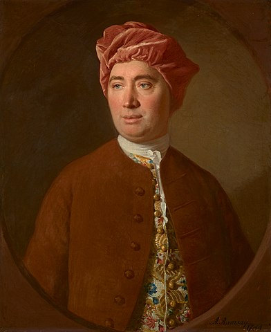
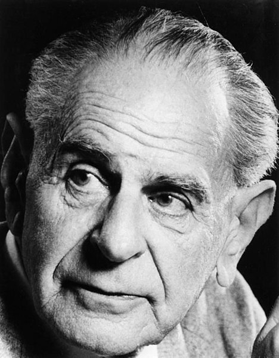
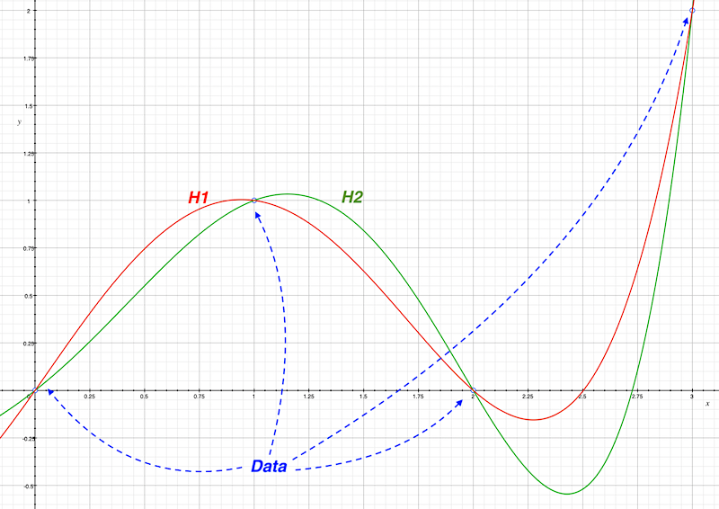
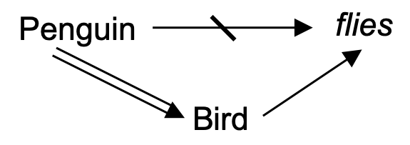
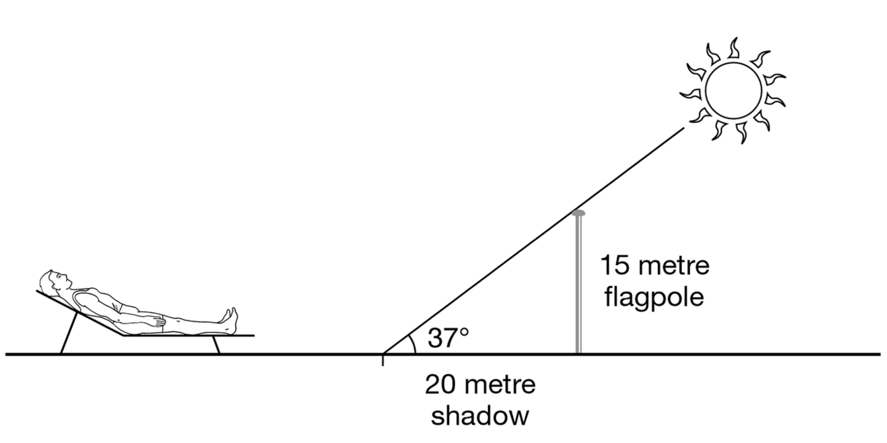
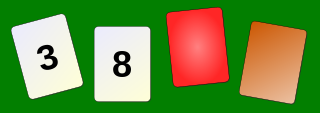
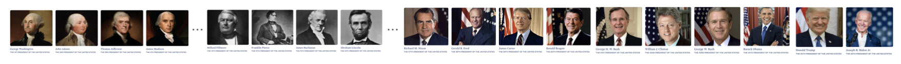

# Scientific Inference

## Overview

Humans have a natural ability to conjecture and spot relationships about the world, *jumping* from hypotheses to conclusions. The scientific attitude is to keep such *jumps* under control and use a well defined procedure to arrive to a conclusion from an hypothesis. In this chapter we will examine in detail those procedures.

```{r, eval=knitr::is_html_output(excludes = "epub"), results = 'asis', echo = F}
cat(
'<figure style="text-align: center">
<video width="500"
  frameborder="0" controls>
  <source src="videos/sagan.mp4" type="video/mp4">
 </video>
 <figcaption>Clip from the television series Cosmos: A Personal Voyage, presented by Carl Sagan. </br> The clip can also be found in <a href="https://youtu.be/_GVhzZCt4yI?">YouTube</a>.</figcaption>
</figure>'
)
```

> But our sun is only one of a billion-trillion stars within the observable universe. And those countless suns all obey natural laws some of which are already known to us. How did we discover that there are such laws? If we lived on a planet where nothing ever changed, there wouldn't be much to do, there'd be nothing to figure out. There'd be no impetus for science. And if we lived in an unpredictable world where things changed in random or very complex ways, we wouldn't be able to figure things out. And again, there'd be no such thing as science. But we live in an in between universe where things change alright, but according to patterns, rules, or as we call them, laws of nature. If I throw a stick up in the air, it always falls down. If the sun sets in the west, it always rises again the next morning in the east. And so it's possible to figure things out. We can do science. And with it we can improve our lives. --- Carl Sagan

## Types of inferences

Most scientific conclusions are uncanny at first glance and difficult to believe without more information and proper explanations about them (e.g. expansion of the universe, electromagnetism, etc.). How do scientists reach such unlikely conclusions? An inference is the act of reaching a conclusion from known facts but there are multiple types as we will see below.

### Deduction and Induction {#deduction-and-induction}

A good argument is one whose conclusions follow from its premises. But how do we tell if the conclusion is a consequence of its premises? Is often assumed that as long as the premises are valid, the conclusions will be valid too. This does not imply that the conclusion is also true. The premises might not be true, but if they are true, then the conclusion will also be true. However, is the truth of the premises always *necessarily sufficient* for the truth of the conclusions? Logicians distinguish between deductive and inductive inference. [@sep-abduction]

Below there is an example of a deductive inference with two premises followed by a conclusion.

```
All Frenchmen like cheese
Loubin is a Frenchman
------------------------------
Therefore, Loubin likes cheese
```

```
All As are Bs
a is an A
--------------------
Therefore, a is a B
```

We call an inference *deductive* whenever the conclusion *necessarily* follows from the premises. **The truth of the premises *guarantees* the truth of the conclusion.** Or in other words, what is inferred is *necessarily* true if the premises from which it is inferred are true. We call this type of inferences *explicative*.

Not all inferences are deductive. For example:

```
The first five eggs in the box were good.
All the eggs have the same best-before date stamped on them.
------------------------------------------------------------
Therefore, the next egg will be good too.
```

In this case, the premises do not entail the conclusion. Even if the previous eggs were good, it is possible that the next egg will be rotten. In this case, is logically possible for the premises to be true and yet the conclusion false. We call this type of inferences *inductive*. Contrary to deduction, where the truth of the premises guarantees the truth of the conclusion, **inductive inferences are *ampliative* --- since whose conclusions go beyond what is contained in their premises ---** and their conclusions could be totally wrong even if infinitely many examples confirm them. [@bergadano1991problem]

In these regards, deduction seems safer than induction. Whenever we reason deductively we can be sure that given true premises we will reach true conclusions. On the other hand, **inductive reasoning can take us from true premises to a false conclusion**. Notwithstanding, we rely on inductive reasoning every day. For instance, every day we turn on our computers and we are confident they will not explode in our faces. [@okasha-pos] But why? Simply because we do it every morning and it has never exploded up to now.

We are sure that the sun will rise tomorrow, and if we are asked why we believe so, we will naturally answer "Because it always does". We believe that it will rise in the future because it has risen in the past. Of course, when we are challenged to answer what *justifies* our belief we can refer to the laws of motion and nature. But will the laws of motion remain the same tomorrow? [@russell2001problems]

### Modus ponens and Modus tollens {#modus}

:::: {.notebox data-latex=""}
::: {.center data-latex=""}
**Course Note:**
:::

The following content relates to deduction and is usually taught in high school philosophy courses as part of propositional calculus. It will help getting a better understanding of the deductive inference rules. If this is already clear to you, feel free to jump to the problem(s) of induction \@ref(problem-induction).
::::

There are two rules of inference in deductive reasoning. We call deduction top-down logic because we reach particular conclusions from general premises. Whereas in bottom-up logic the conclusion is reached by generalizing from specific cases.

- Modus ponens: `P implies Q. P is true. Therefore Q must also be true.`
- Modus tollens: `If P, then Q. Not Q. Therefore, not P.`

The form of a **modus ponens** argument looks like a syllogism consisting of two premises and a conclusion. The first premise is a conditional if-then claim (e.g. `P implies Q`). The second premise is an assertion that $P$ (the antecedent of the first premise) is indeed true. From these two premises, it can be concluded that $Q$, (the consequent of the first premise) must be true as well.

```
If P, then Q.
P.
--------------
Therefore, Q.
```

The next example fits the form of *modus ponens*. 

```
If today rains, John will take the umbrella.
Today is raining.
------------------
Therefore, John will take the umbrella.
```

The argument is valid but it doesn't matter if the statements in the argument are actually true. An argument can be valid but nonetheless unsound if their premises are false. *Modus ponens* rule can be written as $P \rightarrow Q, P \vdash Q$. In logic, an argument is sound if it is both valid in form and its premises are true.

On the other hand, the form of a **modus tollens** argument also consists of two premises and a conclusion. The first premise is a conditional if-then claim (e.g. `P implies Q`). The second premise is an assertion that $Q$ (the consequent of the conditional claim) is not the case. From these two premises, it can be concluded that $P$ is also not the case.  *Modus tollens* rule can be written as $P \rightarrow Q, \lnot Q \vdash \lnot P$. 

```
If P, then Q.
Not Q.
-----------------
Therefore, not P.
```

Modus tollens is specially important in falsification (see \@ref(falsification)). For instance, we take our hypothesis H to test and assume that is true. If $H$ is true, then consequent $C$ is true. We make an observation and see that $C$ is false. Therefore, we conclude that H is false.

```
If H, then C.
C is false.
-----------------
Therefore, H is false.
```

---

There are other forms of arguments that are apparently **similar but invalid forms**.

**Affirming the consequent**. This formal fallacy consists of taking a true conditional statement  $P \rightarrow Q$ and invalidly inferring its converse  $Q \rightarrow P$. For example, the statement "if the light is broken, the room would be dark" does not justify inferring the converse "the room is dark, therefore the lamp is broken". This situations may arise when a consequent has more than one possible antecedent.

**Denying the antecedent**. This fallacy is committed by reasoning in the form: `If P, then Q. Therefore, if not P, then not Q`. This kind of arguments can seem valid at first glance. Consider this famous example from Alan Turing: 

> If each man had a definite set of rules of conduct by which he regulated his life he would be no better than a machine. But there are no such rules, so men cannot be machines. --- Alan Turing

Men could still be machines that do not follow a definite set of rules.

Another trivial example of this second fallacy.

```
If you are a bus driver, then you have a job.
You are not a bus driver.
---------------------------
Therefore, you have no job.
```


<!-- ### Propositional knowledge

[@johansson2016philosophy] -->

## The problem(s) of induction {#problem-induction}

**Do scientists use induction?** Pretty much all the time. Whenever scientists move from limited data to general conclusions scientists reason inductively. **In inductively valid arguments, the (joint) truth of the premises is very likely (but not necessarily) sufficient for the truth of the conclusion.** For instance, a newspaper may run the headline "scientists find experimental proof that transgenic maize is safe to eat". This means scientists tested transgenic maize on a large number of people without finding any issues. Does this *strictly prove* that transgenic maize is safe? Is this prove as strong as the proof of the Pythagoras' theorem? Going from "the transgenic maize didn't harm any of the people on whom it was tested" to "the transgenic maize will not harm anyone" is an inductive inference, not deductive.

:::: {.tipbox data-latex=""}
::: { data-latex=""}
**Writing Note:**
:::

Suppose the following inductive inference $I$: If the probability of observing $R$, given that $H$ is true, is smaller than a significance level of 0.05, then reject $H$. Is important to distinguish between the two following things:

- Justification *with* an inference rule: Justifying the conclusion by pointing to the premise and the inference rule. Inference rules justify conclusions.
- Justification *of* an inference rule: What makes $I$ a good inductive inference? Why not choosing other parameters? The choice of a particular inference rule must be justified.
::::

### David Hume's Problem of Induction

```{r, eval=knitr::is_html_output(excludes = "epub"), results = 'asis', echo = F}
cat(
'<figure class="wrap-figure">

<figcaption>Portrait of David Hume </br>
by Allan Ramsay.</figcaption>
</figure>'
)
```

We use induction to justify our statements but how do we justify induction itself? How would you convince someone else that induction is a good inference method? The Scottish philosopher David Hume (1711-76) argued that the use of induction cannot be rationally justified at all. 

In 1739, still under the shadow of the bubonic plague in Europe, David Hume publishes *A Treatise of Human Nature*, presumably without knowing that his work would not only continue to be debated more than 200 years later, but also still remarkably relevant in the technological advances of our time. In *the problem of induction* Hume argues that we cannot make a causal inference just by *a priori* means, and poses the question of how we can conclude from the observed to the unobserved.

Hume admitted that we use induction all the time in everyday life and science but insisted that this is just a matter of brute animal habit. What does he mean by that? Bertrand Russell (1872-1970) gives us a good example on this. He argues that the inductive association is also present in animals.

> “And this kind of association is not confined to men; in animals also it is very strong. A horse which has been often driven along a certain road resists the attempt to drive him in a different direction. Domestic animals expect food when they see the person who usually feeds them. We know that all these rather crude expectations of uniformity are liable to be misleading. The man who has fed the chicken every day throughout its life at last wrings its neck instead, showing that more refined views as to the uniformity of nature would have been useful to the chicken. [...] The mere fact that something has happened a certain number of times causes animals and men to expect that it will happen again. Thus our instincts certainly cause us to believe that the sun will rise to-morrow, but we may be in no better a position than the chicken which unexpectedly has its neck wrung.” --- [@russell2001problems]

Hume arrived to this conclusion by noting that whenever we make inductive inferences we presuppose the *uniformity of nature*. Remember the eggs box example in § \@ref(deduction-and-induction) ? Our reasoning depends on the assumption that objects that we have not examined yet will resemble those objects that we have already examined. Then, Hume argues that we cannot prove the truth of the uniformity assumption. Basically, from the mere act of being able to imagine a world where nature is not uniform but changes at random it follows that we cannot prove that the uniformity assumption is true. Also, if we try to argue for the uniformity assumption on empirical grounds, we end up reasoning in a circle.

:::: {.tipbox data-latex=""}
::: { data-latex=""}
**Note on uniformity of nature:**
:::

Notice how Machine Learning (ML) models can be regarded as inductive machines performing inductive inferences based on previous observations. For the ML model to perform well on novel data, is often assumed that novel data will resemble past data.

Hume refers to this assumption as the Principle of Uniformity of Nature: *“If reason determined us, it would proceed upon that principle, that instances, of which we have had no experience, must resemble those, of which we have had experience, and that the course of nature continues always uniformly the same.”*

And it continues: *“Our foregoing method of reasoning will easily convince us, that there can be no demonstrative arguments to prove, that those instances, of which we have had no experience, resemble those, of which we have had experience. We can at least conceive a change in the course of nature; which sufficiently proves, that such a change is not absolutely impossible. To form a clear idea of any thing, is an undeniable argument for its possibility, and is alone a refutation of any pretended demonstration against it.”*

[@hume1739treatise] T. 1.3.6.4

::::

The conclusion then is that our tendency to project past regularities into the future is not underpinned by reason. The problem of induction is to find a way to avoid this conclusion, despite Hume’s argument [@sep-induction-problem]. **Hume's problem of induction is still an active area of research for philosophers**. There are many different ways to respond to Hume's argument, yet none is fully convincing. Peter Strawson (1950s) used the following analogy: justifying induction is like asking whether the law is itself legal. This is rather odd, since the law is the standard against which the legality of other things is judged. Others, like Karl Popper (1902-1994) argued that science is not in fact based on inductive inferences at all and presented a deductivist view of science. We will study this in detail in § \@ref(falsification).

As scientists, Hume's problem of induction may leave a huge void in our heart. An empty feeling that science is indeed fallible and the sudden realisation of the impossibility of establishing the truth or falsity of scientific laws [@rosenberg2019philosophy]. But perhaps there is a way to fill such gap, and perhaps big part of the effort of science is put on filling this void with as much certainty as possible. 

Hume’s argument concerns specific inductive inferences such as `All observed instances of A have been B` and `The next instance of A will be B`. Hume's argument proceeds as follows:

- Every inference is either inductive or deductive.
- To justify an inductive inference rule $I$, this rule must be inferred from some premises.
- Is not possible to infer the rule $I$ deductively, because there are no necessary connection between past and future inferences.
- Therefore, the rule $I$ must be inferred inductively.
- When inferring $I$ inductively, we must invoke another inductive inference rule $J$ to justify this induction. But then, how do we justify $J$? ... [*infinite regress*]

Just because an inference rule has yield true conclusions in the past does not necessarily imply that it will do so in the future.
Consequently, Hume concludes that no inductive inference rule can be justified. But, does this mean all scientific inductive inferences are not justified? 

:::: {.tipbox data-latex=""}
::: { data-latex=""}
**Note for data scientists!**
:::

If we visualise the data as points in a plane; every set of finite points belongs to infinite functions or curves. The problem of induction, in this case, consists in establishing criteria that allow us to say that the finite series of data confirms only one of the functions, or less dramatically but just as problematic, that one is more confirmed than the others [@diez1997fundamentos]. (See the problem of underdetermination in §\@ref(confirmation)).

::::


## The Hypothetico-deductive Method

In the section about the [scientific method](#sci-method), we learnt how scientists begin proposing (or guessing) unproven hypotheses. After an initial consideration of the problem and collection of data a conjecture or hypothesis to explain a particular phenomena is formulated. Afterwards, deduction is used to derive consequences or observable implications $\{C_i\}$ from such hypotheses $H$. These consequences should be relevant for $H$ and observable directly or with the help of instruments (e.g. microscope, MRI, etc.). Next, hypotheses are put to test and either based on the results scientists decrease or increase the confidence over the hypotheses.

- 1. Propose a hypothesis $H$.
- 2. Deduce observable consequences $\{C_i\}$ from $H$.
- 3. Test. Look for evidence that conflicts with the predicted consequences $\{C_i\}$ in order to disprove $H$.
- 4. If $\{C_i\}$ is false, infer that $H$ is false, reformulate $H$. (See § \@ref(falsification))
- 5. If $\{C_i\}$ is true, increase confidence in $H$. (See § \@ref(confirmation))

For relevant examples, check \@ref(semmelweis) and \@ref(wason).

### A good hypothesis

There are though some criteria for a [good hypothesis](https://opentext.wsu.edu/carriecuttler/chapter/developing-a-hypothesis/). Apart from other criteria such as parsimony, scope, fruitfulness and conservatism, these are other criteria to recall.

- It should be an statement that can be either true or false (e.g. "Boiling point of a liquid increases with increase in pressure"). In other words, it should be **testable and falsifiable**. We must be able to test the hypothesis using the methods of science and according to Popper’s falsifiability criterion, it must be possible to gather evidence that will reject the hypothesis if it is indeed false.

- A hypothesis must not be a tautology (i.e. claims that are necessarily true or false; e.g. "Either it will rain tomorrow or it will not rain." or "all bachelors are unmarried"). 

- Hypotheses should be informed by previous theories or observations and logical reasoning.

- Finally, the hypothesis should be positive. That is, the hypothesis should make a positive statement about the existence of a relationship or effect, rather than a statement that a relationship or effect does not exist. 

- Finally, it should have some generality (e.g. "things of certain type...") or be about some non-directly observable property of a particular.

### Falsification {#falsification}

```{r, eval=knitr::is_html_output(excludes = "epub"), results = 'asis', echo = F}
cat(
'<figure class="wrap-figure">

<figcaption>Karl Popper in the 1980\'s.</figcaption>
</figure>'
)
```


According to the Hypothetico-deductive method (H-D), a hypothesis is formulated, then relevant consequences are deduced, and finally we observe whether these consequences are false or true. Depending on these observations the hypothesis will be either falsified or confirmed. 

Is important to note a key difference between confirmation and falsification. In step 4 of the **H-D method** we can infer the falsity of the hypothesis from the falsity of even a single one of the expected consequences. In contrast, in step 5 confirmation of the hypothesis is not inferred from the truth of even a large set of the consequences. Instead, we only increase our confidence on the hypothesis after finding that many consequences of the hypothesis are true. This difference is referred as the **asymmetry between confirmation and falsification**. Although a scientific theory can never be proved true by a finite amount of data, it can be proved false, or refuted by a single experiment. 

> “No amount of experimentation can ever prove me right; a single experiment can prove me wrong.” --- Albert Einstein

This asymmetry forms the basics of Karl Popper's (1902-1994) falsificationism. 

- Propose falsifiable hypotheses.
- Try to falsify these hypotheses with observable evidence.
- Reject any falsified hypothesis as false.
- Never accept any hypothesis as true - consider non-falsified hypotheses as "not-rejected yet".

> One objection to this [the asymmetry between confirmation and falsification] holds that the asymmetry is an illusion, because whenever we refute a universal statement we thereby verify its negation. A universal statement “All x are y” is equivalent to “There is no non-y x.” Therefore, when we refute “All apples are green” we automatically verify “There is a non-green apple.” --- [@percival2015confirmation]

Popper is quite radical in this last step. For him, confirmation places no role at all. One can never infer the truth of hypotheses - Popper argues -  from the observations regarding their implications. Not even increase the confidence in the truth of the hypothesis. Popper hoped to avoid Hume's problem of induction by not employing induction in science. Popper thought that science was and should be deductive, and therefore that the lack of justification for inductive inferences was not as damaging for science. Below example is illustrative.

> Suppose a scientist is testing the hypothesis that all pieces of metal conduct electricity. Even if every piece of metal they examine conducts electricity, this doesn’t prove that the hypothesis is true, for reasons that we’ve seen. But if the scientist finds even one piece of metal that fails to conduct electricity, this conclusively refutes the theory. For the inference from ‘this piece of metal does not conduct electricity’ to ‘it is false that all pieces of metal conduct electricity’ is a deductive inference—the premise entails the conclusion. So if a scientist were trying to refute their theory, rather than establish its truth, their goal could be accomplished without the use of induction. --- [@okasha-pos]

However, this view of science process could be rather limiting with respect to the actual scientific practice. First, it does not allow to distinguish between non-falsified hypotheses. Popper argues that obtaining evidence in favour of a given theory is generally easy, and holds that such *corroboration* should count scientifically only if it is the positive result of a genuinely *risky* prediction, which might conceivably have been false. 

> It is logically impossible to verify a universal proposition by reference to experience (as Hume saw clearly), but a single genuine counter-instance falsifies the corresponding universal law. In a word, an exception, far from “proving” a rule, conclusively refutes it. --- [@sep-popper]

Second, in scientific practice hypotheses rarely have immediate observable consequences, they often require measurements or experiments to do so. For instance, the hypothesis "this liquid contains 3 substances" does not entail any direct observable consequence. We might use distillation or chromatography to test such hypothesis but this requires relying on **auxiliary hypothesis** (e.g. the distillation machine works properly). This consideration quite changes the **H-D method** steps. Moreover, we never test a single hypothesis alone, but only in conjunction with various auxiliary hypotheses (Duhem-Quine Thesis). One relevant example is the work of Galileo Galilei and his reports of mountains on the moon and Jupiter satellites. Philosophers such as Cesare Cremonini refused to look through the telescope, arguing that the instrument itself might have introduced artefacts, producing a visual illusion. Therefore, Duhem-Quine thesis states that in order to falsify a hypothesis we must be confident that the responsible for falsity of the consequence are not the auxiliary hypotheses but the main hypothesis.

- 1. Propose a hypothesis $H$.
- 2. Deduce observable consequences $\{C_i\}$ from $H$ in conjunction with auxiliary hypotheses ${AH_j}$
- 3. Test. Look for evidence that conflicts with the predicted consequences $\{C_i\}$ in order to disprove $H$.
- 4. If $\{C_i\}$ is false, infer that $H \& \{AH_j\}$ is false, reformulate $H$.
- 5. If $\{C_i\}$ is true, increase confidence in $H \& \{AH_j\}$.

:::: {.tipbox data-latex=""}
::: { data-latex=""}
**Semantic Note:**
:::

Note the difference between *falsifiable* and *falsified*.

**Falsifiability** is a quality of a hypothesis or a theory. Is the quality of a conjecture or hypothesis to be proven wrong. Some theories have no empirical implications. Popper claimed that astrology and Freud's psychoanalysis were not falsifiable. He argued that *falsifiability* demarcates whether a theory is scientific or not (see the [demarcation problem](https://plato.stanford.edu/entries/pseudo-science/) [@sep-pseudo-science]). Similarly, some hypotheses might be more falsifiable than others because they have more empirically testable implications. For example, Newton's law of gravitation is falsifiable (e.g. it is falsified by "The brick fell upwards when released").

**Falsification** is the observation that an implication of a hypothesis is not true which implies (by *modus tollens*) the falsity of the hypothesis. Hypothesis can only be falsified if they are falsifiable.

> Falsification uses the valid inference modus tollens: if from a statement $P$ we logically deduce $Q$, but what is observed is $\lnot Q$, we infer that $P$ is false. For example, given the statement "all swans are white" and the initial condition "there is a swan here", we can deduce "the swan here is white", but if what is observed is "the swan here is not white" (say black), then "all swans are white" is false, or it was not a swan.

::::

The take-away message from falsification is that despite proposing an unrealistically restrictive practice of science, it might be a useful inference method for scientists. However, they should be aware of its limitations and for instance, bear in mind the pitfalls of *ad-hoc* modifications. (See negative weight in phlogiston theory [@phlogiston]). An *ad-hoc* hypothesis is added to a theory to save it from being falsified. A modification is considered *ad-hoc* if it reduces the falsifiability of the hypothesis in question.

### Confirmation {#confirmation}

<!-- [rewrite] -->

Confirmation is the act of using evidence to justify increasing the confidence in the hypothesis.
Confirmation is not based on deductively valid inferences. For instance, in the **H-D method** we identify some $C$ that is an implication of $H$. $H$ implies $C$, then if $H$ is true we conclude (by *modus ponens*) that $C$ is also true. Moreover, if we observe than $C$ is false, then we conclude (by *modus tollens*) that $H$ is false as well. While these two inference rules are deductively valid, they do not tell us what to conclude if the implication $C$ is true. There is no valid deductive rule that can be used for the case where $H$ implies $C$ and $C$ is true. We cannot deduce anything from that. 

```
Modus ponens     Modus tollens    Induction

H, then C        H, then C        H, then C
H                not C            C
-----------      -----------      =========
C                not H            H 
```

Instead, any rule used here must amplify the information contained in the premises to infer the conclusions. Therefore we must make use of inductive inferences. Inductive inferences are fallible (inductions that fail are common e.g. predicting the weather, stock investing). But fallibility comes in degrees and this degree is affected by the kind and quality of the evidence as well as the inference rule employed. Scientists have attempted to quantify confidence, most prominently by using probabilities. For instance, if an observation $O$ confirms hypothesis $H$, therefore we say that $P(H|O)$ is greater than $P(H|\lnot O)$ where $P(H|O)$ means "the probability of $H$ given $O$".

There is certain debate on this last point. Not everybody agrees that it makes sense to assign probabilities to hypotheses because they differ on the interpretation of the concept of probability. **Frequentists** interpret the probabilities as the frequencies of repeatable observable events. Therefore probabilities cannot be assigned to hypotheses since these are not events, nor observable or repeatable. Another problem is that probabilities are already used to express a property different from confidence. For instance, we may say that the probability of tails when throwing a coin is 50%. But then someone may ask us how confidence we are about our claim. Even if we can also answer that second question with a probability, is clear that these two numbers express different things.

:::: {.tipbox data-latex=""}
::: { data-latex=""}
**Note for data scientists!**
:::

Is important to note the relevance of frequentist and Bayesian approaches in artificial intelligence. Both frequentist and Bayesian are statistical approaches to learning from data. But there is a broad distinction between the frequentist and Bayesian. The frequentist learning only depends on the given data, while the Bayesian learning is performed by the prior belief as well as the given data [@jun2016frequentist].

The frequentist computes the probability of result or data $D$ given hypothesis $H$ is true, i.e. $P(D|H)$. In comparison, the Bayesian approach focus on the probability of hypothesis $H$ when the result or data $D$ occurs, i.e. $P(H|D)$ [@orloffcomparison].
::::

Understanding that confirmation comes in degrees may help clarify the last step of **H-D method**.  Observing $C$ to be true, increases our degree of confidence that $H$ is true. But why is this? A naïve answer to this question is that observing $C$ confirms $H$ because $H$ is compatible with $C$. But this seems rather weak justification. Indefinitely irrelevant implications could be inferred from a hypothesis. For instance:

```
I have pancreas cancer, then I have a pancreas
I have a pancreas    
---------
I have pancreas cancer
```

A clear deductive consequence from this example is that indeed I have a pancreas. However, observing that I do have a pancreas should not confirm the claim that I have pancreas cancer. To solve this issue we should introduce a criteria for relevance to make sure that the chosen implications are relevant to the question. This is key part of the scientific process as this often depends on the domain knowledge we have about the matter we are investigating.

An additional problem to the compatibility issue, is that very many hypotheses are compatible with any given observation. This is called the problem of underdetermination.

```{r chart-underdetermination, echo=F, fig.align="center",  out.width="75%", fig.cap='The problem of underdetermination illustrated with a chart.'}

```

:::: {.tipbox data-latex=""}
::: { data-latex=""}
**Note for data scientists!**
:::

According to *anti-realists*, there will always be multiple *competing* theories about unobservable entities (e.g. atoms) which can account for the data equally well. In other words, such theories are *undetermined* by the empirical data. But then, how do scientists justify choosing one theory over another? *Realists* often reply that aforementioned scenario is only possible in the trivial sense. In fact, scientists often struggle to find even *one* theory that fits the data properly.

But why is this important for data scientists? Often you will find many ML models or solutions that fit your available data or fulfil your requirements, and yet you will have to decide which model/solution is best. If possible, validation with external data and other assessments must be conducted, but sometimes solutions are also chosen based on *non-epistemic* values, such as making society more just or making money.

Is also important to notice how the problem of underdetermination relates to the popular *No Free Lunch Theorem* which is very relevant in the Machine Learning community [@dotan2020theory]. For more on the NFL read [@domingos2015master].

::::

## Other types of inference

:::: {.notebox data-latex=""}
::: {.center data-latex=""}
**Course Note:**
:::

The following content is under construction but might as well be taught during the course. I hope to complete it on time.
This section will superficially tackle abduction and causal inferences and its relation to data science regarding non-monotonic logic. 
::::

<!--

The following types of inference are very common in science.

#### Abduction

Abduction or Inference to the Best Explanation (IBE)...

#### Causal Inference

#### Probability and Inference

Mention non-monotonic logic, defeasible reasoning and tweety.

-->

## Non-Monotonic logic and defeasible reasoning

In its epistemic sense, monotonicity expresses the fact that adding more premises to an argument allows you to derive all the same conclusions as you could with fewer [@sep-logic-nonmonotonic]. Specifically, under monotonic reasoning, if a conclusion $p$ follows from a set of premises $A$, (denoted as $A$ \vdash $p$), adding another set of premises $B$ doesn’t alter the conclusion (i.e. $A ∧ B \vdash p$ also holds). Therefore, reasoning is [non-monotonic](https://plato.stanford.edu/entries/logic-nonmonotonic/) when a conclusion supported by a set of premises can be retracted in the light of new information. Or in other words, we can infer certain conclusions from a subset of a set $S$ of premises which cannot be inferred from $S$ as a whole. Medical diagnosis fits very well under such definition.


```{r tweety, echo=F, fig.align="center", out.width="33%", fig.cap='Double arrows indicate non-defeasible inferences (hard fact), single arrows depict defeasible inferences, and strikethrough arrows denote a negation. It can be read as: Penguins are birds (no exceptions); Birds usually fly; and Penguins usually don’t fly.'}

```

Defeasible reasoning deals with tentative relationships between premises and conclusions, which can be *defeated* by additional information, allowing for the retraction of inferences. For instance, while we may infer that Tweety flies based on the information that Tweety is a bird and the domain knowledge that birds generally fly, we can retract this inference when we learn that Tweety is a penguin. Tweety is indeed a bird but it cannot fly. Defeasible reasoning is not exempt from limitations, requiring from causal information to properly derive conclusions under certain scenarios. Consider, for example, this problem of Judea Pearl: if the sprinkler is on, then normally the sidewalk is wet, and, if the sidewalk is wet, then normally it is raining. However, we should not infer that it is raining from the fact that the sprinkler is on [@pearl2014probabilistic]. Conflicts may arise between hard facts and defeasible conclusions. For instance, both arguments in Figure \@ref(fig:tweety) $Penguin ⇒ Bird → flies$ and $Penguin → ¬flies$ finish with a defeasible inference. The transitivity rule $(a → b, b → c) ⇒ a → c$ cannot be applied to the first argument. In this case, according to their specificity we can give priority to the argument with more a specific antecedent but is not always as trivial, and complex conflicts can remain unresolved.

> Reasoning is defeasible when the corresponding argument is rationally compelling but not deductively valid. The truth of the premises of a good defeasible argument provide support for the conclusion, even though it is possible for the premises to be true and the conclusion false. In other words, the relationship of support between premises and conclusion is a tentative one, potentially defeated by additional information. --- [@sep-reasoning-defeasible].

> Defeasible reasoning is a particular kind of non-demonstrative reasoning, where the reasoning does not produce a full, complete, or final demonstration of a claim, i.e., where fallibility and corrigibility of a conclusion are acknowledged. In other words, defeasible reasoning produces a contingent statement or claim. Defeasible reasoning is also a kind of ampliative reasoning because its conclusions reach beyond the pure meanings of the premises. Defeasible reasoning finds its fullest expression in jurisprudence, ethics and moral philosophy, epistemology, pragmatics and conversational conventions in linguistics, constructivist decision theories, and in knowledge representation and planning in artificial intelligence. --- Wikipedia

## Explanation

At this point, many of you probably have already related data science to two of the goals of science: explanation and prediction. But how do they relate to one another? and what is a scientific explanation? Either to satisfy our natural curiosity or for a further purpose, science has always attempted to understand how the world works. The German philosopher Carl Hempel attempted to answer this question in the 1950s with what is known as the *covering law* model of explanation. He stated that a scientific explanation is an answer given in response to *explanation-seeking why-questions* (e.g. why salt dissolves in water).

According to Hempel, explanations are structured like an argument, i.e. a set of premises followed by a conclusion. Therefore, the conclusion of such an argument states that certain phenomenon occurs, e.g. "salt dissolves in water". On the other hand, the premises indicate why the conclusion is true. Then, the challenge lays in the relationship that should follow between such premises and the conclusion. For Hempel, the premises should all be true and entail the conclusion, i.e. the argument should be deductive and *sound*. Additionally, the premises should contain at least one general law (e.g. all metals conduct electricity), a.k.a. *laws of nature*. The name of the model comes from that fact that the phenomenon to be explained is "covered" by some general law.

1. The *explanandum* must be a valid deductive argument.
2. The *explanans* must contain at least one general law actually needed in the deduction.
3. The *explanans* must be empirically testable.
4. The sentences in the *explanans* must be true.

For instance, Newton explained the elliptical orbits of planets alluding a general rule (his law of universal gravitation) together with some minor assumptions. This example fits Hempel's model very well, but not all scientific explanations do.

```
General Law      (explanans)
Particular Facts (explanans)
---------
Phenomenon to be explained (explanandum)
```

An interesting consequence of this model lays in the relationship between explanation and prediction. Hempel argued that these are two sides of the same coin. Whenever a phenomenon is explained with the help of a covering law, the laws and the particular facts we use could have allowed us to predict the occurrence of the phenomenon. Hempel expressed this by saying that every scientific explanation is potentially a prediction. Hempel argued that the opposite is also true: every prediction is potentially an explanation. **For Hempel, explanation and prediction are structurally symmetric**. For instance, the same information we could use to predict an animal species extinction before it happened will serve to explain that very same fact after it has happened.

(ref:flagpole-okasha) A 15-metre flagpole casts a shadow of 20 metres when the sun is 37° overhead. Figure from [@okasha-pos].

```{r flagpole, echo=F, out.width="75%", fig.align="center", fig.cap='(ref:flagpole-okasha)'}

```

Hempel's model might be too liberal, as it faces a number of odd counterexamples. For example, consider Figure \@ref(fig:flagpole). In order to explain why the shadow is 20 metres long. Indeed, this is a *explanation-seeking why-question* and a possible answer could be the following: The light rays from the sun hit the flagpole (15 metres high), the sun's elevation angle is 37° and light travels in straight lines. The trigonometric calculation $tan(37°) = 15/20$ demonstrates that the flagpole will cast a shadow of 20 metres long. This example can be found in both [@rosenberg2019philosophy] and [@okasha-pos].

```
General Law      (Light travels in straight lines)
General Law      (Trigonometric laws)
Particular Fact  (Flagpole is 15 metres high)
Particular Fact  (Sun's angle of elevation is 37°)
---------
Phenomenon to be explained (Shadow is 20 metres long)
```

This explanation can be structured according to Hempel's schema and indeed fits Hempel's covering law model. However, when we swap the *explanandum* with the particular fact that the flagpole is 15 metres high, a problem arises. The explanation still complies with the covering law pattern, but it would be rather odd to regard it as an explanation of why the flagpole is 15 metres high. In this case, we know that the height of the flagpole is not conditioned by the sun's angle of elevation but rather because it was manufactured with such height. We can *calculate* or *predict* its height but this height will not change upon the other variables, so they do not *explain* the flagpole height.

```
General Law      (Light travels in straight lines)
General Law      (Trigonometric laws)
Particular Fact  (Shadow is 20 metres long)
Particular Fact  (Sun's angle of elevation is 37°)
---------
Phenomenon to be explained (Flagpole is 15 metres high)
```

The moral of this example is that the concept of explanation showcases an important **asymmetry**. The length of the shadow can be explained by the height of the flagpole, given aforementioned general laws. But this does not happen in the other direction. In general, if $x$ explains $y$, then it will not be true that $y$ explains $x$ given the same laws and facts. Explanation is then an asymetric relation and Hempel's covering law model does not respect such asymmetry. Information that allow us to predict a fact before we know it does not serve to explain that very same fact after we know it, which **contradicts Hempel's thesis**.
The general conclusion is that a good explanation of a phenomenon should contain information that is relevant to the phenomenon's occurrence.

### Explanation and causality

There are alternatives to the covering law model that help us understanding scientific explanation. For many, explaining a phenomenon is simply to say what caused it. Obviously, causality is also an asymmetric relation. If a faulty appliance caused a fire, then is clear that the fire did not cause the appliance to failure. The asymmetry of explanation derives from the asymmetry of causality. 

However, the criticism against Hempel covering law is a bit unfair as he was an empiricist. Empiricists are sceptical about the concept of causality and argue that all our knowledge comes from experience. David Hume argued that is impossible to experience causal relations, and that causality is just what we humans project to understand the world.

There are however some examples were explanation and causality do not match. For example, to say that an object's temperature is the average kinetic energy of its molecules is to explain what temperature *is*, but this does not yield the cause of such temperature.

The law $PV = nRT.$ explains the temperature of a gas at equilibrium by appeal to its pressure and the volume it takes up. But volume and pressure cannot be *causes* of temperature since all of them — the temperature, the volume, and the pressure — vary, in the way the law describes, instantaneously. The changes in volume at one time do not cause changes in temperature at a later time; instead, the change in temperature occurs during exactly the same interval that pressure is changing [@rosenberg2019philosophy]. The nature of causation is still an open debate, but most philosophers have agreed that causes somehow necessitate their effects and that mere regularity cannot express this necessity.

Another example, this time from [@book-of-why], show us the gap between causal vocabulary and ordinary scientific vocabulary. Consider the problem of expressing the following causal relationship: The barometer reading $B$ tracks the atmospheric pressure $P$. We can write down the relationship as $B = kP$, where $k$ is a constant of proportionality. Thanks to algebra we can rewrite the equation in multiple ways such as: $P = B/k$, $k = B/P$, or $B-kP = 0$. They mean the same and given two of the variables we can calculate the third. But in these equations there is no account of directionality. We cannot express that is the pressure which *causes* the barometer to change and not the other way around. Similarly, we cannot express the fact that the singing of the rooster *does not cause* the sun to rise. Why have scientists not captured such facts in formulas as is done in other areas like mechanics, geometry or optics? For a better understanding of causation and its role in data science I recommend you the Book of Why [@book-of-why].

> Data can tell you that the people who took a medicine recovered faster than those who did not take it, but they can't tell you why. --- Book of Why


:::: {.tipbox data-latex=""}
::: { data-latex=""}
**Note for data scientists!**
:::

In the biological and social sciences, instead of strict laws one finds statements of probabilities, or statistical regularities, and explanations that appeal to them. In the medical contexts, explanations often employ relations that are reported in statistical form in order to express causal relationships. For instance, it is accepted that smoking causes lung cancer because it is associated with a big increase in the probability of contracting lung cancer. Nonetheless, we know that **statistical correlation does not warrant causal connection**. There are some problems with the statement that smoking causes cancer. Some smokers never contract cancer, while some lung cancer victims never smoked. The latter issue is easy, smoking is not the only cause of lung cancer. However, the first problem is harder to tackle. 

> Smoking can be said to cause cancer if and only if, among all the different background conditions we know about (heredity, diet, exercise, air pollution, etc.), there is no correlation between smoking and a lower than average incidence of lung cancer, and in one or more of these background conditions, smoking is correlated with a higher incidence in lung cancer rates. --- [@rosenberg2019philosophy]

::::


## Examples

### The problem is in your hands! {#semmelweis}

```{r, eval=knitr::is_html_output(excludes = "epub"), results = 'asis', echo = F}
cat(
'<figure class="wrap-figure">

<figcaption>Dr. Ignaz Semmelweis, aged 42 in 1860 copperplate engraving by Jenő Doby.</figcaption>
</figure>'
)
```

Ignaz Semmelweis, a Hungarian physician, was a member of the First Maternity Division at the Vienna General Hospital from 1844 to 1848. Semmelweis was distressed to find a big proportion of the women who delivered their babies contracted a serious and often fatal illness known as childbed fever. In 1844, 8.2% of mothers died from the disease, 6.8% in 1845 and 11.4% in 1846. However, in the adjacent Second Maternity Division which had as many women as the first, the death toll was much lower (2.3%, 2% and 2.7% respectively).

From this moment on, various explanations were considered, subjected to test and then rejected.

The first explanation attributed the issue to "epidemic influences" described as "atmospheric-cosmic-telluric changes" spreading over districts and causing childbed fever. This hypothesis did not explain why the first division had more cases than the second. Neither explained the lack of cases in the city of Vienna. Epidemics such as cholera are not so selective. Finally, Semmelweis notes that women who had to give birth in the street on their way to the hospital had a lower death rate than the average for the first division. 

On a different view, overcrowding of the first division was proposed as a cause but Semmelweis pointed out that the second division was much crowded. Moreover, there were no differences regarding diet or general care of the patients.

In 1846, a commission was appointed to investigate the issue, which attributed the prevalence to injuries in the first division resulting from rough examination by medical students. Semmelweis refuted this view since: a) the injuries of birth itself are more extensive than those from the examination. b) midwives' examinations from the second division were similar. c) as a consequence of the commission the number of students was halved and the examinations were reduced to a minimum. The mortality increased.

After considering peculiar conjectures (e.g. delivery position, priest visits), an accident gave Semmelweis the decisive clue. In 1847, a colleague of his received a puncture wound in the finger, from the scalpel of a student while performing an autopsy. His colleague died after an illness with similar symptoms to those observed in the victims of childbed fever. Note, that the role of micro-organisms had not yet been recognized at the time. Semmelweis ordered all medical students to wash their hands with a chlorinated lime solution before making examinations, especially after performing dissections in the autopsy room.

Mortality fell to 1.27% in the First Division compared to 1.33% in the second. In further support of his hypothesis, Semmelweis notes that midwives from the Second Division did not dissect cadavers. This also explained the "street births" low mortality since women were rarely examined as they already gave birth. Semmelweis concluded that the cause was infection by cadaveric material and putrid matter.

:::: {.rnote data-latex=""}
Example and discussion extracted from Chapter 2 of [@hempel-pos]
:::

#### How a hypothesis is tested

Some conjectures (e.g. differences in diet, crowding or care) were trivial to test as their assumptions conflict with readily observable facts. Others were not as straightforward and required certain interventions. For example, changing the routine of the priest or the birth position. If the hypothesis $H$ is true, then certain observable events $I$ should occur (e.g. drop in mortality) under specified circumstances (e.g. lateral delivery position). Semmelweis experiment showed the test implication to be false, rejecting the hypothesis in consequence.

```
If H is true, then so is I.
But (as the evidence shows) I is not true.
---------------
H is not true.
```

This is a good example of *modus tollens* (see \@ref(modus)). However, let us consider now the case where observation or experiment confirms the test implication $I$. From the hypothesis that childbed fever is blood poisoning produced by cadaveric matter, Semmelweis infers that antiseptic measures will reduce mortality rates. Now, the experiment shows the test implication to be true. But this favourable outcome does not prove the hypothesis true.

```
If H is true, then so is I.
(as the evidence shows) I is true.
---------------
H is true.
```

This reasoning is deductively invalid and referred to as the *fallacy of affirming the consequent* (see \@ref(modus)). The conclusion may be false even if its premises are true. Thus, even if many implications of a hypothesis have been confirmed by tests, the hypothesis may still be false.

```
If H is true, then so are I1, I2, ...
(as the evidence shows) I1, I2, ... are all true.
---------------
H is true.
```

Above's argument still commits the fallacy. Note that although the many tests do not provide conclusive proof for a hypothesis, they provide at least some support or confirmation for it.

:::: {.rnote data-latex=""}
Chapter 4 of [@hempel-pos] continues on this.
:::

> In the absence of unfavorable evidence, the confirmation of a hypothesis will normally be regarded as increasing with the number of favorable test findings. [...] **the increase in confirmation effected by one new favorable instance will generally become smaller as the number of previously established favorable instances grows.** If thousands of confirmatory cases are already available, **the addition of one more favorable finding will raise the confirmation but little.**

:::: {.tipbox data-latex=""}
::: { data-latex=""}
**Note for data scientists!**
:::

Notice how Machine Learning (ML) models can also be affected by the previous statement. Many researchers blindly rely on the dogma *the more data, the merrier* but is not just the amount of data that matters but also its variety. The greater the variety, the stronger the resulting support for the trained model.

::::

### Wason selection task {#wason}

Consider the following  hypothetico-deductive reasoning problem created by Peter Cathcart Wason employing the logical rule of implication:

> You are shown a set of four cards placed on a table, each of which has a number on one side and a colored patch on the other side. The visible faces of the cards show 3, 8, red and brown. Which card(s) must you turn over in order to test the truth of the proposition that if a card shows an even number on one face, then its opposite face is red?

```{r wason-cards, echo=F, out.width="25%", fig.align="center", fig.cap='Wason selection task or four-card problem.'}

```

Hypothesis H: "If a card shows an even number on one face, then its opposite face is red"

Test whether H is false. Which consequences of H do you need to consider - i.e. which cards do you need to turn over? Under what conditions would this statement be false? 

<!-- - When a card is even and its opposite face is not red. => $H$ is falsified by observing a brown even-number card.
- need to turn over even-number cards and brown cards! -->

These are the possible situations:

- If the 3 card is red (or brown), that doesn't violate the rule. The rule makes no claims about odd numbers. (Denying the antecedent)
- If the 8 card is not red, it violates the rule. (Modus ponens)
- If the red card is odd (or even), that doesn't violate the rule. The red color is not exclusive to even numbers. (Affirming the consequent)
- If the brown card is even, it violates the rule. (Modus tollens)

$p$       $q$     $p \rightarrow q$
-----     ------ -------
   T        T       *T  
   T        F       F
   F        T       T
   F        F       **T

Table: Truth table for $p \rightarrow q$. (ref:table-ponens) (ref:table-tollens)

(ref:table-ponens) </br> **(\*)** In instances of *modus ponens* we assume as premises that $p \rightarrow q$ is true and $p$ is true. Only one line of the truth table — the first — satisfies these two conditions ($p$ and $p \rightarrow q$). On this line, $q$ is also true. Therefore, whenever $p \rightarrow q$ is true and $p$ is true, $q$ must also be true.

(ref:table-tollens) </br> **(\*\*)** In instances of *modus tollens* we assume as premises that $p \rightarrow q$ is true and $q$ is false. There is only one line of the truth table — the fourth line — which satisfies these two conditions. In this line, $p$ is false. Therefore, in every instance in which $p \rightarrow q$ is true and $q$ is false, $p$ must also be false.

There are two ways to face the problem and reach the solution. First, we can choose the cards based on *modus ponens* and *modus tollens* as follows: From *modus ponens* we need to check the cards that are even. If even cards are not red, then the claim is false.

```
If even, then red. (claim)
even               (obs)
-----------------
Therefore, red.    (conclusion)
```

From *modus tollens* we need to check the cards that are not red i.e. brown. If brown cards are even, then the claim is false.

```
If even, then red. (claim)
not red            (obs)
-----------------
Therefore, not even (conclusion)
```

Another approach is to take the truth table of $p \rightarrow q$ and take the case where $p \rightarrow q$ is false - second line - i.e. when $p$ is true and $q$ is false or for our case, when a card is even and its back not red (so brown). From this we need to take the cards that are $p$ and $\lnot q$ i.e. even cards and brown cards.

### U.S.A. Presidents

```{r us-presidents, echo=F, out.width="100%", fig.align="center", fig.cap='Presidents of the United States of America as of 2021.'}

```

Suppose we aim to predict whether the next president of the United States of America will be a woman or not. If we rely solely on the gender of previous presidents, by induction we will predict a zero chance. But by understanding how a person becomes a presidential candidate, and how previously became a candidate for their party, we can take into account the network of people involved in the process and recalculate our forecast with higher precision. In this case the rules are clearly defined in the law. Pouring these bits of domain knowledge into our model will show that chances are increasing over time. Encoding the rules behind the data heavily increased the robustness and precision of our model. Thanks to these rules our inference became deductive rather than inductive, since the conclusion necessarily follows from the premises; and as long as the premises are true the conclusion will also be true.

We can identify two issues in the first approach of our example: First, partial data can misrepresent the underlying phenomena that shapes the data, producing a model that does not resemble the real world. This is especially notable in the case of bias and confounders which are further aggravated by the lack of domain knowledge in designing the solutions. The second issue relates to induction. Contrary to deduction, where the truth of the premises guarantees the truth of the conclusion, inductive inferences are *ampliative* --- since whose conclusions go beyond what is contained in their premises --- and their conclusions could be totally wrong even if infinitely many examples confirm them [@bergadano1991problem]. This *ampliative* factor has also an amplifying effect over the partial data from which we infer a conclusion. In this case, considering only the final results of the elections amplified the bias derived from a partial collection of the data, reducing the chances of women being predicted as president to zero.

:::: {.rnote data-latex=""}
From [@vega2021hume].
:::


### Yersinia pestis

This excerpt from Plague and Cholera is a great example of how laboratory conditions can act as an unintended auxiliary hypothesis that must be taken into account during research. It was 1894 in Hong Kong and all was set for an intellectual duel between Alexandre Yersin and Kitasato Shibasaburō that eventually unveiled the cause of the disease plague.

> From the moment of his disembarkation in torrential rain, Yersin sees the bodies of plague victims lying in the street, in pools of standing water, in parks, aboard moored junks. British soldiers, acting on authority, remove the sick and empty their houses, pile everything up and set fire to it. [...] 

> 'I notice many dead rats lying on the ground.' The first note scribbled by Yersin that evening concerns sewers spewing out decomposed bodies of rats. Since Camus, that has seemed obvious, but not then. [...] By telegram, and as a concession to diplomacy, British governor Sir William Robinson gives Yersin explicit authority to come and study plague in Hong Kong. However, bad faith on the British side is clear to see, and it is even worse with the Japanese team under Shibasaburo Kitasato, who intends to reserve all autopsies for himself. [...] 

> Never again, in the history of humanity, will there be such an opportunity to become the person who vanquished plague. A few more weeks of devastation will mean a few thousand more bodies to study. [...] Kitasato, though, has a handicap advantage. Not a single cadaver will be placed at Yersin's disposal. [...]

> For Yersin's benefit he [Father Vigano] arranges, in just two days, to have a bamboo-framed, straw-covered hut erected near the Alice Memorial Hospital. With the matter of his living quarters and laboratory settled, Yersin installs a camp bed, unlocks the cabin trunk, and sets out microscope and test tubes. Vigano then greases the palms of the British sailors in charge of the hospital mortuary, where the bodies are stacked prior to being cremated or buried, and buys several from them. Yersin proceeds to ply his scalpel. [...] 'The bubo is quite distinct. In less than a minute I have it out and take it up to my laboratory. I make a quick preparation and place it under the microscope. One glance reveals a veritable mess of microbes, all similar. They are small stubby rods with rounded ends.' [...] Yersin becomes the first human being to observe the plague bacillus, as Pasteur was the first to observe those of silkworm pebrine, ovine anthrax, chicken cholera and canine rabies. 

> What Kitasato describes, having sampled organs and blood and disregarded the bubo, is the pneumococcus of a collateral infection, which he mistakes for the plague bacillus. Without luck, without chance, genius is nothing. The agnostic Yersin is blessed by the gods. Subsequent studies will show that one reason for Kitasato's failure is that he enjoyed the benefits of a proper hospital laboratory, including an incubator set at the temperature of the human body, a temperature at which pneumococcus proliferates, whereas the plague bacillus develops best at approximately twenty-eight degrees centigrade, the mean temperature in Hong Kong at that time of year and the temperature at which Yersin, with no incubator, conducts his observations.

:::: {.rnote data-latex=""}
From Plague and Cholera, by Patrick Deville. [@deville2014plague]
:::

I absolutely recommend this book about Alexandre Yersin life. A Swiss-French physician and bacteriologist, pupil of Louis Pasteur, that trying to run away from himself became an agronomist and an explorer of the highlands of Vietnam and Cambodia.

### Risks of induction and non-epistemic values in ML

I recommend the following [blog post](https://simonfischer.me/the-necessity-of-non-epistemic-values-in-machine-learning-modelling/) from Simon Fischer. I copy a fragment here but the whole article is very interesting.

> For example, when we think of the problem of *filter bubbles* we are less and less confronted with opposing world views. Moreover, the idea that the future resembles the past, gives us examples of how Amazon has developed an algorithm for recruiting new staff which only hired males (Dastin, 2018). Even though the model might be correct from an epistemological point of view, such as accuracy or simplicity, it questions non-epistemic values, such as fairness. [...]

> Another problem arises with regard to Popper’s falsification approach. We cannot be sure what we have falsified: the hypothesis, the auxiliary assumptions, or even both? Consequently, under these considerations, it appears that the risks of drawing conclusions from machine learning outweigh the benefits. [...]

> In the case of Amazon the false hypothesis and background assumptions were found rather quickly. But there could be more subtle biases around us which we are not yet aware. This again shows the twofold consequences in terms of inductive risk: The danger of scientists implementing these biases into the algorithms and the benefit of amplifying these biases, and thus making them visible to us. --- [@fischer_2020]

<!--- https://en.wikipedia.org/wiki/Underdetermination Any phenomenon can be explained by a multiplicity of hypotheses. How, then, can data ever be sufficient to prove a theory? This is the "epistemological problem of the indeterminacy of data to theory".

  -->

<!--

## Takeaway Messages

1. A
2. B
3. C
4. D
5. E

-->
