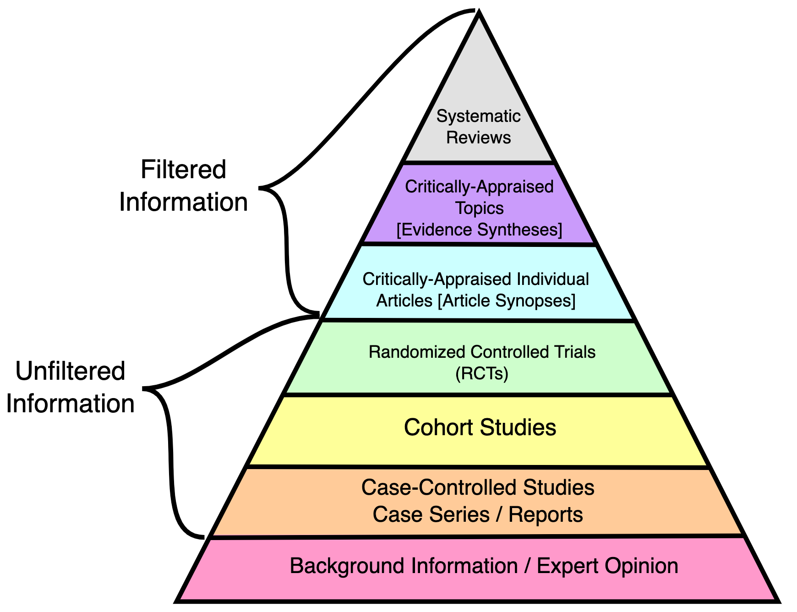
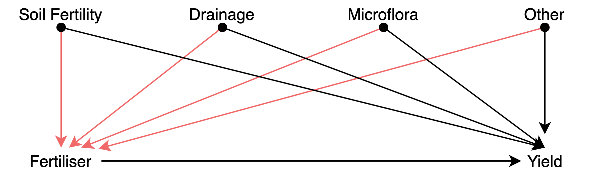
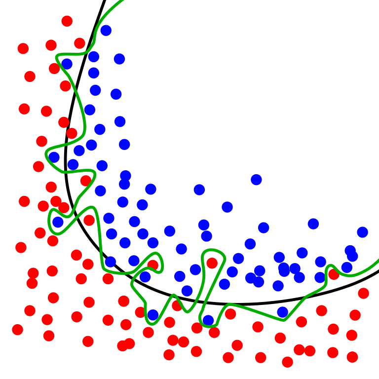
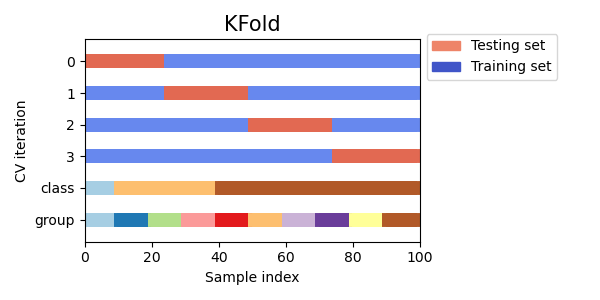
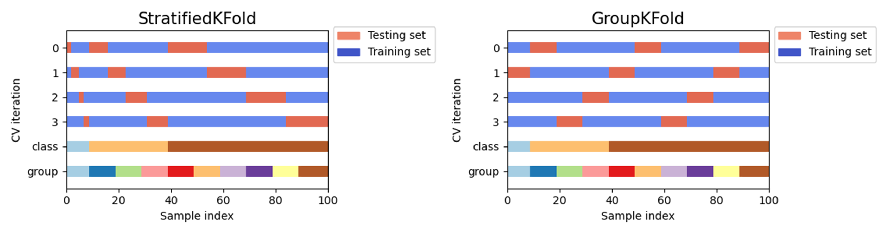

# Empirical Practices and Models {#empirical-practices}

:::: {.notebox data-latex=""}
::: {.center data-latex=""}
**Course Note:**
:::

This chapter is under construction. Some content is hidden.
::::

## Overview

> *Empirical*: based on, concerned with, or verifiable by observation or experience rather than theory or pure logic.

I would like to introduce this chapter in the same way the Book of Why [@book-of-why] introduces its fourth chapter "Slaying the lurking variable". During the times of Babylonian King Nebuchadnezzar (642 BC - 562 BC), one captive -- Daniel -- refused to eat royal meat offered by the King as part of their education and service in the court since it did not comply with his religious beliefs. Instead, Daniel asked to be fed on a vegetable diet. The overseer was reluctant as he thought the servants would lose weight and become weaker. Daniel proposed an experiment to convince his overseer. For ten days, one group of servants would be given a vegetable diet, while another group of servants would eat the king's meat. Then, the overseer would compare both groups and see that the vegetable diet did not reduce their strength. Of course, the experiment was a success, and the king was so impressed that he granted Daniel a favoured place in the court.

This example synthesizes the process of controlled experiments employed nowadays in experimental science. The overseer poses a question, *will the vegetarian diet cause my servants to lose weight?*. There it is our hypothesis. To address the question, Daniel proposed a methodology. Divide the servants in two identical groups. Give one group a new treatment (e.g. diet or a drug), while another group (control) remains under no special treatment. Of course, the two groups should be comparable and representative of some population in order to transfer the conclusions to the population at large. This process allowed Daniel to show the *causal effect* (beware, we will tackle this in Chapter \@ref(stats-abuse)) of the diet. Moreover, Daniel's experiment was proactive (in contrast to retrospective studies) as the groups were chosen in advance. Prospective controlled trials are a common characteristic of sound science. Still, Daniel didn't think of everything, but we will see that in Chapter \@ref(stats-abuse).

## What is an experiment?

Many data scientists believe their role should be limited to data analysis, but experiment design is fundamental for data collection, which conditions the data to be analysed. Conclusions drawn from data can be biased or determined by decisions and errors taken during experiment design. Understanding this can help you spot issues during the data analysis and ask the right questions to your colleagues in charge of the experiments. 

An experiment is an observation process in which we control background variables through manipulation, intervene on target variable (through manipulation) and observe the difference produced by such intervention thanks to measurements.

> Experiment is the kind of scientific experience in which some change is deliberately provoked, and its outcome observed, recorded and interpreted with a cognitive aim. --- [@bunge2017philosophy]

<!-- consider adding mill's method of difference -->

### Observational studies

However, there are whole research areas were scientists cannot make experiments. For instance, astrophysics is mainly observational and theoretical as is not possible to manipulate the observed entities (e.g. stars). It aims to find out measurable implications of physical models. Sometimes is not feasible, legal or ethical to conduct certain types of experiments, conducting observational studies instead. So, in **observational studies** there is no manipulation, no intervention on the target variable, neither control of background variables. [**Natural experiments**](https://en.wikipedia.org/wiki/Natural_experiment) on the other side share the first two characteristics but is possible to control background variables (but not through manipulation though). See § \@ref(john-snow) for an example of the latter.

:::: {.tipbox data-latex=""}
::: { data-latex=""}
**Definitions:**
:::

**Target variables**: The target variable of a dataset is the feature of a dataset about which you want to gain a deeper understanding. They also receive the name "dependent variables" because, in an experiment, their values are studied under the supposition or demand that they depend, by some law or rule (e.g., by a mathematical function), on the values of other variables. The dependent variable is the *effect*. Its value depends on changes in the independent variable.

**Independent variables**:: It is a variable that stands alone and isn't changed by the other variables you are trying to measure. The independent variable is the *cause*. Its value is independent of other variables in your study.


**Background variables**: An explanatory variable that can affect other (dependent) variables but cannot be affected by them. For example, one's schooling may affect one's subsequent career, but the reverse is unlikely to be true.

::::

We can recognise five elements in the observation process: the *object* of observation; the *subject* (or observer) and its perceptions; the *circumstances* of observation (e.g. environment of object and subject); the observation *media* (e.g. senses, instruments, procedures); and the body of *knowledge* used to relate all the previous elements. The last two can be grouped into *tools* (concrete and conceptual). So, an observation statement has the form "$w$ observes $x$ under $y$ with the help of $z$". [@bunge2017philosophy]

#### Observability 

We can try to define observability by stating that a fact is *observable* "only if there exists at least one subject, one set of circumstances, and one set of observation tools, such that the fact can appear to the subject armed with those tools under those circumstances" [@bunge2017philosophy]. This definition is rather unsatisfactory since someone could claim the existence of ghosts or aliens. We should define what is objectively observable. Then, $x$ is observable only if there exist at least one recording instrument $w$, one set of circumstances $Y$, and one set of observation tools $Z$, such that $w$ can register $x$ under $y$ helped by $z$. Here we have eliminated the possibility of the subject's perceptual delusions, but devices (e.g. a camera) have limitations too.

Observations are often expressed in the form of a rule so that other researchers can reproduce their results under similar conditions. Some facts cannot be repeated, such as the eruption of a volcano or a supernova. So very often, we expect results of the same kind to be reproducible by observers. Exact duplication is desirable but not always achievable. Even independent observers may make the same wrong observations due to faulty equipment or false hypotheses.

#### Indicators

Most facts we know about are indirectly observable, i.e. we infer them through an intermediary. For instance, the wind is not directly observable but inferred from bodies apparently moved by it. We *objectify* an observable fact by establishing its relationship to some perceptible fact(s) that serve us as an *indicator* of the fact. In other words, hypotheses are made concerning unperceived facts and tested through evidence consisting of data about other directly observable facts, assuming that the latter are **collaterally connected with** or **effects** of the former. Of course, that such relationship should hold is as well a hypothesis (see Figure \@ref(fig:indicator)).

(ref:indicator) The physical object-indicator relation, is expressed by a hypothesis enabling us to infer the object from observations made on its indicator. Figure extracted from [@bunge2017philosophy]. 

```{r indicator, echo=F, fig.align="center", out.width="50%", fig.cap='(ref:indicator)'}
knitr::include_graphics('Figures/indicator.png')
```

#### Data and Evidence

Every evidence is a *datum* but not every datum constitutes *evidence*. What turns a datum into evidence is that is relevant to some idea, that it makes sense under some theory or body of knowledge. In particular, we believe a datum constitutes an evidence in favour of a theory and assign the theory some *credence* because it justifies or predicts that evidence. The evidence must be related to a specific hypothesis, and this relationship is justified because of a body of theoretical knowledge. In fact, no evidence is absolute.  Consider the following example from [@bunge2017philosophy]:

> The observed deviation of a magnetic needle in the vicinity of an electric circuit (datum $e$) supports the hypothesis $h_x$ that electricity is flowing through the circuit, on the theory $⊤_1$ that electric currents produce magnetic fields which in turn interact with the fields of magnetic needles. But exactly the same datum $e$ might be taken as an evidence in favour of the rival hypothesis $h_2$ that a big magnet somewhere nearby has been switched on, on the theory $⊤_2$ that magnets can interact directly with one another. The given datum is then *ambiguous* and only an independent checking of $h_x$ and $h_2$, i.e. a test independent of $e$, will enable us to reach a decision between the two rivals. 

Importantly, the characteristics that make data count as evidence must be agreed prior to observation and on the basis of theory. Sometimes a scientist may obtain data that seems incompatible with a theory. Instead of getting rid of such data (or the theory), the scientist will attempt to reproduce the data and assess whether is anomalous data (e.g. due to a faulty instrument) or not. The *raw* data may contain any information, but *refined* data should express only relevant and useful information for the problem at hand. Of course, some information is always lost in the process. In consequence, the refinement process is irreversible. Data are *means* rather than *ends* and we aim to systematise data in order to disclose patterns on it. For this reason *noise* must be removed. The systematization of refined data may involve displaying information in graphs or tables as well as arranging information in data structures such as matrices.

:::: {.tipbox data-latex=""}
::: { data-latex=""}
**Note for data scientists!**
:::

As he have seen, data alone is not enough. Note that this is a problem for solutions based on Machine Learning, since domain knowledge or *context* should be introduced somehow to *direct* the model in the desired direction. 

> "There is no learning without bias, there is no learning without knowledge" --- [@skansi2020guide] [@domingos2015master].

An example of how data depends on its context is user ratings or opinions. For instance, the meaning of *fashionable clothes* changes over time, as do political terms. This issue is known as *concept drift* [@kubat2017introduction]. Similarly, a text-mining engine to tag biology terms with the corresponding ontology terms may confuse elements between species, as several entities appear in multiple animals or organisms.

Finally, context is crucial for external validation and translation of solutions into real-world settings. A system for clothes recommendation should adapt to countries, cultures or ages. Similarly, a health system to predict patient risk based on disease comorbidities must be *calibrated* for each country or region (e.g. Diabetes treatment is often affordable in the EU, but an expensive treatment in the USA, which increases its mortality rate).

In Chapter \@ref(stats-abuse) we will see another side of this problem.

::::

### Field, laboratory and simulation experiments

In contrast to observational experiments, **field experiments** randomly assing the sampling units (e.g. study participants) into two groups (treatment and control) to test causal relationships. The same conditions are maintained for both groups only varying the intervention on the factor of interest (e.g. two parts of soil (fertilized/unfertilized)). The background variables are considered as given and not manipulated. On the other side, **laboratory experiments** construct the same background conditions in both groups manipulating the environment (lab settings) and varying the intervention on the factor of interest. Finally, **simulation experiments** are constructions representing a real system on a computer to perform interventions. This type of experiments are done when is not feasible to experiment on the real entities (e.g. climate simulations or geological simulations).

Therefore, an experiment is a controlled observation in which the observer manipulates the real variables (independent variables) that are believed to influence the outcome (dependent variable), both for the purpose of intervention and control. The following article provides a good description of the [basics of experiments](https://opentextbc.ca/researchmethods/chapter/experiment-basics/).


In Chapter \@ref(stats-abuse) we will see some examples of experimental errors (e.g. confirmation bias, selection bias, etc) as well as examples of statistical abuse. All in all, the experiment process is also a craft which entails learning from previous experiments (ours and others), as well as applying all available knowledge (theoretical and experimental) for the design of experiments.
  
:::: {.tipbox data-latex=""}
::: { data-latex=""}
**Definitions:**
:::

**Repetition**: An experiment is repeatable if enough information is provided about the used data and the experiment methods and conditions. With such information, it should be possible to repeat the experiment.

**Reproduction**: An experiment is considered as reproduced if the repetition of the experiment yields the same result. For instance, in computer science, reproducing involves using the original data and code.

**Replication**:  An independent experiment, in the spirit of the original experiment produces the same result. For example, in computer science replication entails collecting new data and use similar methods to reach similar conclusions in answer to the same scientific question. Or implementing a new software following similar design principles and reaching similar results.

::::

### Control

Experimental control entails a series of procedures for experiment and observation design aimed at minimising the effects of extraneous variables (i.e. confounding factors) other than the manipulated variables (i.e. independent variable) to ensure that the measured variable (i.e. dependent variable) is only affected by the independent variables. To evaluate the effects of manipulating the independent variables, some control system is needed in which no such deliberate changes are introduced. As we have seen, sampling units (e.g. study participants) are often divided into two groups (the experimental group and the control group) in a way that the only noticeable (or significant) difference between them lies in the stimuli exerted by the experiment.
Therefore, the control and experimental groups must be *homogeneous* in all relevant factors. 

In general, there are two techniques for the formation of such homogeneous groups: individual and collective control [@bunge2017philosophy]. **Individual control** requires simultaneous pairing of individuals in both groups, i.e. every member of the experimental group has a corresponding equivalent member in the control group. For instance, for every thirty years old Asian man in the control group another thirty years old Asian man is assigned to the experimental group. Simultaneous pairing is complex and expensive. **Statistical control** has two main types. On one side, the *control of distributions* should be performed to equate certain parameters such as averages, spreads (i.e. std. dev.) and other collective properties (e.g. medians). This technique is more flexible as only some properties are kept under control. In this case, we would take two samples of people with the same age and height distributions. Both simultaneous pairing and distribution control share a common disadvantage regarding the formation of the groups, which could be unintentionally biased. For instance, we could assign the strongest people to the treatment (or experimental) group to make sure they bear the treatment. To prevent this issue the two groups are usually formed at random. Thanks to **randomisation**, all variables (including most unknown factors) that were not previously controlled become randomly distributed, minimising their effect on the dependent variables. However, randomisation is not an alternative to other techniques, but rather a complement.

#### Other experimental control techniques

There are multiple strategies for experimental control. We have previously seen the method of division into treatment and control groups. The control and treatment groups can entail two moments in **time**, with the initial setting being the control scenario which is later on manipulated through the intervention of certain variables (e.g. measure noise from bats in a dark chamber before and after turning a light). Another technique requires **holding certain factors constant** or finding scenarios (like in a field experiment) with the same background conditions. Nonetheless, constructing such conditions in a laboratory can also achieve this goal. In an **elimination** strategy some factors are removed to simplify study conditions, such as air resistance in a vacuum chamber or [drop tower](https://en.wikipedia.org/wiki/Drop_tube), radio waves in a Faraday cage, or gravity in space experiments. A common case of elimination is **blinding**, where subjects do not know which group they are assigned to (single blinding). Moreover, double-blinding implies hiding this information from the experimenter and/or the data analyst. Finally, we can **separate factors** by measuring their effect and correcting for it. For example, the measurements of time dilation require taking into account the Doppler effect caused by the changing distance between the observer and the moving clock. GPS systems perform adjustments due to the effects of time dilation and gravitational frequency shifts. Another example, missile trajectories are often adjusted for the effect of [Coriolis force](https://en.wikipedia.org/wiki/Coriolis_force).

---

(ref:pyramid-evidence) Figure from [Wikimedia](https://commons.wikimedia.org/wiki/File:Research_design_and_evidence_-_Capho.svg) by CFCF. Keep in mind that this hierarchy is not free from [criticism](https://en.wikipedia.org/wiki/Hierarchy_of_evidence#Criticism) and take it just as a useful simplification.

```{r pyramid-eviodence, echo=F, out.width="70%", fig.align="center", fig.cap='(ref:pyramid-evidence)'}

```

### Randomised Control Trials

Randomisation offers a systematic solution for the division of participants (or sampling units) into two groups. In particular, RCTs are frequently regarded as a gold standard for clinical trials and among the highest quality evidence available (see Figure \@ref(fig:pyramid-eviodence)). However, as with every method, it will only yield fruitful results if applied correctly, and its sole employment does not warrant against other errors.

There are different types of randomisation. In **simple randomisation**, subjects are assigned into two groups purely randomly but in small samples, we risk creating uneven groups. **Block randomisation** works by randomising participants within blocks such that an equal number are assigned to each treatment. For example, given a block size of 4, there are 6 possible ways to equally assign participants to a block (AABB, ABAB, ABBA, BAAB, BABA, BBAA). Allocation proceeds by randomly selecting one of the orderings and assigning the next block of participants to study groups according to the specified sequence. A major disadvantage of this method is that it might be possible to predict the next sequence. **Stratified randomisation** is crucial whenever all other properties (except for the factors of interest) need to be assigned equally. The study population is first stratified into subgroups (i.e. *stratas*) sharing attributes, then followed by simple or block random sampling from the subgroups.

One of the main advantages of RCTs is the reduction of selection bias or allocation bias. In Chapter \@ref(stats-abuse) we will see biases in more detail. The randomisation process reduces mistrust towards a potential rigged distribution of the participants. Another common advantage is that it facilitates blinding the groups from investigators and participants. 

:::: {.tipbox data-latex=""}
::: { data-latex=""}
**Terminology Note:**
:::

Very often terms are used interchangeably in many domain but they can also mean different things depending on the are.

> By "allocation bias" we understand the bias caused by allocating patients with better prognosis to either the experimental or the control group. In the context of a randomized trial the term "selection bias" is sometimes used instead of allocation bias to indicate selection of patients into treatment arms. We avoid the term "selection bias" as it has a different meaning in epidemiology more broadly: selection of non-representative persons into a study. --- [@paludan2016mechanisms]

::::

However, RCTs do not necessarily ensure that background factors are equally distributed in the treatment and control groups. For small samples randomisation can provide unequal distributions. The average number after rolling a dice an infinite amount of times will converge to 3.5, but we should not be surprised if we roll a dice 10 or 20 times obtaining considerably more occurrences of the number 6 than the other numbers. The danger of relying on pure randomisation to balance covariates has been described in [@krause2003random] [@morgan2012rerandomization]. For this reason is essential to check for imbalances in known factors after randomisation. Stratified randomisation also helps balancing known factors. Nonetheless, randomisation does not necessarily guarantee full control of unknown factors but *on average* their effect should be significantly smaller than the treatment applied [@deaton2018understanding].

Although RCTs are still preferred to observational studies, there are scenarios in which intervention is not possible. For instance, we cannot assign participants to be obese or not in order to study the effect of obesity on heart diseases.

```{r, eval=knitr::is_html_output(excludes = "epub"), results = 'asis', echo = F}
cat(
'<figure class="wrap-figure">

<figcaption>Ronald Aylmer Fisher in 1913</figcaption>
</figure>'
)
```

#### Origins of RCTs

R.A. Fisher (1890-1962) conceived the RCTs in the 1930s. Fisher designed intricate approaches to disentangle the effects of fertiliser from other variables. Using the *Latin square*, he would divide the field into a grid of subplots to test each fertiliser with each combination of soil type and plant. However, in this scenario the experimenter would observe the effects of the fertiliser *mixed* (i.e. *confounded*) with a variety of other things (e.g. soil fertility, drainage, microflora). Fischer realised that the only design that would "*trick nature*" is one where the fertilisers are assigned randomly to the subplots. Of course, sometimes you might be unlucky and assign a certain fertiliser to the least fertile subplots, but other times you might get the opposite assignment. A new random allocation is generated each time the experiment is conducted. By running the experiment multiple times the luck of each fertiliser is *averaged*. 

> But Fisher realized that an uncertain answer to the right question is much better than a highly certain answer to the wrong question. [...] If you ask the right question, getting an answer that is occasionally wrong is much less of a problem. You can still estimate the amount of uncertainty in your answer, because the uncertainty comes from the randomization procedure (which is known) rather than the characteristics of the soil (which are unknown). --- Section "Why RCTs work" in Chapter 4 from [@book-of-why]

The Book of Why describes the aforementioned experiment in causal terms [@book-of-why]. The causal diagram from Figure \@ref(fig:rct-diagram) depicts a model describing how the yield of each plot is determined by both the fertiliser and other variables, but the effect of the fertiliser is also affected by the same variables (red arrows). The experimenter aims to know about the effect of the fertiliser controlling for the latter effects. In other words, a model in which the effects represented by the red arrows are controlled. In this second scenario, the relation between Fertilizer and Yield is *unconfounded* since there is no common cause of Fertiliser and Yield.

```{r rct-diagram, echo=F, fig.align="center",  out.width="100%", fig.cap='Causal diagram depicting an improperly controlled experiment.'} 

```

#### Validity

Transferring RCTs results to other scenarios is not trivial. All in all, RCTs results concern a particular sample used during the study. The study sample is of course drawn from a larger group, i.e. the population, but the RCT results cannot be simply applied to another sample drawn from the population. Randomisation is not the same as random sampling from the population. In fact, there are many RCT studies that misrepresented certain population groups. An example of women inclusion issues in clinical studies includes the under-representation of women in stroke randomized controlled trials, which leads to misleading conclusions that affect stroke care delivery [@tsivgoulis2017under]. A similar bias exists in animal research, including [lab mice](https://www.wired.com/2016/07/science-huge-diversity-problem-lab-rats/). 

> Most rodents used in biomedical studies --- the ones that suss out the effects of treatments before they make it to humans --- have boy parts and boy biological functions. And that particular kind of gender imbalance has cascading effects. A growing body of evidence indicates that females process pain differently than males. But many lab scientists who study ways of treating pain *still *use all-male cohorts of lab mice. They say it's because male mice and rats aren't as hormonal as females—because isn't that what they always say—and are therefore more reliable in terms of getting data. And that means the scientific community is ignoring research that might help women manage pain better. --- **Science Has a Huge Diversity Problem... in Lab Mice - Wired**

---

> Of 2,347 articles reviewed, 618 included animals and/or cells. For animal research, 22% of the publications did not specify the sex of the animals. Of the reports that did specify the sex, 80% of publications included only males, 17% only females, and 3% both sexes. A greater disparity existed in the number of animals studied: 16,152 (84%) male and 3,173 (16%) female. --- [@yoon2014sex]

Therefore, RCTs must be internally valid, --- i.e. the design must eliminate the possibility of bias --- but to be clinically useful the result must also be relevant to a well-defined group of patients (i.e. external validity). Differences between trial protocol and routine practice also affect the external validity of RCTs. In [@rothwell2006factors], the authors list some of the most important potential determinants of external validity.

### Cross-validation in Machine Learning

As data scientists, you may wonder why the previous practices are relevant to your job. In this section I want to show how similar control measures must be considered regarding machine learning (ML). When applying supervised ML methods, is important to prevent over-fitting and under-fitting situations. In particular, over-fitting occurs when a model begins to *memorize* training data rather than *learning* to generalize from a trend (see Figure \@ref(fig:overfitting)). One of the techniques to detect or lessen the change of over-fitting includes cross-validation. The basis of this technique is to test the generalization power of the model by evaluating its performance on a set of data not used during the training stage.

(ref:overfitting-caption) Source: [Wikimedia](https://en.wikipedia.org/wiki/File:Overfitting.svg). The green line represents an overfitted model and the black line represents a regularized model. While the green line best follows the training data, it is too dependent on that data and it is likely to have a higher error rate on new unseen data, compared to the black line.

```{r overfitting, echo=F, fig.align="center",  out.width="45%", fig.cap='(ref:overfitting-caption)'}

```

The simplest approach is the **hold out method** which entails spliting the dataset into a train and test sets. However, yet another part of the dataset is often held out (validation set) so that the model training proceeds on the training set, the model evaluation on the validation set, and once the hyperparameters are successfully tweaked, the final evaluation is conducted on the test set. This process reduces the amount of data available for training. Cross-validation (CV) alleviates this issue.

The following procedure (see Figure \@ref(fig:cross-validation)) is followed for each of the $k$ "folds":

- A model is trained using $k-1$ of the folds as training data.
- The resulting model is validated on the remaining part of the data.

The performance measure reported by K-fold CV is then the average of the values computed in the loop. This approach can be computationally expensive, but does not waste too much data [@scikit-learn].

(ref:cross-validation) Source: [Scikit-Learn](https://scikit-learn.org/stable/modules/cross_validation.html#cross-validation). A test set should still be held out for final evaluation, but the validation set is no longer needed when doing CV. In the basic approach, called K-fold CV, the training set is split into k smaller sets [@scikit-learn]. 

```{r cross-validation, echo=F, fig.align="center",  out.width="75%", fig.cap='(ref:cross-validation)'}
knitr::include_graphics('Figures/grid_search_cross_validation.png')
```

However, the vanilla approach to K-fold CV does not consider certain properties of the dataset. In particular, K-fold CV is not affected by classes or groups. For instance, the training set of the first CV iteration in Figure \@ref(fig:k-fold-vis) does not contain one of the classes.

```{r k-fold-vis, echo=F, fig.align="center",  out.width="63%", fig.cap='Source: Scikit-Learn. K-fold CV is not affected by classes or groups.'}

```

Issues similar to the ones previously studied regarding RCTs can arise when conducting cross-validation. Some problems exhibit a large imbalance in the distribution of the target classes. For example, the negative class can be more representative than the positive class. In such cases, stratified sampling is recommended (see Figure \@ref(fig:k-fold-strategies)) to preserve relative class frequencies in each train and validation fold.

One strong assumption of machine learning theory is that data is Independent and Identically Distributed (i.i.d.), i.e. that all samples stem from the same generative process and that such process is assumed to have no memory regarding past samples. For example, a succession of throws of a fair coin is i.i.d. since the coin has no memory, so all the throws are independent. In this sense, if we know that the generative process has a group structure (e.g. samples collected from different subjects, experiments, measurement devices) we should use group-wise CV. The grouping of data depends on the context. For instance, in medical data, we can find multiple samples for each patient, so it makes sense to group the samples by patient to prevent any [*data leakage*](https://scikit-learn.org/0.24/common_pitfalls.html#data-leakage). Similarly, problems where the samples have been generated using a time-dependent process call for [time-series aware CV schemes](https://scikit-learn.org/stable/modules/cross_validation.html#timeseries-cv).

(ref:k-fold-strategies) Source: Scikit-Learn. Other K-fold CV strategies. [**GroupKFold**](https://scikit-learn.org/stable/modules/cross_validation.html#group-k-fold) is a variation of K-fold which ensures that the same group is not represented in both testing and training sets. [**StratifiedKFold**](https://scikit-learn.org/stable/modules/cross_validation.html#stratified-k-fold) is a variation of K-fold which returns stratified folds: each set contains approximately the same percentage of samples of each target class as the complete set..

```{r k-fold-strategies, echo=F, fig.align="center",  out.width="100%", fig.cap='(ref:k-fold-strategies)'}

```

Similar to RTC internal validity, cross-validation does not ensure transferability to other scenarios. External validation must be performed with independent datasets to ensure robustness against new scenarios. Consider a deep-learning algorithm trained to predict the number of years a patient will survive based on its characteristics and the medication administrated. This system could be then transferred to a different hospital, in another country, region, or city where the population characteristics (diet, hygiene, professions) are different. The model will require undertaking a certain recalibration process to learn the new conditions. 

### How to evaluate experiment success

Very often, success is not defined by a single goal or metric. For instance, the best car is not always the fastest car. In fact, there are many other values to bear in mind, such as gasoline consumption, pollution, ease of manufacture, etc. Similarly an experiment success is rarely assessed with a single metric in mind. 

Moreover, some metrics must not be degraded, often called **guardrail metrics**. This type of metrics can include security, speed, robustness, etc. But very often include *non-epistemic values* too. In this context, non-epistemic values are metrics not directly related to the instance to be designed, such as fairness, justice, or making money (or saving it), in contrast to metrics that make the instance at issue *internally* or *intrinsically* better (e.g. speed). For instance, a car is not necessarily a better car depending on its price if what is judged is the *car itself* in isolation, but a low price might make it easier to sell. In another example, the fastest data processing system might not necessarily be the best choice since other requirements must be considered too (e.g. ease of use).

A non-epistemic value that is always at stake is money, or in a different shape, OPEX (operational expenditure) and CAPEX (capital expenditure). Very often, they condition other metrics, such as performance (e.g. use less/worse resources) or safety (e.g. employ less/worse materials). For example, I had the opportunity to work on the design of enterprise log processing systems. In this case, we wanted to maximise speed while reducing resources, as mid-sized companies often wish to reduce the number of servers deployed, which ultimately affects their operational costs (e.g. space and electricity). Most commercial solutions scale horizontally, requiring the use of on-site server clusters to handle large amounts of data (at prohibitively high prices) or cloud-hosted clusters (impractical due to data protection). Our proposal optimised vertical scalability and coped with tens of millions of events per second with a single server. But of course, such an approach was specifically designed for a particular task, in contrast to the flexibility offered by commercial alternatives.

In data science, success should be defined by how well the analysis answers the research questions. For this reason, setting the research questions at the very beginning of the process remains crucial. They not only determine the data analysis but, more importantly, the data collection design. However, very frequently, the data science process starts with a given dataset. Still, it is essential to assess if the collected data can answer the posed questions.

<!--

## What is a model?

Very often is not possible to directly conduct research on the targets (e.g. it might not be feasible, legal, affordable). For example, is common to study aerodynamics in scale models or computational models.

are:

representations

- When we take a model (e.g. DNA model) it is representing or substituting the target.

idealisations

depend on the purpose

things to be manipulated

## Differences between Models, Theories and Experiments

What distinguishes models from theories and experiments is examined and two ways of using models are presented, as mirrors and as isolation.

-->

## Examples

### 1854 Broad Street cholera outbreak {#john-snow}


<!-- [write]

This case is very popular and can be found in several books and posts online but I recommend the explanation given in Chapter 7 from The Book of Why [@book-of-why] as the authors also re-formulate the case in causal terms.
-->


### Study about honesty is retracted over fake data

<!--
[write]

https://www.buzzfeednews.com/article/stephaniemlee/dan-ariely-honesty-study-retraction

https://twitter.com/jpsimmon/status/1427628315939049491
-->

## Takeaway Messages


