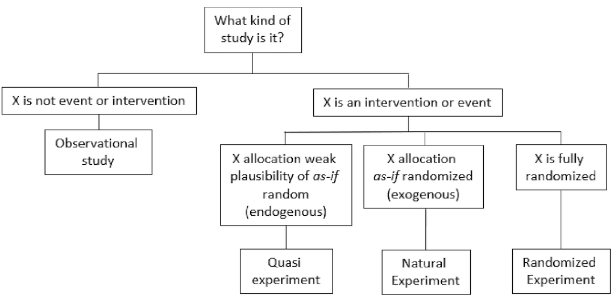
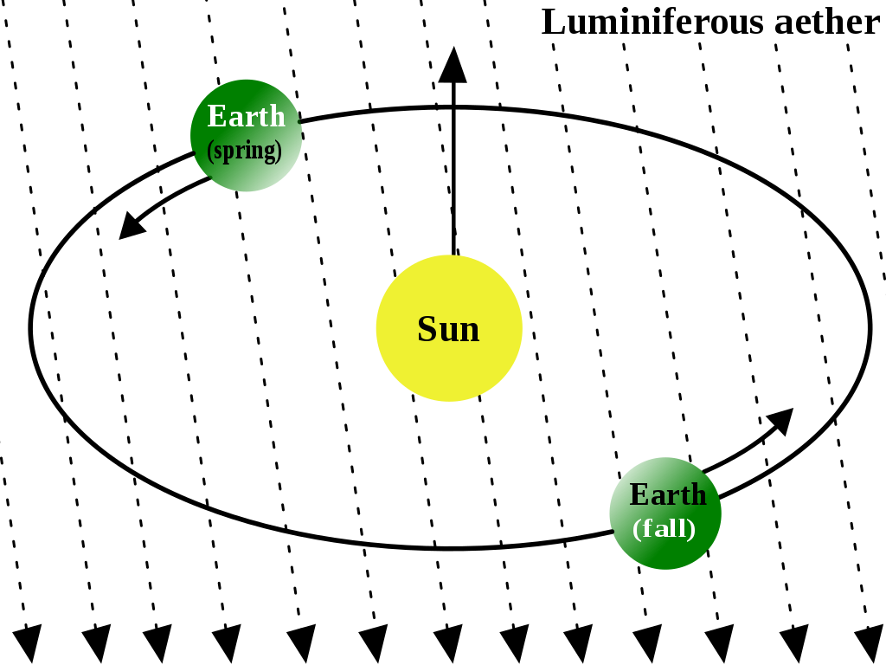

# Empirical Practices and Models {#empirical-practices}

## Overview

> *Empirical*: based on, concerned with, or verifiable by observation or experience rather than theory or pure logic.

I would like to introduce this chapter in the same way the Book of Why [@book-of-why] introduces its fourth chapter "Slaying the lurking variable". During the times of Babylonian King Nebuchadnezzar (642 BC - 562 BC), one captive -- Daniel -- refused to eat royal meat offered by the King as part of their education and service in the court since it did not comply with his religious beliefs. Instead, Daniel asked to be fed on a vegetable diet. The overseer was reluctant as he thought the servants would lose weight and become weaker. Daniel proposed an experiment to convince his overseer. For ten days, one group of servants would be given a vegetable diet, while another group of servants would eat the king's meat. Then, the overseer would compare both groups and see that the vegetable diet did not reduce their strength. Of course, the experiment was a success, and the king was so impressed that he granted Daniel a favoured place in the court.

This example synthesizes the process of controlled experiments employed nowadays in experimental science. The overseer poses a question, *will the vegetarian diet cause my servants to lose weight?*. There it is our hypothesis. To address the question, Daniel proposed a methodology. Divide the servants in two identical groups. Give one group a new treatment (e.g. diet or a drug), while another group (control) remains under no special treatment. Of course, the two groups should be comparable and representative of some population in order to transfer the conclusions to the population at large. This process allowed Daniel to show the *causal effect* (beware, we will tackle this in Chapter \@ref(stats-abuse)) of the diet. Moreover, Daniel's experiment was prospective (in contrast to retrospective studies) as the groups were chosen in advance. Prospective controlled trials are a common characteristic of sound science. Still, Daniel did not think of everything, but we will see that in Chapter \@ref(stats-abuse).

## What is an experiment?

Many data scientists believe their role should be limited to data analysis, but experiment design is fundamental for data collection, which conditions how the data must be analysed. Conclusions drawn from data can be biased or determined by decisions and errors taken during experiment design. Understanding this can help you spot issues during the data analysis and ask the right questions to your colleagues in charge of the experiments. 

An experiment is an observation process in which we control background variables through manipulation, intervene on target variable (through manipulation) and observe the difference produced by such intervention thanks to measurements.

> Experiment is the kind of scientific experience in which some change is deliberately provoked, and its outcome observed, recorded and interpreted with a cognitive aim. --- [@bunge2017philosophy]

<!-- consider adding mill's method of difference -->

### Observational studies

However, there are whole research areas were scientists cannot make experiments. For instance, astrophysics is mainly observational and theoretical as is not possible to manipulate the observed entities (e.g. stars). It aims to find out measurable implications of physical models. Sometimes is not feasible, legal or ethical to conduct certain types of experiments, conducting observational studies instead. So, in **observational studies** there is no manipulation, no intervention on the target variable, neither control of background variables. 

#### Natural experiments

[**Natural experiments**](https://en.wikipedia.org/wiki/Natural_experiment) on the other side share the first two characteristics but is possible to control background variables (but not through manipulation though). See § \@ref(john-snow) for an example. A major limitation of natural experiments when inferring causation is the presence of unmeasured confounding factors. Natural experiments are appealing for public health research because they enable the evaluation of events or interventions that are difficult or impossible to manipulate experimentally, such as many policy and health system reforms [@de2021conceptualising].

> For example the Canterbury earthquakes in 2010-2011 could be used to study the impact of such disasters because about half of a well-studied birth cohort lived in the affected area with the remainder living outside. [...] More recently, the use of the term ‘natural’ has been understood more broadly as an event which did not involve the deliberate manipulation of exposure for research purposes, even if human agency was involved. [...]  Natural experiments describing the study of an event which did not involve the deliberate manipulation of an exposure but involved human agency, such as the impact of a new policy, are the mainstay of ‘natural experimental research’ in public health. --- [@de2021conceptualising]

See Figure \@ref(fig:diagram-experiments) for an schema depicting the conceptualisation of natural and quasi-experiments. Some authors differentiate between natural experiments and *quasi-experiments*. In a quasi-experiment, the criterion for group assignment of the study units (e.g. study participants) is selected by the researchers, whereas, in a natural experiment, the assignment occurs *naturally*, without the intervention of the researchers.

> Quasi-experiment: A quasi-experiment is an empirical interventional study used to estimate the causal impact of an intervention on target population without random assignment. Quasi-experimental research shares similarities with the traditional experimental design or randomized controlled trial, but it specifically lacks the element of random assignment to treatment or control. Instead, quasi-experimental designs typically allow the researcher to control the assignment to the treatment condition, but using some criterion other than random assignment. Quasi-experiments are subject to concerns regarding internal validity, because the treatment and control groups may not be comparable at baseline. In other words, it may not be possible to convincingly demonstrate a causal link between the treatment condition and observed outcomes. This is particularly true if there are confounding variables that cannot be controlled or accounted for. --- Wikipedia on [@rossi1985evaluation] and [@dinardo2010natural].

(ref:dia-exp-caption) Diagram depicting the conceptualisation of natural and quasi-experiments within the evaluation framework of Thad Dunning. Re-drawn from [@de2021conceptualising]. Note that the same article provides three additional conceptualisations from different frameworks. For example, a different conceptualisation makes a distinction between quasi and natural experiments, arguing that natural experiments describe unplanned events whereas quasi-experiments describe events that are planned (but not controlled by the researcher).

```{r diagram-experiments, echo=F, fig.align="center",  out.width="100%", fig.cap='(ref:dia-exp-caption)'}

```

> Dunning takes this concept further and defines a ‘natural experiment’ as a quasi-experiment where knowledge about the exposure allocation process provides a strong argument that allocation, although not deliberately manipulated by the researcher, is essentially random, referred to as ‘as-if randomization’. --- [@de2021conceptualising]

:::: {.tipbox data-latex=""}
::: { data-latex=""}
**Definitions:**
:::

**Target variables**: The target variable of a dataset is the feature of a dataset about which you want to gain a deeper understanding. They also receive the name "dependent variables" because, in an experiment, their values are studied under the supposition or demand that they depend, by some law or rule (e.g., by a mathematical function), on the values of other variables. The dependent variable is the *effect*. Its value depends on changes in the independent variable.

**Independent variables**: It is a variable that stands alone and isn't changed by the other variables you are trying to measure. The independent variable is the *cause*. Its value is independent of other variables in your study.


**Background variables**: An explanatory variable that can affect other (dependent) variables but cannot be affected by them. For example, one's schooling may affect one's subsequent career, but the reverse is unlikely to be true.

::::

We can recognise five elements in the observation process: the *object* of observation; the *subject* (or observer) and its perceptions; the *circumstances* of observation (e.g. environment of object and subject); the observation *media* (e.g. senses, instruments, procedures); and the body of *knowledge* used to relate all the previous elements. The last two can be grouped into *tools* (concrete and conceptual). So, an observation statement has the form "$w$ observes $x$ under $y$ with the help of $z$". [@bunge2017philosophy]

#### Observability 

We can try to define observability by stating that a fact is *observable* "only if there exists at least one subject, one set of circumstances, and one set of observation tools, such that the fact can appear to the subject armed with those tools under those circumstances" [@bunge2017philosophy]. This definition is rather unsatisfactory since someone could claim the existence of ghosts or aliens. We should define what is objectively observable. Then, $x$ is observable only if there exist at least one recording instrument $w$, one set of circumstances $Y$, and one set of observation tools $Z$, such that $w$ can register $x$ under $y$ helped by $z$. Here we have eliminated the possibility of the subject's perceptual delusions, but devices (e.g. a camera) have limitations too.

Observations are often expressed in the form of a rule so that other researchers can reproduce their results under similar conditions. Some facts cannot be repeated, such as the eruption of a volcano or a supernova. So very often, we expect results of the same kind to be reproducible by observers. Exact duplication is desirable but not always achievable. Even independent observers may make the same wrong observations due to faulty equipment or false hypotheses.

#### Indicators

Most facts we know about are indirectly observable, i.e. we infer them through an intermediary. For instance, the wind is not directly observable but inferred from bodies apparently moved by it. We *objectify* an unobservable fact by establishing its relationship to some perceptible fact(s) that serve us as an *indicator* of the fact. In other words, hypotheses are made concerning unperceived facts and tested through evidence consisting of data about other directly observable facts, assuming that the latter are **collaterally connected with** or **effects** of the former. Of course, that such relationship should hold is as well a hypothesis (see Figure \@ref(fig:indicator)).

(ref:indicator) The physical object-indicator relation, is expressed by a hypothesis enabling us to infer the object from observations made on its indicator. Figure extracted from [@bunge2017philosophy]. 

```{r indicator, echo=F, fig.align="center", out.width="50%", fig.cap='(ref:indicator)'}
knitr::include_graphics('Figures/indicator.png')
```

#### Data and Evidence

Every evidence is a *datum* but not every datum constitutes *evidence*. What turns a datum into evidence is that is relevant to some idea, that it makes sense under some theory or body of knowledge. In particular, we believe a datum constitutes an evidence in favour of a theory and assign the theory some *credence* because it justifies or predicts that evidence. The evidence must be related to a specific hypothesis, and this relationship is justified because of a body of theoretical knowledge. In fact, no evidence is absolute.  Consider the following example from [@bunge2017philosophy]:

> The observed deviation of a magnetic needle in the vicinity of an electric circuit (datum $e$) supports the hypothesis $h_x$ that electricity is flowing through the circuit, on the theory $⊤_1$ that electric currents produce magnetic fields which in turn interact with the fields of magnetic needles. But exactly the same datum $e$ might be taken as an evidence in favour of the rival hypothesis $h_2$ that a big magnet somewhere nearby has been switched on, on the theory $⊤_2$ that magnets can interact directly with one another. The given datum is then *ambiguous* and only an independent checking of $h_x$ and $h_2$, i.e. a test independent of $e$, will enable us to reach a decision between the two rivals. 

Importantly, the characteristics that make data count as evidence must be agreed prior to observation and on the basis of theory. Sometimes a scientist may obtain data that seems incompatible with a theory. Instead of getting rid of such data (or the theory), the scientist will attempt to reproduce the data and assess whether is anomalous data (e.g. due to a faulty instrument) or not. The *raw* data may contain any information, but *refined* data should express only relevant and useful information for the problem at hand. Of course, some information is always lost in the process. In consequence, the refinement process is irreversible. Data are *means* rather than *ends* and we aim to systematise data in order to disclose patterns on it. For this reason *noise* must be removed. The systematization of refined data may involve displaying information in graphs or tables as well as arranging information in data structures such as matrices.

### Field, laboratory and simulation experiments

#### Field experiments

In contrast to observational experiments, **field experiments** randomly assign the sampling units (e.g. study participants) into two groups (treatment and control) to test causal relationships. The same conditions are maintained for both groups only varying the intervention on the factor of interest (e.g. two parts of soil (fertilized/unfertilized)). The background variables are considered as given and not manipulated.

- No manipulation.
- No intervention on the target variable.
- Control for the background variable (but not through manipulation).

In the example (see Figure \@ref(fig:fertiliser)), the background variables are controlled, we do not alter the soil, the number of hours of sun light received by the two groups of plants, nor the watering conditions. The only intervention is giving fertiliser to one side of the field. In this case, the seeds can be randomly assigned the treatment (fertiliser) or control groups.

```{r fertiliser, echo=F, fig.align="center", out.width="66%", fig.cap='Fertiliser experiment.'}

```

**Potential threats to internal validity**

- Excludability: The assumption of excludability states that the randomization does not affect outcomes through other variables than the reception of the treatment. If this assumption is violated, the causal effect identified in a study is a combination of the treatment and other variables [@hansen2020systematic]. For instance, that the two fields do not receive the same amount of light. 

- Interference: Interference occurs when experimental units alter each other's outcomes. This generates a bias that precludes the proper estimation of causal effects by the reseachers.

- Attrition: Attrition occurs when outcome data are missing. Attrition becomes a problem for causal inference when two conditions are present: (1) units with missing outcomes differ systematically on the outcome from those that are not missing and (2) attrition is different in experimental groups. There is greater potential for attrition in field experiments than in laboratory experiments because field experiments confer less control [@hansen2020systematic]. For instance, some participants may leave a study if they do not get any improvement.

#### Laboratory experiments

On the other side, **laboratory experiments** construct the same background conditions in both groups manipulating the environment (lab settings) and varying the intervention on the factor of interest. Background conditions are controlled through manipulation. For instance, temperature, pressure, humidity can be controlled for a fertiliser trial. Laboratory experiments tend to have higher internal validity, but at the cost of lower external validity (generalistation), owing to the artificial setting in which the study is conducted may not reflect the real world.

#### Simulation experiments

Finally, **simulation experiments** are constructions representing a real system on a computer to perform interventions. This type of experiments are done when it is not feasible to experiment on the real entities (e.g. climate simulations or geological simulations). The important consideration is that all interventions and manipulations are performed on the computer representation instead of the real target itself.

#### Wrap-up

Therefore, an experiment is a controlled observation in which the observer manipulates the real variables (independent variables) that are believed to influence the outcome (dependent variable), both for the purpose of intervention and control. The following article provides a good description of the [basics of experiments](https://opentextbc.ca/researchmethods/chapter/experiment-basics/).

In Chapter \@ref(stats-abuse) we will see some examples of experimental errors (e.g. confirmation bias, selection bias, etc) as well as examples of statistical abuse. All in all, the experiment process is also a craft which entails learning from previous experiments (ours and others), as well as applying all available knowledge (theoretical and experimental) for the design of experiments.
  
:::: {.tipbox data-latex=""}
::: { data-latex=""}
**Definitions:**
:::

**Repetition**: An experiment is repeatable if enough information is provided about the used data and the experiment methods and conditions. With such information, it should be possible to repeat the experiment.

**Reproduction**: An experiment is considered as reproduced if the repetition of the experiment yields the same result. For instance, in computer science, reproducing involves using the original data and code.

**Replication**:  An independent experiment, in the spirit of the original experiment produces the same result. For example, in computer science replication entails collecting new data and use similar methods to reach similar conclusions in answer to the same scientific question. Or implementing a new software following similar design principles and reaching similar results.

::::

### How to evaluate experiment success

Very often, success is not defined by a single goal or metric. For instance, the best car is not always the fastest car. In fact, there are many other values to bear in mind, such as gasoline consumption, pollution, ease of manufacture, etc. Similarly an experiment success is rarely assessed with a single metric in mind. 

Moreover, some metrics must not be degraded, often called **guardrail metrics**. This type of metrics can include security, speed, robustness, etc. But very often include *non-epistemic values* too. In this context, non-epistemic values are metrics not directly related to the instance to be designed, such as fairness, justice, or making money (or saving it), in contrast to metrics that make the instance at issue *internally* or *intrinsically* better (e.g. speed). For instance, a car is not necessarily a better car depending on its price if what is judged is the *car itself* in isolation, but a low price might make it easier to sell. In another example, the fastest data processing system might not necessarily be the best choice since other requirements must be considered too (e.g. ease of use).

A non-epistemic value that is always at stake is money, or in a different shape, OPEX (operational expenditure) and CAPEX (capital expenditure). Very often, they condition other metrics, such as performance (e.g. use less/worse resources) or safety (e.g. employ less/worse materials). For example, I had the opportunity to work on the design of enterprise log processing systems. In this case, we wanted to maximise speed while reducing resources, as mid-sized companies often wish to reduce the number of servers deployed, which ultimately affects their operational costs (e.g. space and electricity). Most commercial solutions scale horizontally, requiring the use of on-site server clusters to handle large amounts of data (at prohibitively high prices) or cloud-hosted clusters (impractical due to data protection). Our proposal optimised vertical scalability and coped with tens of millions of events per second with a single server. But of course, such an approach was specifically designed for a particular task, in contrast to the flexibility offered by commercial alternatives.

In data science, success should be defined by how well the analysis answers the research questions. For this reason, setting the research questions at the very beginning of the process remains crucial. They not only determine the data analysis but, more importantly, the data collection design. However, very frequently, the data science process starts with a given dataset. Still, it is essential to assess if the collected data can answer the posed questions.

## Scientific models

Scientific models are widespread and varied. These include scale models (e.g. plane models for aerodynamic studies), laboratory animals (e.g. mice for drug trials), simulation models (e.g. computational model for weather forecast). In all the previous cases, a model is made to replace or to stand in for what we are ultimately interested in. Models are characterised by being **representations**, containing **idealisations**, being **purpose dependent**, and **ready to be manipulated**.

> Typically models are representations in which details, that appear inessential for intended uses, are omitted. A model is intended to represent the real thing in certain significant aspects. --- Guy Orcutt

```{r sbml-model, echo=F, fig.align="center", out.width="100%", fig.cap='Different representations of a biological process. On the right side, the process is encoded in a XML file in Systems Biology Markup Language (SBML) format. '}

```

> We shall be concerned with model objects and theoretical models as hypothetical sketches of supposedly real, though possibly fictitious, things or facts. Thus a fluid may be modeled as a continuum endowed with certain properties, such as compressibility and viscosity. Such a model object may be grafted onto any of a number of general theories, say classical mechanics, or general relativistic mechanics. Likewise, a learning organism may be modeled as a black box equipped with certain input and output terminals, and this model object may then be expanded into a hypothetico-deductive system. In either case a specific theory, or theoretical model, of a concrete (or supposedly concrete) object, results. What can be subjected to empirical tests are such theoretical models: on the other hand general theories, being unconcerned with particulars, remain empirically untestable unless enriched with models of their referents. --- [@bunge2012method]

For instance, a physical model of DNA on a table represents the real DNA. Obviously, such a model is not a piece of real DNA. It is made of something else (e.g. plastic) and at a different scale. In this case, such a model is useful for pedagogic purposes. Although there are clear differences between models and targets, the key relationship is that **a model represents (in some way) the target**. From the methodological point of view, we must justify why to represent targets with models instead of investigating the targets themselves?. Possible answers include physical impossibility, costs, ethical and legal reasons, etc. However, very often the main justification to employ models is that targets are very complex. Therefore, employing a model that simplifies the target complexity might allow us to get a better understanding of the main factors operating in the target system. Our cognitive limits very often determine how we investigate complex systems, starting with a simpler model and increasing its complexity as we gain understanding.

> A schematic representation of an object may be called a model object. If the represented object (or referent) is concrete or physical, then its model is an idealization of it. The representation may be pictorial, as in the case of a drawing, or conceptual, as in the case of a mathematical formula. It may be figurative, like the ball-and-spoke model of a molecule, of semisymbolic, as in the case of the contour map of the same molecule; or finally symbolic like the hamiltonian operator for that same object. --- [@bunge2012method]

Therefore, we are intentionally choosing or building a model that differs from the target in some properties. Precisely because of this condition, we cannot assume that whatever is the case in the model is also the case in the target. **Models come with idealisations.** Not bearing in mind this key condition of the models can lead us to produce false claims about the target. 

> - **Idealized models.** Idealized models are models that involve a deliberate simplification or distortion of something complicated with the objective of making it more tractable or understandable. Frictionless planes, point masses, completely isolated systems, omniscient and fully rational agents, and markets in perfect equilibrium are well-known examples. Idealizations are a crucial means for science to cope with systems that are too difficult to study in their full complexity.
> - **Scale models.** Some models are down-sized or enlarged copies of their target systems (Black 1962). A typical example is a small wooden car that is put into a wind tunnel to explore the actual car’s aerodynamic properties. 
> - **Phenomenological models.** Phenomenological models have been defined in different, although related, ways. A common definition takes them to be models that only represent observable properties of their targets and refrain from postulating hidden mechanisms and the like.
> - **Exploratory models.** Exploratory models are models which are not proposed in the first place to learn something about a specific target system or a particular experimentally established phenomenon. Exploratory models function as the starting point of further explorations in which the model is modified and refined.
> - **Models of data.** A model of data (sometimes also “data model”) is a corrected, rectified, regimented, and in many instances idealized version of the data we gain from immediate observation, the so-called raw data. Characteristically, one first eliminates errors (e.g., removes points from the record that are due to faulty observation) and then presents the data in a “neat” way, for instance by drawing a smooth curve through a set of points. These two steps are commonly referred to as “data reduction” and “curve fitting”. 
> --- [@sep-models-science]

### The models of the atom

For example, Bohr's model of the atom assumes that electrons orbit the atomic nucleus in circles. The success of such a model relied that the Bohr assumptions reproduced the series that fitted the hydrogen emission spectra. In 1913 it predicted the correct frequencies of the specific colours of light absorbed and emitted by ionised helium. One could say that Bohr was very lucky as despite his model is wrong in some ways, it also has some bits of truth, enough for his predictions about ionised helium to work out. 

(ref:bohr-caption) Source: [Wikipedia Commons](https://commons.wikimedia.org/wiki/File:Bohr_atom_model.svg).

```{r bohr-model, echo=F, fig.align="center", out.width="33%", fig.cap='Illustration of bound-bound transition in the Bohr atomic model. (ref:bohr-caption)', fig.pos="hbtp"}
knitr::include_graphics('Figures/bohr-atom-model.png')
```

However, other predictions about the properties of the atom were wrong, and its implications were not observed in experiments. In the Schrödinger model, the electron of a one-electron atom, rather than travelling in fixed orbits around the nucleus, has a probability distribution allowing the electron to be at almost all locations in space, some being much more likely than others. Bohr theory (1913) was rejected in 1925 after the advent of quantum mechanics, but its model remains because despite its flaws and idealisations, [Bohr's model is useful for education](https://blogs.scientificamerican.com/guest-blog/why-it-s-okay-to-teach-wrong-ideas-in-physics/).

### The models of benzene

**Models are as well purpose-dependent**. Suppose the next question. Which benzene model is better? A quantum mechanic model, or a structural formula?. On one side, the quantum mechanic model is more precise about the potential position of electrons. Additionally, is more similar to the target as it represents better its relevant properties. The structural model is simpler and easier to work with. In this case, theoretically tractable models such as structural models allow for functional group analysis in chemistry.

(ref:benzene-caption) Source: [Wikipedia Commons](https://en.wikipedia.org/wiki/File:Benzene_Representations.svg).

```{r benzene-model, echo=F, fig.align="center", out.width="90%", fig.cap='Various representations of Benzene. (ref:benzene-caption)', fig.pos="hbtp"}
knitr::include_graphics('Figures/Benzene_Representations.png')
```

(ref:benzene-caption-history) Historic benzene structures (from left to right) by Claus (1867), Dewar (1867), Ladenburg (1869), Armstrong (1887), Thiele (1899) and Kekulé (1865). Dewar benzene and prismane are distinct molecules that have Dewar's and Ladenburg's structures. Thiele and Kekulé's structures are used today.

```{r benzene-model-evolution, echo=F, fig.align="center", out.width="90%", fig.cap='(ref:benzene-caption-history)', fig.pos="hbtp"}

```

### Models as analogies

```{r, eval=knitr::is_html_output(excludes = "epub"), results = 'asis', echo = F}
cat(
'<figure class="wrap-figure">

<figcaption>Prof. Mary Hesse (1924-2016), by Peter Mennim.</figcaption>
</figure>'
)
```

```{r, include=knitr::is_latex_output(), echo = F}
knitr::asis_output('\\begin{wrapfigure}{R}{.36\\textwidth}  
 \\begin{center}
    \\includegraphics[width=.33\\textwidth]{Figures/mary-hesse.jpeg}  
  \\captionsetup{labelformat=empty}
  \\caption{Prof. Mary Hesse (1924-2016), by Peter Mennim.} 
\\end{center}
\\end{wrapfigure}
\\addtocounter{figure}{-1}')
```

Philosopher Mary Hesse (1924-2016) argued that models act as analogies rather than descriptions of the targets. She distinguished between 3 kinds of analogies. In the first place, she considered that **positive analogies** hold between the aspects of a model and its target for which we have reasons to believe they are similar. An example of positive analogies can be found between mice and humans, which have similar hormone systems and physiology.  On the other hand, the idealisations constitute **negative analogies**, such as the differences in size or lifespan between mice and humans. These negative analogies cover the properties in which model and target differ. Finally, **neutral analogies** concern the properties that we cannot investigate directly in the target, requiring the model for their study. 

> Without analogy there might be no knowledge: the perception of analogies is a first step towards classification and generalization. [@bunge2012method]

For instance, the reaction to a certain drug or treatment of interest. At the initial stage, is not possible to tell whether the model-target relationships concerning these properties constitute positive or negative analogies because we do not know yet how the relevant target properties are affected. Instead, such properties are investigated in the model, and researchers hypothesise that the model is analogous to the target in such properties. For instance, we assume that the effects of a drug in mice will give us knowledge about its effects in humans.

> The positive analogy between two items consists in the properties or relations they share (both gas molecules and billiard balls have mass); the negative analogy consists in the properties they do not share (billiard balls are colored, gas molecules are not); the neutral analogy comprises the properties of which it is not known (yet) whether they belong to the positive or the negative analogy (do billiard balls and molecules have the same cross section in scattering processes?). Neutral analogies play an important role in scientific research because they give rise to questions and suggest new hypotheses. --- [@sep-models-science]

Consider again the Michelson and Morley experiment. Before the XX century, most physicists considered light as a wave. Their beliefs were justified on the many positive analogies between light, water and sound waves. For instance, light produces a diffraction pattern when encountering an obstacle, just as water and sound waves do. With this model in mind, physicists inferred a neutral analogy, namely, that light needs a medium to travel, as other waves require. They called this medium: luminiferous aether. The experiment from Michelson and Morley is a consequence of such model. However, the experiment revealed that such analogy was indeed a negative analogy, an idealisation. This discovery led people to replace the model of light for more precise models. Therefore, model manipulation allows discovering the effects of neutral analogies.

(ref:aether-caption) Source: [Wikipedia Commons](https://commons.wikimedia.org/wiki/File:AetherWind.svg).

```{r aether, echo=F, fig.align="center", out.width="50%", fig.cap='The luminiferous aether: it was hypothesised that the Earth moves through a "medium" of aether that carries light. (ref:aether-caption)'}

```

### Differences between Models and Experiments

There are several commonalities between models and experiments. Setting parameters and variables in models resembles experimental control. In the same way, model manipulation is akin to experimental manipulation. Moreover, model manipulation yields results that are observed, just as in experimental observations. 

Notwithstanding, there are also important differences to bear in mind, which mainly concern the source of errors. For instance, the most troubling experimental errors concern internal validity questions, i.e. the degree of confidence that the causal relationship put to test is not influenced by other factors or variables. For these reasons, researchers require careful design and control of experiments. Nonetheless, models are generally less sensitive to these issues since the modeller is aware of the idealisations and mechanisms of its models. 

For modelling, the key concern is whether the relevant analogies between model and target hold. Such concern is usually not a problem for experiments, especially those conducted directly on the target. Once internal validity is assessed, researchers are confident that the inferences drawn from the experiment refer to the target. However, inferences drawn from model manipulation constitute neutral analogies considered as hypotheses regarding the target, requiring further testing and justification. This last step is error-prone.

### What makes a good model?

Since models are purpose dependent, there is no exhaustive set of sufficient and necessary conditions to define what a good model is. Nonetheless, there are some common criteria (e.g. robustness, simplicity, tractability) that can be balanced, but is often impossible to optimise all criteria at the same because some criteria are complements of each other.

The **similarity** criterion can for example assess physical resemblance. More generally, we could say that a model $M$ is similar to target $X$ if and only if $M$ is similar to $X$ with respect to the set of properties $P$ to a certain degree. However, this definition does not tell us which properties should be optimised. For instance, for a scale model of an air plane aimed at aerodynamic studies, it might be more justified to maximise the similarities of geometric properties over the interior design (e.g. the number of seats might not be relevant since the cabin is closed). Therefore, the purpose of the model justifies maximising one set of properties over another, in particular, the properties that are relevant for the research purpose.

**Robustness** expresses how model results are affected by condition changes. Therefore, a model result is robust (w.r.t. some condition) if changing such condition does not alter the result. For example, all properties except one (e.g. plane hull colour) can be kept fixed to test whether painting the plane with a different colour might affect its aerodynamic properties. If the result remains equal, we can say the model is robust with respect to the hull colour. Perhaps such property is not relevant to the research purpose, but that is not enough to justify removing the property.

(ref:prec-vs-acc-caption) Accuracy consists of trueness (proximity of measurement results to the true value) and precision (repeatability or reproducibility of the measurement). Source: [St. Olaf College](https://wp.stolaf.edu/it/gis-precision-accuracy/).

```{r prec-vs-acc, echo=F, fig.align="center", out.width="66%", fig.cap='(ref:prec-vs-acc-caption)'}
knitr::include_graphics('Figures/prec_vs_acc.png')
```

Another model criterion to consider is **precision** (w.r.t. parameters). We say that model $M_1$ is more precise than $M_2$ if the parameter specifications of $M_1$ *imply* those from $M_2$. This definition is better understood through an example. Consider the following models $M_1$, $M_2$, and $M_3$ and below definitions. The first model describes a rate of changes as a function of $X$. $M_2$ is more precise as describes the rate of changes as a linear function of $X$. The description of $M_2$ implies the description of $M_1$. Linear functions of $X$ are a subset of functions of $X$. Finally, the third model is yet more precise as it indicates an absolute value of the parameter $a$, reducing the subset of linear functions from the definition of $M_2$ to a particular linear function. Importantly, parameter precision is a property of the model alone, not of the relationship between model and target. Although precision offers potential for high accuracy, it is no warrant for it. For instance, if the actual rate of linear change would be other than $1.2X$, then the less precise model $M_2$ would be more accurate than $M_3$. Similarly, if the rate of change would not change linearly, the more general model $M_1$ would be more accurate than the alternatives.

- $M_1: dX/dt = f(X)$
- $M_2: dX/dt = aX$
- $M_3: dX/dt = 1.2X$

:::: {.tipbox data-latex=""}
::: { data-latex=""}
**Note for data scientists!**
:::

Questions regarding scientific models also concern Machine Learning models to a great extent. For example, consider the precision and accuracy criteria. The following paragraph is extracted from [the article "A Few Useful Things to Know About Machine Learning" by Pedro Domingos](https://dl.acm.org/doi/pdf/10.1145/2347736.2347755).

> Everyone in machine learning knows about overfitting, but it comes in many forms that are not immediately obvious. One way to understand overfitting is by decomposing generalization error into bias and variance. Bias is a learner’s tendency to consistently learn the same wrong thing. Variance is the tendency to learn random things irrespective of the real signal. Figure illustrates this by an analogy with throwing darts at a board. A linear learner has high bias, because when the frontier between two classes is not a hyperplane the learner is unable to induce it. Decision trees do not have this problem because they can represent any Boolean function, but on the other hand they can suffer from high variance: decision trees learned on different training sets generated by the same phenomenon are often very different, when in fact they should be the same. Similar reasoning applies to the choice of optimization method: beam search has lower bias than greedy search, but higher variance, because it tries more hypotheses. Thus, contrary to intuition, a more powerful learner is not necessarily better than a less powerful one. --- [@domingos2012few]

::::

**Simplicity** is often another criteria that affects models. A simpler model might fit very well its purpose. For example, underground maps often misrepresent distances or omit unnecessary details such as roads, monuments, etc. Such simplification is suited for the particular purpose of travelling in the underground but is not useful for other purposes. We can say a model is simpler if it contains less parameters, considers less variables and uses less operations than another model. Therefore, simplicity is a virtue with respect to the models and not to targets. Is usually a practical criterion that facilitates the model use.

Related to simplicity, we can find **tractability**. We say a model is tractable (w.r.t. a set of rules) if the relevant model result may be obtained by applying certain principles to the model. For instance, models solved through analytical methods (e.g. mathematical proofs) are called analytically tractable in contrast to models for which results can only be approximated through numerical simulations methods. Tractability implies the existence of methods to analyse and solve such models. In this sense, **theoretical tractability** considers theoretical principles to assess the suitability of the model for certain operations. For instance, a structural representation of a chemical compound allows for the application of functional group classification (this is an example of theoretical principle to fulfil). In contrast, a quantum mechanical model is more accurate but does not allow for such operation. Therefore we consider it a less tractable model.

Finally, **transparency** is an epistemic value that assesses the degree to which the model user can cognitively understand how the model result is produced. This criterion is known in artificial intelligence as interpretability and/or explainability. For example, a decision tree is often human-readable while the nature of neural networks creates obfuscated models difficult to interpret. Transparent models allow to back-track the result and understand how it was produced from a given input. A transparent model enables the scientist to check the correctness of the results, which is especially important when employing models developed by third parties.

Again, most of the previous virtues will require certain trade-off. Increasing an epistemic value often entails decreasing another one. Therefore, building or choosing a model requires finding the best trade-off for the model's purpose.

### Models as mirrors

A common way to consider models is as mirrors of the real world. Very often, models are built to be as similar as possible to the target. This is common in highly complex projects such as brain simulations of the neural networks that represent human brain activity or epidemic simulations in which all the available demographic information (e.g. transportation, habits) is considered. The aim of such complex projects is to build a model as a replacement of the actual target system. In the case of epidemic simulations, it is clear that is not feasible to conduct real-world experiments, but the simulation can serve as a way to try different vaccination strategies that might, for instance, prioritise the vaccination of potential super spreaders, i.e. people who are in contact with many people during their daily routine (e.g. supermarket cashiers, waiters). In this sense, we say that the simulation is *mirroring* the world. Another example from engineering includes finite element analysis (FEA) which is used to divide a complex problem into smaller elements to facilitate calculations.

This type of model is very similar to the target and require high precision modelling. However, these advantages come at a cost. For instance, they compromise the simplicity, transparency and sometimes the tractability of the models. Despite the high similarity of the models to their target systems, it is not enough to avoid external validity issues. For example, FEA employs a mesh consisting of millions of small elements that mould the physical shape of the analysed structure. Then, calculations are made for each element. Such approximations are usually polynomial, which means that the structural elements have been interpolated, and their precision is bounded to the mesh size. Therefore, the accuracy depends on the purpose of the analysis (e.g. car, hardware tools, camera).

```{r fea, echo=F, fig.align="center", out.width="50%", fig.cap='A visualization of an asymmetrical collision analysis using the finite element analysis method.'}

```

### Models as isolations

An alternative perspective is to consider models as isolations of particular features of the complex world. This consideration is motivated by the following question. Can models be similar to their target systems and still be simple? We have previously seen that these two factors are very often inversely related. Isolated models choose a particular aspect of the target, disregarding all the rest. Then, a model is built to represent the behaviour of such factors as accurately as possible.

```{r lift, echo=F, fig.align="center", out.width="50%", fig.cap='Reproduction of lift balance used in 1901 wind tunnel; model airfoil in testing position. Source: NPS.'}

```

During the development of the airplane. George Cayley (1773 - 1857) proposed to separate the airplane system into 3 subsystems: Lift, Propulsion, Control. After this, the problem is divided into three problems, i.e. how to obtain lift, how to provide propulsion, and how to offer control. The Wright Brothers developed a separate model for each of this subsystems. As can be observed in Figure \@ref(fig:lift), the lift balance model does not resemble an airplane. Similarly, their propeller model was not attached to the airplane. Likewise, they employed gliders to test their control systems. This contrast with the approach of other inventors, such as Hiram Maxim, who attempted to build a full scale from scratch.
An overview of the Wright Brothers Invention Process can be found at [NASA's website](https://wright.nasa.gov/overview.htm).

(ref:brothers-caption) Historic photo of the Wright brothers' third test glider being launched at Kill Devil Hills, North Carolina, on October 10, 1902. Wilbur Wright is at the controls, Orville Wright is at left, and Dan Tate (a local resident and friend of the Wright brothers) is at right.

```{r brothers, echo=F, fig.align="center", out.width="50%", fig.cap='(ref:brothers-caption)', fig.pos="h"}
knitr::include_graphics('Figures/Wright_Brothers.jpg')
```

However, a limitation of this approach is that the target system must be dividable in different subsystems. Similarly, the results of valid isolating models might not look like the real world phenomena simply because the latter is a combination of effects. On the other side, the model represents a single effect in isolation. Therefore, the validation of isolated models is problematic.

<!--

Models as mirrors. Models as isolations.

--->

## Examples

### Willow tree experiment {#willow}

```{r, eval=knitr::is_html_output(excludes = "epub"), results = 'asis', echo = F}
cat(
'<figure class="wrap-figure">

<figcaption>Portrait of Jan Baptist van Helmont by Mary Beale, c.1674.</figcaption>
</figure>'
)
```

```{r, include=knitr::is_latex_output(), echo = F}
knitr::asis_output('\\begin{wrapfigure}{R}{.25\\textwidth}  
 \\begin{center}
    \\includegraphics[width=.22\\textwidth]{Figures/Jan_Baptist_van_Helmont_portrait.jpg}  
  \\captionsetup{labelformat=empty}
  \\caption{Portrait of Jan Baptist van Helmont by Mary Beale, c.1674.} 
\\end{center}
\\end{wrapfigure}
\\addtocounter{figure}{-1}')
```

Jan Baptist van Helmont (1580 - 1644) was a chemist, physiologist, and physician from the Spanish Netherlands (current Belgium).
In 1634, Jan Baptist was arrested by agents of the Spanish Inquisition for the crime of studying plants and other natural phenomena. During his house arrest, he studied how plants grew. The prevailing theory at the time, stated that plants grew by eating soil, and Jan Baptist conceived an experiment to test this idea. Such prevailing theory has its origins in the ancient Greeks.

Jan Baptist started by weighing a small willow tree (2.28 kg) and then weighed the dry soil (90 kg) in which he planted the tree. To prevent the dust from the surrounding air from mixing with the earth, the rim of the pot was protected, covered with a sheet of iron covered with tin and pierced by many holes. The tree was watered with rainwater or (when necessary) with distilled water. Jan Baptist left the tree for five years. After the five years had passed, Jan Baptist re-weighed the tree, which weighed 169 pounds (about 77 kg). He also re-weighed the dried soil and found the same 200 pounds (90 kg) minus about 2 ounces (56 gm). 

He wrongly concluded that the mass gain of the tree was produced by the water, which was his only intervention on the system. Although the experiment was carefully conducted, the conclusions derived from the experiment were wrong because the theory on which it was based was incorrect. Importantly, the fact that Helmont used soil contradicted his hypothesis that only water was needed for plant growth [@hershey1991digging].

Jan Baptist did not know anything about photosynthesis. During the photosynthesis, carbon from the air and minerals from the soil are used to generate new plant tissue. Ironically, Helmont has been credited with discovering carbon dioxide [@hershey1991digging].

The employment of the balance during van Helmont's experiment was an important improvement; Jan Baptist believed that the mass of materials had to be accounted for during the study of chemical processes. This experiment is considered the first quantitative experiment in plant nutrition. It is also a great example of how firm conclusions can be misled by lack of knowledge of the studied system. Jan Baptist failed to control for an important background factor.

(ref:caption-van-helmont) Illustration of the willow tree experiment. By [Lars Ebbersmeyer](https://commons.wikimedia.org/wiki/File:Van_Helmont_Experiment.jpg).

```{r van-helmont, echo=F, fig.align="center",  out.width="70%", fig.cap='(ref:caption-van-helmont)', fig.pos = "H"} 

```

### 1854 Broad Street cholera outbreak {#john-snow}

```{r, eval=knitr::is_html_output(excludes = "epub"), results = 'asis', echo = F}
cat(
'<figure class="wrap-figure">

<figcaption>Dr. John Snow (1813-1858), British physician.</figcaption>
</figure>'
)
```

```{r, include=knitr::is_latex_output(), echo = F}
knitr::asis_output('\\begin{wrapfigure}{R}{.25\\textwidth}  
 \\begin{center}
    \\includegraphics[width=.22\\textwidth]{Figures/John_Snow.jpg}  
  \\captionsetup{labelformat=empty}
  \\caption{Dr. John Snow (1813-1858), British physician.} 
\\end{center}
\\end{wrapfigure}
\\addtocounter{figure}{-1}')
```

The birth of epidemiology and public health is often attributed to the Natural Experiment described by Dr. John Snow in the mid-1800s when he investigated the relationship between drinking contaminated water and the incidence of cholera [@applied_stats_healthcare]. The case of Dr. Snow is very popular in public health science and can be found in several books and posts on-line but I recommend the explanation given in Chapter 7 from The Book of Why [@book-of-why] as the authors also re-formulate the case in causal terms, using concepts that were not available in the mid-1800s. Below, I give a summarised account of this study.

> *Miasma*: "A vaporous exhalation formerly believed to cause disease." 

Since the 1830s, various epidemics spread across Europe but were often attributed to social unrest and political upheaval. During the 1850s, there were several theories and misconceptions about the causes of cholera outbreaks.  The miasma theory attempted to explain outbreaks of bubonic plague and cholera, stating that they were caused by a form of “bad air”. According to the competing theory, i.e. the germ theory of disease, the cause of the outbreak was a yet unknown germ. However, in 1853, disease-causing germs had not yet been observed under a microscope and the germ theory of disease was not established yet. Louis Pasteur did not demonstrate the relationship between germ and disease until the 1860s. Therefore, the prevailing theory was that a miasma of unhealthy air caused cholera. 

In August 1854, a major outbreak of cholera occurred in Soho, London (United Kingdom). In just three days, 127 people died in Broad Street. By September, 500 people had died. John Snow was skeptical of the prevailing miasma theory and theorized that the cause was the presence of an agent in the contaminated water source from certain water supplying companies [@applied_stats_healthcare]. Namely, the Southwark and Vauxhall Company and the Lambeth Waterworks Company. The main difference between the two companies was that the former drew its water from London Bridge, which was downstream from London's sewers. Years earlier, Lambeth had moved its water intake so that it would be upstream of the sewers.

(ref:thames-caption) Water distribution by the Lambeth Water and the Southwark & Vauxhall Companies.

```{r thames, echo=F, fig.align="center",  out.width="66%", fig.cap='(ref:thames-caption)'} 
knitr::include_graphics('Figures/JohnSnowRiver.png')
```

Therefore, the customers of the Southwark and Vauxhall Company were getting water contaminated by the excrements of cholera victims, whereas Lambeth users were drinking uncontaminated water.

In consequence, districts supplied by the Southwark and Vauxhall Company had a death rate eight times higher than other districts. At this point, the evidence supporting the hypothesis of water contamination is just circumstantial. The causal diagram from Figure \@ref(fig:snow-dia-A) depicts the situation. A proponent of the miasma theory could argue that the effect of miasma was strongest in those districts [@book-of-why]. 

```{r snow-dia-A, echo=F, fig.align="center",  out.width="33%", fig.cap='Causal diagram for cholera for the case of John Snow.'} 

```

Then, Snow noted that in some districts water was served by both companies (see Fig. \@ref(fig:snow-map)), and even there, the death rate was still higher in the houses where water was supplied by the Southwark and Vauxhall Company. Those households did not showcase any difference in terms of poverty or miasma. Snow wrote: "each company supplies to both rich and poor, both large houses and small; there is no difference either in the condition or occupation of the persons receiving the water of the different companies." [@book-of-why]. 

Table: Relation of the household water source and deaths

Source of water                       Deaths
----------------                    ------------
Southwark and Vauxhall company           286
Lambeth company                           14
Direct from the river                     22
Pump wells                                 4
Ditches                                    4
Unknown                                    4

**It is precisely at this point where the natural experiment takes all its strength.** Around 300 people of both sexes, every age, and socio-economic class were naturally divided into two groups without them to know. One group received pure water, whereas the other received water mixed with sewage. 

The observations of John Snow introduced a new variable into the causal diagram (see Fig. \@ref(fig:snow-dia-B)), the **Water Company**. In this new diagram we can see that there is no arrow between Miasma and Water Company, therefore both variables are independent. Moreover, we can note the presence of an arrow between Water Company and Water Purity. Finally, the diagram depicts a third assumption. There is no direct arrow from Water Company to Cholera, i.e. water companies do not deliver cholera to their customers in any other way. 

```{r snow-dia-B, echo=F, fig.align="center",  out.width="50%", fig.cap='Causal diagram after the introduction of an instrumental variable.', fig.pos = "htb"} 
knitr::include_graphics('Figures/SnowDiagramB.png')
```

A variable that satisfies these properties is called an **instrumental variable**. See [@pokropek2016introduction] for examples of valid and invalid instrumental variables and [SciencesPo](https://scpoecon.github.io/ScPoEconometrics/IV.html) for econometric examples. **Since there are no confounders of the relation between Water Company and Cholera, any observed association must be causal**. Similarly, the association between Water Purity and Cholera is also causal. 

> Specifically, an instrumental variable Z is an additional variable used to estimate the causal effect of variable X on Y. The traditional definition qualifies a variable Z as an instrumental (relative to the pair (X, Y)) if (i) Z is independent of all variables (including error terms) that have an influence on Y that is not mediated by X and (ii) Z is not independent of X. --- [@pearl2000causality]

Although today miasma theory has been discredited, poverty and location are clear confounders. In [@book-of-why], the authors show how instrumental variables can be used to determine the number of lives that could have been saved by purifying the water supply. The instrumental variable **Water Company** allow us to find the effect of **Water Purity** on **Cholera** even without being able to control, or collect data on, the confounder variables (poverty, location, etc.).

One of the main innovations of John Snow approach was to focus on death rates in districts served by two water companies rather than on data from victims of the Broad Street pump which drew water from a well.

> A transitional period began in the late 1850s with the work of Louis Pasteur. This work was later extended by Robert Koch in the 1880s. By the end of that decade, the miasma theory was struggling to compete with the germ theory of disease. Viruses were initially discovered in the 1890s. Eventually, a "golden era" of bacteriology ensued, during which the germ theory quickly led to the identification of the actual organisms that cause many diseases. --- Wikipedia, [Germ theory of disease](https://en.wikipedia.org/wiki/Germ_theory_of_disease).

```{r snow-map, echo=F, fig.align="center",  out.width="100%", fig.cap='Detail of John Snow’s map of Cholera in the Broad Street outbreak in 1854. Each bar represents one death in a topography that attempted to relate the water source (“Pump”) to pattern of cases in the neighborhood outbreak.', fig.pos = "htbp"} 
knitr::include_graphics('Figures/snow-cholera-map-crop.jpg')
```

<!-- [write]


<!--
[write]

https://www.technologyreview.com/2019/02/04/137602/this-is-how-ai-bias-really-happensand-why-its-so-hard-to-fix/

-->


<!--
## Takeaway Messages


-->
