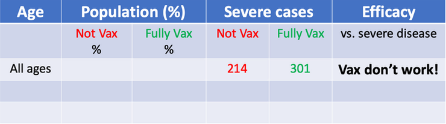
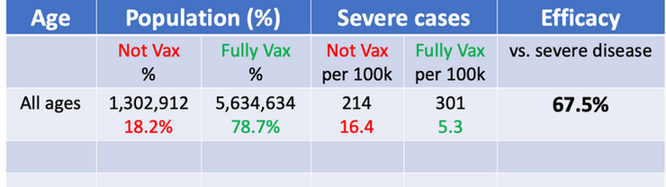
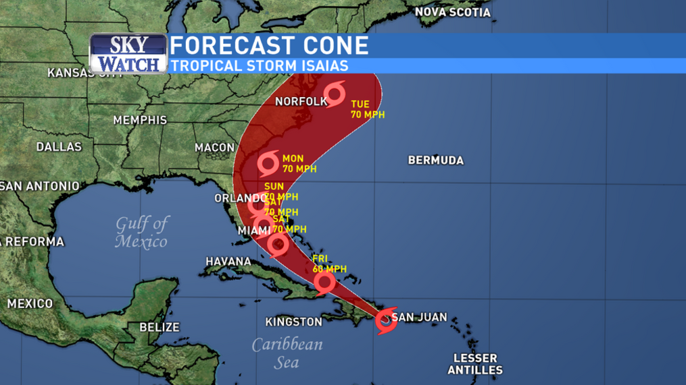
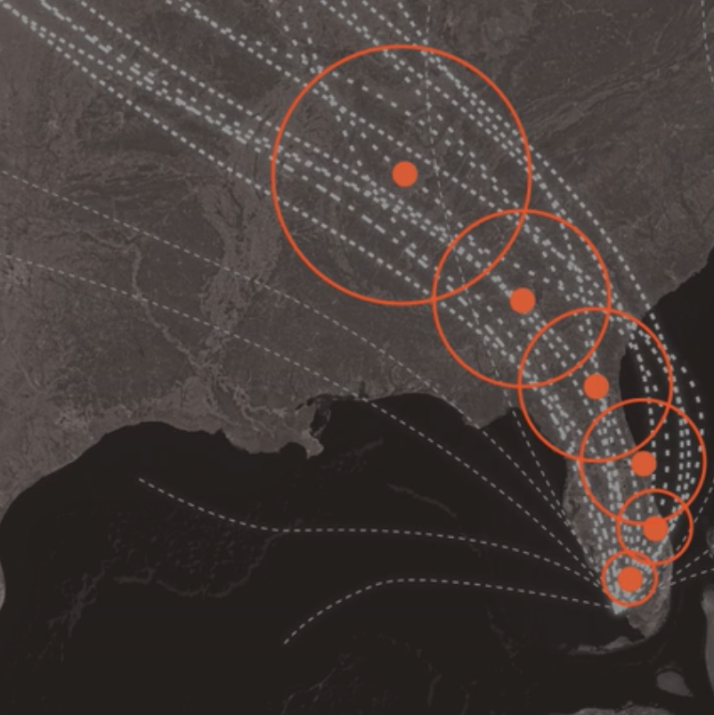
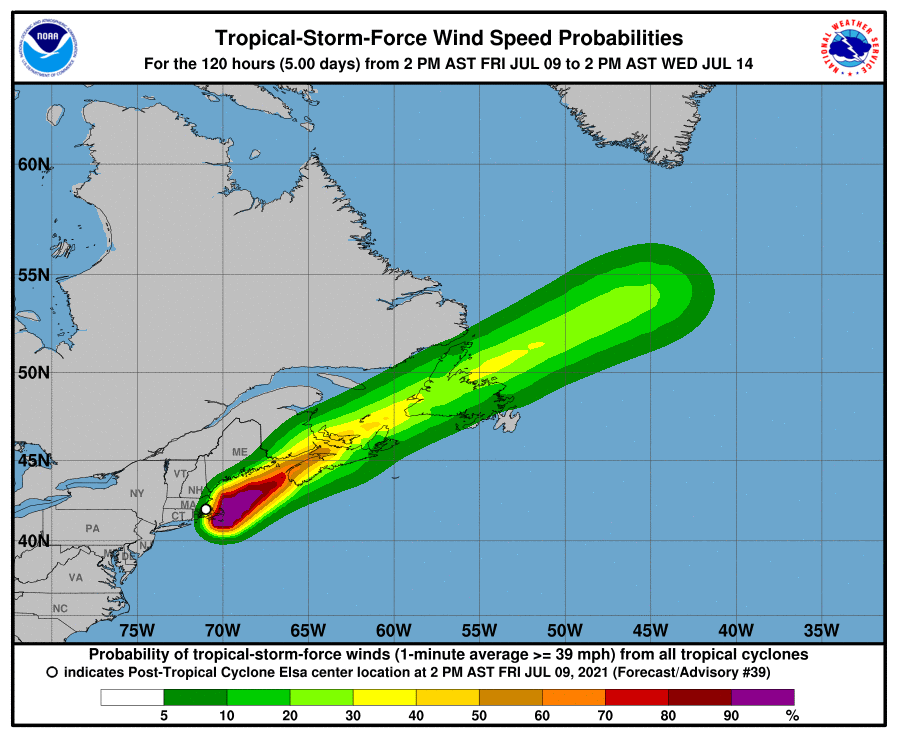

# Statistical abuse, Biases and Confounders {#stats-abuse}

:::: {.notebox data-latex=""}
::: {.center data-latex=""}
**Course Note:**
:::

This chapter is under construction. Content is hidden.
::::

<!--

## Overview

Continue on the example from chapter \@ref(empirical-practices) from Chapter 4 from the Book of Why.

## Bias and Confounders

### Experimental errors

#### Confirmation bias

#### Selection bias

Women and Health Research: Ethical and Legal Issues of Including Women in Clinical Studies

https://www.ncbi.nlm.nih.gov/books/NBK236575/

#### Internal and External validity


Example from § \@ref(covid-israel).

- Ref. Chapter Confounding and deconfounding, from The Book of Why.
- Ref. Judgment under Uncertainty. (Amos Tversky and Daniel Kahneman).
- Ref. John Snow and cholera.
- Ref. https://catalogofbias.org/ 
- The trouble with bias https://www.youtube.com/watch?v=fMym_BKWQzk
- The problem with building a fair system https://www.oreilly.com/radar/the-problem-with-building-a-fair-system/


## Data alone is not enough {#data-is-not-enough}

The confirmation of a hypothesis is often considered to increase as the number of favourable test findings grows, but the increase in confirmation, produced by one new favourable instance, will generally become smaller as the number of previously established favourable instances grows [@hempel-pos]. Many researchers and data scientists blindly rely on the dogma *the more data, the merrier* but the addition of one more favourable finding raises the hypothesis confirmation but little. The confirmation of a hypothesis depends not only on the quantity of the favourable evidence available but also on its variety.

## Visualizations can lie

- Ref. How charts lie from Alberto Cairo. https://www.newyorker.com/magazine/2021/06/21/when-graphs-are-a-matter-of-life-and-death

Example from § \@ref(viz-hurricane).

## More...

## Examples

### Covid-19: How can efficacy versus severe disease be strong when 60% of hospitalized are vaccinated? {#covid-israel}

:::: {.rnote data-latex=""}
*There are three kinds of lies: Lies, damned lies, and statistics*
:::

In this [blog post](https://www.covid-datascience.com/post/israeli-data-how-can-efficacy-vs-severe-disease-be-strong-when-60-of-hospitalized-are-vaccinated), biostatistics Professor Jeffrey Morris demonstrates how without properly controlling for age, efficacy against severe disease in Israel may appear weak when in fact within each age-group it is extremely strong. Consider the table from Figure \@ref(fig:vaccine-rates-a) and the following data from the the Israeli government. As of August 15, 2021 nearly 60% of all patients currently hospitalized for COVID-19 are vaccinated. Out of 515 patients currently hospitalized with severe cases in Israel, 301 (58.4%) of these cases were fully vaccinated.

```{r vaccine-rates-a, echo=F, out.width="70%", fig.align="center", fig.cap='Misleading table. This kind of tables have been used to claim that vaccines do not work or that its efectiveness reduces over time.'}

```

The numbers are true, but we need more than that to draw a proper conclusion about vaccine efficacy. Consider the following extreme scenarios. If the number of vaccinated people would be 0 we would expect all severe cases to be not vaccinated (obviously). On the other hand, if 100% of people would have been vaccinated, we would expect all severe cases to proceed from vaccinated people and 0 from non vaccinated. In this case, we have an in-between situation where 80% of residents (older than 12 years) have been vaccinated. Therefore, since the group of vaccinated people is larger than the non-vaccinated, we can expect more severe cases in absolute numbers. However, once we adjust for vaccination rates and normalise the counts, the story changes. The rate of severe cases is three times higher in unvaccinated individuals.

```{r vaccine-rates-b, echo=F, out.width="70%", fig.align="center", fig.cap='Table adjusted for vaccination rates.'}

```

> Vaccine Efficacy vs. Severe disease = 1 -  5.3/16.4 = 67.5%. 
> The interpretation of this number is that the vaccines are preventing >2/3 of the serious infections leading to hospitalization that would have occurred sans vaccination.  

Still, the obtained efficacy is lower than what we would expect. There are other factors that contribute to this confusion, including: age disparity in vaccinations, old people is more likely to be hospitalized than young people, etc.

I recommend going through the blog post to see how the author continues to apply adjustments and stratifications to find the true efficacy of the vaccines. Moreover, this is a good example of the Simpson's paradox, where misleading results can be obtained in the presence of confounding factors.

> In conclusion, as long as there is a major age disparity in vaccination rates, with older individuals being more highly vaccinated, then the fact that older people have an inherently higher risk of hospitalization when infected with a respiratory virus means that it is always important to stratify results by age; Even more fundamentally, it is important to use infection and disease rates (per 100k, e.g.) and not raw counts to compare unvaccinated and vaccinated groups to adjust for the proportion vaccinated.   Use of raw counts exaggerates the vaccine efficacy when vaccinated proportion is low and attenuates the vaccine efficacy when, like in Israel, vaccines proportions are high.  

### Misinterpretations of hurricane forecast maps {#viz-hurricane}

The [following article](https://www.nytimes.com/interactive/2019/08/29/opinion/hurricane-dorian-forecast-map.html) by Alberto Cairo published in The New York Times explains how hurricane cone forecast maps can mislead the public and produce real-world consequences. 

```{r hurricane-tv, echo=F, out.width="66%", fig.align="center", fig.cap='Example of hurricane forecast cone graphic in TV.'}

```

[Studies](https://www.semanticscholar.org/paper/Misinterpretations-of-the-%E2%80%9CCone-of-Uncertainty%E2%80%9D-in-Broad-Leiserowitz/f7c04b6eb883cf7d7fdee007cda056ed18182829) show that people can misinterpret this type of map as indicating that the hurricane will get bigger over time. Others think it shows areas under threat. Recent [research](https://interactive.miami.edu/hurakan/) suggests that 40% of people would not feel threatened if they lived just outside of the cone. Moreover, people who live inside the cone, but far from the center, take less precautions than those closer to the central line. These misunderstandings have real-world consequences. Actually, the cone represents a range of possible positions and paths for the storm’s center. The dots in the middle of the cone correspond to the forecast of where the hurricane’s center could be in the following five days. But there’s a good chance that the actual center of the storm will not end up being at those positions. 

To create the cone, the National Hurricane Center (N.H.C.) surrounds each estimated position of the storm center with circles of increasing size. **These circles represent uncertainty**, meaning that the storm center may end up being anywhere inside the circles — or even outside of them. The uncertainty circles grow over time because it is more difficult to to predict what will happen in five days from now than in one day. Finally, a curve connects the circles, resulting in what is popularly known as the 'cone of uncertainty'.

```{r hurricane-map, echo=F, out.width="66%", fig.align="center", fig.cap='Cone of uncertainty.'}

```

> N.H.C. says cones will contain the path of the storm center only 60 to 70 % of the time. In other words, one out of three times we experience a storm like this, its center will be outside the boundaries of the cone. Hurricanes are also hundreds of miles wide, and the cone shows only the possible path of the storm’s center. Heavy rain, storm surges, flooding, wind and other hazards may affect areas outside the cone. The cone, when presented on its own, doesn’t give us much information about a hurricane’s dangers. The N.H.C. designs other graphics, including this one showing areas that may be affected by strong winds. But these don’t receive nearly as much attention as the cone. The cone graphic is deceptively simple. That becomes a liability if people believe they’re out of harm’s way when they aren’t. As with many charts, it’s risky to assume we can interpret a hurricane map correctly with just a glance. Graphics like these need to be read closely and carefully. Only then can we grasp what they're really saying.

:::: {.rnote data-latex=""}
From a [NYT article](https://www.nytimes.com/interactive/2019/08/29/opinion/hurricane-dorian-forecast-map.html) by Alberto Cairo
:::

```{r hurricane-heatmap, echo=F, out.width="66%", fig.align="center", fig.cap='Other graphics designed by USA National Hurricane Center.'}

```


### The smoke debate (part II)


## Takeaway Messages

-->
