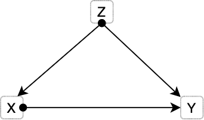
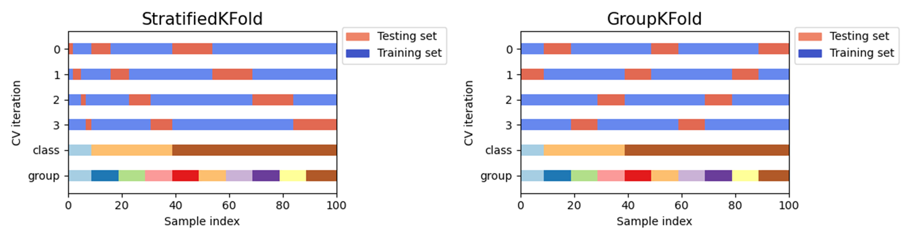
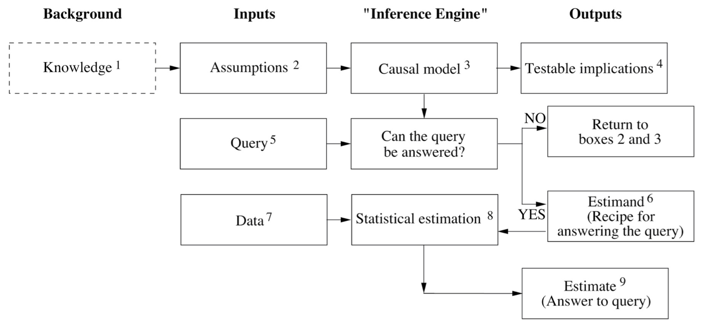

# Experimental Control and Statistical Abuse {#stats-abuse}

:::: {.notebox data-latex=""}
::: {.center data-latex=""}
**Course Note:**
:::

This chapter is under construction. Some content is hidden.
::::

## Overview

Daniel did not think of everything when designing his experiment. He did not take confounding bias into account. For instance, Daniel and his friends could have been healthier than the control group. Under such supposition, their strong appearance after ten days of a vegetarian diet may have nothing to do with the diet itself. Perhaps, they would have become even stronger if they had eaten the meat from the king. As we have seen in previous examples presented in this book, confounding bias happens when a variable influences both who is chosen for the treatment group as well as the experiment outcome. These variables might be known variables or act as a lurking third variable we are not aware of. Such variables are easy to spot in causal diagrams.

The term *"confounding"* means *"to pour, mingle, or mix together"*, and Figure \@ref(fig:confounder-simple) illustrates why such name was chosen to denominate these situations. The true causal effect $X -> Y$ is *mixed* with the spurious correlation between $X$ and $Y$ induced by the fork $X <- Z -> Y$ [@book-of-why].

```{r confounder-simple, echo=F, out.width="33%", fig.align="center", fig.cap='Most basic version of confounding situation: Z is a confounder of the proposed causal relationship between X and Y.'}

```

### The smoke debate - Part II

Many famous cases present these confounding situations. For instance, this book previously tackled the debate around smoking and lung cancer. Austin B. Hill and Richard Doll noticed that hidden biases could be present in their previous case-control studies, and the replication of the studies would not be enough to overcome them. In consequence, they began a prospective study (1951) in which they considered 60.000 physicians from United Kingdom consisting of questionnaires tackling their smoking habits. These physicians were followed over time. In just five years, heavy smokers showed a death rate from lung cancer 24 times higher than non-smokers. A similar study conducted in the United States showed that smokers died from lung cancer 29 times more often than non-smokers while heavy smokers died 90 times more frequently. However, former smokers reduced their risk by a factor of two. This behaviour is often called the “dose-response effect”, indicating that a prolonged dose of a drug causes a stronger response.

Still, R. A. Fischer and Jacob Yerushalmy remained sceptical, stating that such prospective studies failed to compare smokers to non-smokers, arguing that they were not identical groups. The rationale of the critic is that smokers in the study are self-chosen. Moreover, there might be a constitutional difference between smokers and non-smokers. For instance, smokers might be more risk-taking, or more prone to be alcoholics, which might cause adverse health effects which are then wrongly attributed to smoking by Hill and Doll studies. Another possibility they appealed to is the existence of a smoking gene that caused people to become smokers and made them more likely to develop lung cancer. 

The *constitutional hypothesis* was almost impossible to test. In 2000, the sequencing of the human genome became real and with it the possibility to study links between genes and lung cancer. Actually, such genes do exist, as with breast cancer that make people more prone to develop certain types of cancer. In 1959, a couple of researchers published a rebuttal of Fischer's arguments that settled the debate. One of the researchers, Cornfield, was not a statistician, nor a biologist, but instead, a historian with statistical knowledge who worked in the department of agriculture (this is of course not a cause of his family name). Cornfield aimed to debunk such constitutional hypothesis with the following reasoning: suppose the possibility of a confounding factor (e.g. smoking gene) that would fully explain the cancer risk of smokers. If smokers have 9 times the risk of developing lung cancer, the supposed confounding factor ought to be at least nine times more common in smokers to account for such risk difference. Let's exemplify this. If 11% of non-smokers have such a gene, then 99% (since they have 9 times more risk: 11 x 9) of smokers would have to have the gene. But if 12% of non-smokers would have the smoking gene, then it is not mathematically possible for the cancer gene to fully explain the association between smoking and lung cancer. This is none as Cornfield's inequality, and led to the development of sensitivity analysis.

The above's explanation shows that the association between smoking and lung cancer is too strong to be explained by appeal to a smoking gene (or any other constitutional hypothesis). In essence, Cornfield's rationale gives us a way to choose between both causal diagrams. Once it becomes evident that such constitutional hypothesis is not able to fully explain the association, the relationship between smoking and lung cancer (left diagram) becomes apparent.

```{r smoke-debate-dia, echo=F, out.width="70%", fig.align="center", fig.cap='The causal diagram on the left presents the situation in which the constitutional hypothesis is insufficient to explain the association between smoking and lung cancer. The diagram on the right side depicts the alternative situation in which the smoking gene fully explains the observed association.'}
knitr::include_graphics('Figures/SmokeDebate_diagram.png')
```

The tobacco industry magnified any bit of controversy they could find on the scientific studies. Such organised denialism explains why the link between smoking and cancer remained so controversial in the public long after the debate was settled among epidemiologists.

> Remarkably, even researchers at the tobacco companies were convinced—a fact that stayed deeply hidden until the 1990s, when litigation and whistle-blowers forced tobacco companies to release many thousands of previously secret documents. In 1953, for example, a chemist at R.J. Reynolds, Claude Teague, had written to the company’s upper management that tobacco was “an important etiologic factor in the induction of primary cancer of the lung,” nearly a word-for-word repetition of Hill and Doll’s conclusion. --- The Book of Why [@book-of-why].


<!--
Continue on the example from chapter \@ref(empirical-practices) from Chapter 4 from the Book of Why.

For the Abuse of event space: If we shrink the hypothesis space, the bound improves, but the chances that it contains the true classifier shrink also. (pedro domingos)

https://catalogofbias.org/biases/collider-bias/#:~:text=The%20collider%20bias%20occurs%20when,effect%20of%20obesity%20on%20mortality.

Include continuation from smoke debate

-->

## Experimental Control

Experimental control entails a series of procedures for experiment and observation design aimed at minimising the effects of extraneous variables (i.e. confounding factors) other than the manipulated variables (i.e. independent variable) to ensure that the measured variable (i.e. dependent variable) is only affected by the independent variables. To evaluate the effects of manipulating the independent variables, some control system is needed in which no such deliberate changes are introduced. As we have seen, sampling units (e.g. study participants) are often divided into two groups (the experimental group and the control group) in a way that the only noticeable (or significant) difference between them lies in the stimuli exerted by the experiment.
Therefore, the control and experimental groups must be *homogeneous* in all relevant factors. 

In general, there are two techniques for the formation of such homogeneous groups: individual and collective control [@bunge2017philosophy]. **Individual control** requires simultaneous pairing of individuals in both groups, i.e. every member of the experimental group has a corresponding equivalent member in the control group. For instance, for every thirty years old Asian man in the control group another thirty years old Asian man is assigned to the experimental group. Simultaneous pairing is complex and expensive. **Statistical control** has two main types. On one side, the *control of distributions* should be performed to equate certain parameters such as averages, spreads (i.e. std. dev.) and other collective properties (e.g. medians). This technique is more flexible as only some properties are kept under control. In this case, we would take two samples of people with the same age and height distributions. Both simultaneous pairing and distribution control share a common disadvantage regarding the formation of the groups, which could be unintentionally biased. For instance, we could assign the strongest people to the treatment (or experimental) group to make sure they bear the treatment. To prevent this issue the two groups are usually formed at random. Thanks to **randomisation**, all variables (including most unknown factors) that were not previously controlled become randomly distributed, minimising their effect on the dependent variables. However, randomisation is not an alternative to other techniques, but rather a complement.

### Other experimental control techniques

There are multiple strategies for experimental control. We have previously seen the method of division into treatment and control groups. The control and treatment groups can entail two moments in **time**, with the initial setting being the control scenario which is later on manipulated through the intervention of certain variables (e.g. measure noise from bats in a dark chamber before and after turning a light). Another technique requires **holding certain factors constant** or finding scenarios (like in a field experiment) with the same background conditions. Nonetheless, constructing such conditions in a laboratory can also achieve this goal. In an **elimination** strategy some factors are removed to simplify study conditions, such as air resistance in a vacuum chamber or [drop tower](https://en.wikipedia.org/wiki/Drop_tube), radio waves in a Faraday cage, or gravity in space experiments. A common case of elimination is **blinding**, where subjects do not know which group they are assigned to (single blinding). Moreover, double-blinding implies hiding this information from the experimenter and/or the data analyst. Finally, we can **separate factors** by measuring their effect and correcting for it. For example, the measurements of time dilation require taking into account the Doppler effect caused by the changing distance between the observer and the moving clock. GPS systems perform adjustments due to the effects of time dilation and gravitational frequency shifts. Another example, missile trajectories are often adjusted for the effect of [Coriolis force](https://en.wikipedia.org/wiki/Coriolis_force).

---

(ref:pyramid-evidence) Figure from [Wikimedia](https://commons.wikimedia.org/wiki/File:Research_design_and_evidence_-_Capho.svg) by CFCF. Keep in mind that this hierarchy is not free from [criticism](https://en.wikipedia.org/wiki/Hierarchy_of_evidence#Criticism) and take it just as a useful simplification.

```{r pyramid-eviodence, echo=F, out.width="70%", fig.align="center", fig.cap='(ref:pyramid-evidence)'}
knitr::include_graphics('Figures/pyramid-evidence.png')
```

## Randomised Control Trials

The fundamental problem of causal inference tell us that it is impossible, by definition, to observe the effect of more than one treatment on a subject over a specific time period. A study participant cannot both take the pill and not take the pill at the same time. Directly observing causal effects is impossible. Nonetheless, this does not make causal inference impossible. There are certain techniques and assumptions that allow to circumvent the fundamental problem. In this context, randomized experiments allow for the estimation of population-level causal effects. 
<!--- https://en.wikipedia.org/wiki/Rubin_causal_model#The_fundamental_problem_of_causal_inference https://www.youtube.com/watch?v=dSOjpxo1UX0 -->

Randomisation offers a systematic solution for the division of participants (or sampling units) into two groups. In particular, RCTs are frequently regarded as a gold standard for clinical trials and among the highest quality evidence available (see Figure \@ref(fig:pyramid-eviodence)). However, as with every method, it will only yield fruitful results if applied correctly, and its sole employment does not warrant against other errors.

There are different types of randomisation. In **simple randomisation**, subjects are assigned into two groups purely randomly but in small samples, we risk creating uneven groups. **Block randomisation** works by randomising participants within blocks such that an equal number are assigned to each treatment. For example, given a block size of 4, there are 6 possible ways to equally assign participants to a block (AABB, ABAB, ABBA, BAAB, BABA, BBAA). Allocation proceeds by randomly selecting one of the orderings and assigning the next block of participants to study groups according to the specified sequence. A major disadvantage of this method is that it might be possible to predict the next sequence. **Stratified randomisation** is crucial whenever all other properties (except for the factors of interest) need to be assigned equally. The study population is first stratified into subgroups (i.e. *stratas*) sharing attributes, then followed by simple or block random sampling from the subgroups.

One of the main advantages of RCTs is the reduction of selection bias or allocation bias. In Chapter \@ref(stats-abuse) we will see biases in more detail. The randomisation process reduces mistrust towards a potential rigged distribution of the participants. Another common advantage is that it facilitates blinding the groups from investigators and participants. 

:::: {.tipbox data-latex=""}
::: { data-latex=""}
**Terminology Note:**
:::

Very often terms are used interchangeably in many domain but they can also mean different things depending on the are.

> By "allocation bias" we understand the bias caused by allocating patients with better prognosis to either the experimental or the control group. In the context of a randomized trial the term "selection bias" is sometimes used instead of allocation bias to indicate selection of patients into treatment arms. We avoid the term "selection bias" as it has a different meaning in epidemiology more broadly: selection of non-representative persons into a study. --- [@paludan2016mechanisms]

::::

However, RCTs do not necessarily ensure that background factors are equally distributed in the treatment and control groups. For small samples randomisation can provide unequal distributions. The average number after rolling a dice an infinite amount of times will converge to 3.5, but we should not be surprised if we roll a dice 10 or 20 times obtaining considerably more occurrences of the number 6 than the other numbers. The danger of relying on pure randomisation to balance covariates has been described in [@krause2003random] [@morgan2012rerandomization]. For this reason is essential to check for imbalances in known factors after randomisation. Stratified randomisation also helps balancing known factors. Nonetheless, randomisation does not necessarily guarantee full control of unknown factors but *on average* their effect should be significantly smaller than the treatment applied [@deaton2018understanding].

> When we use an RCT to evaluate an intervention, we do so with respect to one or more endpoints (or outcomes) that will be measured in the future, after the period of intervention. It could be blood pressure, death, quality of life, etc. We want to understand the causal effect of the intervention on that outcome, but this is tricky. That’s because to really understand the effect of the intervention, we would need to give it to someone and measure the outcome to see what happened. Then we would need to reset the universe back to the exact point when the intervention was given, withhold it this time, and see what happened when they were left untreated. The difference in the outcomes between the two scenarios would be our estimate of the causal effect of the intervention. This is clearly a fantasy, but hope is not lost. Thankfully we can mimic this counterfactual situation by randomizing people into groups, and since we are now talking about groups, we have to start talking about distributions of future outcomes. --- [Darren Dahly, PhD](https://statsepi.substack.com/p/out-of-balance)

Although RCTs are still preferred to observational studies, there are scenarios in which intervention is not possible. For instance, we cannot assign participants to be obese or not in order to study the effect of obesity on heart diseases.

```{r, eval=knitr::is_html_output(excludes = "epub"), results = 'asis', echo = F}
cat(
'<figure class="wrap-figure">

<figcaption>Ronald Aylmer Fisher in 1913</figcaption>
</figure>'
)
```

```{r, include=knitr::is_latex_output(), echo = F}
knitr::asis_output('\\begin{wrapfigure}{R}{.25\\textwidth}  
 \\begin{center}
    \\includegraphics[width=.22\\textwidth]{Figures/RAFisher.jpeg}  
  \\captionsetup{labelformat=empty}
  \\caption{Ronald Aylmer Fisher in 1913} 
\\end{center}
\\end{wrapfigure}
\\addtocounter{figure}{-1}')
```

### Origins of RCTs

R.A. Fisher (1890-1962) conceived the RCTs in the 1930s. Fisher designed intricate approaches to disentangle the effects of fertiliser from other variables. Using the *Latin square*, he would divide the field into a grid of subplots to test each fertiliser with each combination of soil type and plant. However, in this scenario the experimenter would observe the effects of the fertiliser *mixed* (i.e. *confounded*) with a variety of other things (e.g. soil fertility, drainage, microflora). Fischer realised that the only design that would "*trick nature*" is one where the fertilisers are assigned randomly to the subplots. Of course, sometimes you might be unlucky and assign a certain fertiliser to the least fertile subplots, but other times you might get the opposite assignment. A new random allocation is generated each time the experiment is conducted. By running the experiment multiple times the luck of each fertiliser is *averaged*. 

> But Fisher realized that an uncertain answer to the right question is much better than a highly certain answer to the wrong question. [...] If you ask the right question, getting an answer that is occasionally wrong is much less of a problem. You can still estimate the amount of uncertainty in your answer, because the uncertainty comes from the randomization procedure (which is known) rather than the characteristics of the soil (which are unknown). --- Section "Why RCTs work" in Chapter 4 from [@book-of-why]

The Book of Why describes the aforementioned experiment in causal terms [@book-of-why]. The causal diagram from Figure \@ref(fig:rct-diagram) depicts a model describing how the yield of each plot is determined by both the fertiliser and other variables, but the effect of the fertiliser is also affected by the same variables (red arrows). The experimenter aims to know about the effect of the fertiliser controlling for the latter effects. In other words, a model in which the effects represented by the red arrows are controlled. In this second scenario, the relation between Fertilizer and Yield is *unconfounded* since there is no common cause of Fertiliser and Yield.

```{r rct-diagram, echo=F, fig.align="center",  out.width="100%", fig.cap='Causal diagram depicting an improperly controlled experiment.'} 
knitr::include_graphics('Figures/RCT-causal-diagram.png')
```

### Validity

<!---

Example from § \@ref(covid-israel).

- Ref. Chapter Confounding and deconfounding, from The Book of Why.
- Ref. Judgment under Uncertainty. (Amos Tversky and Daniel Kahneman).
- Ref. John Snow and cholera.
- Ref. https://catalogofbias.org/
- The trouble with bias https://www.youtube.com/watch?v=fMym_BKWQzk
- The problem with building a fair system https://www.oreilly.com/radar/the-problem-with-building-a-fair-system/

-->

> When a hypothesis is designed to explain certain observed phenomena, it will of course be so constructed that it implies their occurrence; hence, the fact to be explained will then constitute confirmatory evidence for it. But it is highly desirable for a scientific hypothesis to be confirmed also by “new” evidence — by facts that were not known or not taken into account when the hypothesis was formulated. Many hypotheses and theories in natural science have indeed received support from such “new” phenomena, with the result that their confirmation was considerably strengthened. --- [@hempel-pos]

Transferring RCTs results to other scenarios is not trivial. All in all, RCTs results concern a particular sample used during the study. The study sample is of course drawn from a larger group, i.e. the population, but the RCT results cannot be simply applied to another sample drawn from the population. Randomisation is not the same as random sampling from the population. In fact, there are many RCT studies that misrepresented certain population groups. An example of women inclusion issues in clinical studies includes the under-representation of women in stroke randomized controlled trials, which leads to misleading conclusions that affect stroke care delivery [@tsivgoulis2017under]. A similar bias exists in animal research, including [lab mice](https://www.wired.com/2016/07/science-huge-diversity-problem-lab-rats/). 

> Most rodents used in biomedical studies --- the ones that suss out the effects of treatments before they make it to humans --- have boy parts and boy biological functions. And that particular kind of gender imbalance has cascading effects. A growing body of evidence indicates that females process pain differently than males. But many lab scientists who study ways of treating pain *still *use all-male cohorts of lab mice. They say it's because male mice and rats aren't as hormonal as females—because isn't that what they always say—and are therefore more reliable in terms of getting data. And that means the scientific community is ignoring research that might help women manage pain better. --- **Science Has a Huge Diversity Problem... in Lab Mice - Wired**

---

> Of 2,347 articles reviewed, 618 included animals and/or cells. For animal research, 22% of the publications did not specify the sex of the animals. Of the reports that did specify the sex, 80% of publications included only males, 17% only females, and 3% both sexes. A greater disparity existed in the number of animals studied: 16,152 (84%) male and 3,173 (16%) female. --- [@yoon2014sex]

Therefore, RCTs must be internally valid, --- i.e. the design must eliminate the possibility of bias --- but to be clinically useful the result must also be relevant to a well-defined group of patients (i.e. external validity). Differences between trial protocol and routine practice also affect the external validity of RCTs. In [@rothwell2006factors], the authors list some of the most important potential determinants of external validity.

## Cross-validation in Machine Learning

As data scientists, you may wonder why the previous practices are relevant to your job. In this section I want to show how similar control measures must be considered regarding machine learning (ML). When applying supervised ML methods, is important to prevent over-fitting and under-fitting situations. In particular, over-fitting occurs when a model begins to *memorize* training data rather than *learning* to generalize from a trend (see Figure \@ref(fig:overfitting)). One of the techniques to detect or lessen the change of over-fitting includes cross-validation. The basis of this technique is to test the generalization power of the model by evaluating its performance on a set of data not used during the training stage.

(ref:overfitting-caption) Source: [Wikimedia](https://en.wikipedia.org/wiki/File:Overfitting.svg). The green line represents an overfitted model and the black line represents a regularized model. While the green line best follows the training data, it is too dependent on that data and it is likely to have a higher error rate on new unseen data, compared to the black line.

```{r overfitting, echo=F, fig.align="center",  out.width="45%", fig.cap='(ref:overfitting-caption)'}
knitr::include_graphics('Figures/Overfitting.png')
```

The simplest approach is the **hold out method** which entails spliting the dataset into a train and test sets. However, yet another part of the dataset is often held out (validation set) so that the model training proceeds on the training set, the model evaluation on the validation set, and once the hyperparameters are successfully tweaked, the final evaluation is conducted on the test set. This process reduces the amount of data available for training. Cross-validation (CV) alleviates this issue.

The following procedure (see Figure \@ref(fig:cross-validation)) is followed for each of the $k$ "folds":

- A model is trained using $k-1$ of the folds as training data.
- The resulting model is validated on the remaining part of the data.

The performance measure reported by K-fold CV is then the average of the values computed in the loop. This approach can be computationally expensive, but does not waste too much data [@scikit-learn].

(ref:cross-validation) Source: [Scikit-Learn](https://scikit-learn.org/stable/modules/cross_validation.html#cross-validation). A test set should still be held out for final evaluation, but the validation set is no longer needed when doing CV. In the basic approach, called K-fold CV, the training set is split into k smaller sets [@scikit-learn]. 

```{r cross-validation, echo=F, fig.align="center",  out.width="75%", fig.cap='(ref:cross-validation)'}
knitr::include_graphics('Figures/grid_search_cross_validation.png')
```

However, the vanilla approach to K-fold CV does not consider certain properties of the dataset. In particular, K-fold CV is not affected by classes or groups. For instance, the training set of the first CV iteration in Figure \@ref(fig:k-fold-vis) does not contain one of the classes.

```{r k-fold-vis, echo=F, fig.align="center",  out.width="63%", fig.cap='Source: Scikit-Learn. K-fold CV is not affected by classes or groups.'}
knitr::include_graphics('Figures/k-fold-vis.png')
```

Issues similar to the ones previously studied regarding RCTs can arise when conducting cross-validation. Some problems exhibit a large imbalance in the distribution of the target classes. For example, the negative class can be more representative than the positive class. In such cases, stratified sampling is recommended (see Figure \@ref(fig:k-fold-strategies)) to preserve relative class frequencies in each train and validation fold.

One strong assumption of machine learning theory is that data is Independent and Identically Distributed (i.i.d.), i.e. that all samples stem from the same generative process and that such process is assumed to have no memory regarding past samples. For example, a succession of throws of a fair coin is i.i.d. since the coin has no memory, so all the throws are independent. In this sense, if we know that the generative process has a group structure (e.g. samples collected from different subjects, experiments, measurement devices) we should use group-wise CV. The grouping of data depends on the context. For instance, in medical data, we can find multiple samples for each patient, so it makes sense to group the samples by patient to prevent any [*data leakage*](https://scikit-learn.org/0.24/common_pitfalls.html#data-leakage). Similarly, problems where the samples have been generated using a time-dependent process call for [time-series aware CV schemes](https://scikit-learn.org/stable/modules/cross_validation.html#timeseries-cv).

(ref:k-fold-strategies) Source: Scikit-Learn. Other K-fold CV strategies. [**GroupKFold**](https://scikit-learn.org/stable/modules/cross_validation.html#group-k-fold) is a variation of K-fold which ensures that the same group is not represented in both testing and training sets. [**StratifiedKFold**](https://scikit-learn.org/stable/modules/cross_validation.html#stratified-k-fold) is a variation of K-fold which returns stratified folds: each set contains approximately the same percentage of samples of each target class as the complete set..

```{r k-fold-strategies, echo=F, fig.align="center",  out.width="100%", fig.cap='(ref:k-fold-strategies)'}

```

Similar to RTC internal validity, cross-validation does not ensure transferability to other scenarios. External validation must be performed with independent datasets to ensure robustness against new scenarios. Consider a deep-learning algorithm trained to predict the number of years a patient will survive based on its characteristics and the medication administrated. This system could be then transferred to a different hospital, in another country, region, or city where the population characteristics (diet, hygiene, professions) are different. The model will require undertaking a certain recalibration process to learn the new conditions. 

## Data alone is not enough {#data-is-not-enough}

The confirmation of a hypothesis is often considered to increase as the number of favourable test findings grows, but the increase in confirmation, produced by one new favourable instance, will generally become smaller as the number of previously established favourable instances grows [@hempel-pos]. Many researchers and data scientists blindly rely on the dogma *the more data, the merrier* but the addition of one more favourable finding raises the hypothesis confirmation but little. The confirmation of a hypothesis depends not only on the quantity of the favourable evidence available but also on its variety.

As he have seen during this course, data alone is not enough. Note that this is especially a problem for solutions based on Machine Learning, since domain knowledge or *context* should be introduced somehow to *direct* the model in the desired direction. 

> "There is no learning without bias, there is no learning without knowledge" --- [@skansi2020guide] [@domingos2015master].

An example of how data depends on its context is user ratings or opinions. For instance, the meaning of *fashionable clothes* changes over time, as do political terms. This issue is known as *concept drift* [@kubat2017introduction]. Similarly, a text-mining engine to tag biology terms with the corresponding ontology terms may confuse elements between species, as several entities appear in multiple animals or organisms. Context is crucial for external validation and translation of solutions into real-world settings. A system for clothes recommendation should adapt to countries, cultures or ages. Similarly, a health system to predict patient risk based on disease comorbidities must be *calibrated* for each country or region (e.g. Diabetes treatment is often affordable in the EU, but an expensive treatment in the USA, which increases its mortality rate).

```{r inference-engine, echo=F, fig.align="center",  out.width="90%", fig.cap='Diagram extracted from The Book of Why. The diagram depicts a hypothetical inference engine that combines data and causal knowledge to produce answers to questions of interest. Knowledge (dashed) is not part of the engine but required for its construction. Boxes 4 (testable implications) and 9 (estimate) could also feedback such knowledge to incrementally improve the engine.'}

```

Figure \@ref(fig:inference-engine) represents an ideal causal inference engine for scientific questions. Today, causal models for scientific applications are based on a similar design. It is important to notice how this diagram showcases the importance of extra-observational information (i.e. information other than data) such as **assumptions**, which derive from the available **knowledge**. With them, a **causal model** is built in any of its different forms, e.g. logical statements, structural equations, causal diagrams, etc. Causation (or a causation assumption) can be defined from the following analogy, $X$ is a cause of $Y$ if $Y$ *listens* to $X$ and determines its value in response to what it hears. For instance, the patient's lifespan $L$ is determined by the intake of drug $D$. In this case, $D$ acts as a cause of $L$ (although it might not be the only cause), which is represented by an arrow from $D$ to $L$ in a causal diagram (see Figure \@ref(fig:blueprint)). For the sake of simplicity the other causes of $L$ can be grouped in an additional variable $Z$. 

In box $4$ the patterns encoded in the paths of the causal model yields a series of observable consequences (or data dependencies), that we know as **testable implications** (remember the hypothetico-deductive method?). These implications can be used to test the model. For instance, the lack of path between $D$ and $L$ implies that $D$ and $L$ are independent, meaning that a variation of $D$ will not alter $L$. If such implication is contradicted by the data, the model should be revised bearing in mind this new knowledge. The box $5$ is in charge of the scientific **query** which must be encoded in causal vocabulary, e.g. $P(L | do(D))$, i.e. what is the probability that a typical patient would live $L$ years given that it takes the drug $D$?. 

```{r blueprint, echo=F, fig.align="center",  out.width="70%", fig.cap='Diagram depicting two different scenarios: before, and after an intervention.'}
knitr::include_graphics('Figures/blueprint.png')
```

The $do()$ operator represents an intervention in the system, in contrast to an observation $P(L|D)$. An instance of the latter would entail letting the patient decide between taking or not the drug (see left side of Figure \@ref(fig:blueprint)). Such decision might be affected by other variables we are not aware, like the patient's education, family, etc. However, when we make an intervention and assume that we are giving the drug to the patient, the arrow illustrating the patient's decision disappears (right side of Figure \@ref(fig:blueprint)).

The ***estimand*** is the recipe to answer the scientific query, written as a probability formula, such as $P(L | D, Z) \times P(Z)$. Once the **data** is introduced, an **estimate** can be calculated. Importantly, some queries may not be answerable regardless of the amount of data collected. For instance, our causal model could indicate that both $D$ and $L$ depend upon a third variable $Z$. If there would not be any way to measure $Z$, the query $P(L | do(D))$ would be unanswerable. Collecting data for this question would be worthless. Under such a scenario, the causal model needs to be reviewed. Either to introduce new knowledge to enable estimating $Z$, or to simplify the previous assumptions, potentially increasing the risk of wrong answers, e.g. stating that $Z$ has a negligible effect on $D$.

Following the analogy, the data acts as the ingredients of the recipe provided by the *estimand*. Our estimate (box $9$) represents an approximate answer to the query. Such an answer is approximate because data always represents a finite sample from a theoretically infinite population [@book-of-why]. An example of answer in this case could be that drug $D$ increases lifespan $L$ of diabetic patients by $30\% \pm 10\%$.

The most important fact about the diagram in Figure \@ref(fig:inference-engine) is that data and causal model are two independent pieces of the puzzle that later work together. Data is collected after the causal model and stating that the scientific query can be answered. The *estimand* computation does not require any data. Comparing this to conventional machine learning (ML) systems, an ML solution would have to be re-trained when moved from one hospital to another since such model just fitted a function to data, without levering from any causal model.

<!--

## Bias and Confounders

difference between both? 

#### Confirmation bias

#### Selection bias

Women and Health Research: Ethical and Legal Issues of Including Women in Clinical Studies

https://www.ncbi.nlm.nih.gov/books/NBK236575/


## Visualizations can lie

- Ref. How charts lie from Alberto Cairo. https://www.newyorker.com/magazine/2021/06/21/when-graphs-are-a-matter-of-life-and-death

Example from § \@ref(viz-hurricane).


## More...

 something as simple as median vs mean (breakdown point)
- how to lie with statistics
- statistical abuse: take a partial representation of the sample space increases its relative probability in the event space of the model
- presume normality: e.g. use a statistical test suited for gaussian distributions
- simpson's paradox (agg data)
- political use (german household ecb 2013 median, mean)
- stochastic implications of H
- quantify error H & HA example of amyloid plaque as cause of Alzheimer
-->

## Examples

### Covid-19: How can efficacy versus severe disease be strong when 60% of hospitalized are vaccinated? {#covid-israel}

:::: {.rnote data-latex=""}
*There are three kinds of lies: Lies, damned lies, and statistics*
:::

In this [blog post](https://www.covid-datascience.com/post/israeli-data-how-can-efficacy-vs-severe-disease-be-strong-when-60-of-hospitalized-are-vaccinated), biostatistics Professor Jeffrey Morris demonstrates how without properly controlling for age, efficacy against severe disease in Israel may appear weak when in fact within each age-group it is extremely strong. Consider the table from Figure \@ref(fig:vaccine-rates-a) and the following data from the the Israeli government. As of August 15, 2021 nearly 60% of all patients currently hospitalized for COVID-19 are vaccinated. Out of 515 patients currently hospitalized with severe cases in Israel, 301 (58.4%) of these cases were fully vaccinated.

```{r vaccine-rates-a, echo=F, out.width="70%", fig.align="center", fig.cap='Misleading table. This kind of tables have been used to claim that vaccines do not work or that its efectiveness reduces over time.'}
knitr::include_graphics('Figures/vaccines-ex-fig1.png')
```

The numbers are true, but we need more than that to draw a proper conclusion about vaccine efficacy. Consider the following extreme scenarios. If the number of vaccinated people would be 0 we would expect all severe cases to be not vaccinated (obviously). On the other hand, if 100% of people would have been vaccinated, we would expect all severe cases to proceed from vaccinated people and 0 from non vaccinated. In this case, we have an in-between situation where 80% of residents (older than 12 years) have been vaccinated. Therefore, since the group of vaccinated people is larger than the non-vaccinated, we can expect more severe cases in absolute numbers. However, once we adjust for vaccination rates and normalise the counts, the story changes. The rate of severe cases is three times higher in unvaccinated individuals.

```{r vaccine-rates-b, echo=F, out.width="70%", fig.align="center", fig.cap='Table adjusted for vaccination rates.'}
knitr::include_graphics('Figures/vaccines-ex-fig2.png')
```

> Vaccine Efficacy vs. Severe disease = 1 -  5.3/16.4 = 67.5%.
> The interpretation of this number is that the vaccines are preventing >2/3 of the serious infections leading to hospitalization that would have occurred sans vaccination.

Still, the obtained efficacy is lower than what we would expect. There are other factors that contribute to this confusion, including: age disparity in vaccinations, old people is more likely to be hospitalized than young people, etc.

I recommend going through the blog post to see how the author continues to apply adjustments and stratifications to find the true efficacy of the vaccines. Moreover, this is a good example of the Simpson's paradox, where misleading results can be obtained in the presence of confounding factors.

> In conclusion, as long as there is a major age disparity in vaccination rates, with older individuals being more highly vaccinated, then the fact that older people have an inherently higher risk of hospitalization when infected with a respiratory virus means that it is always important to stratify results by age; Even more fundamentally, it is important to use infection and disease rates (per 100k, e.g.) and not raw counts to compare unvaccinated and vaccinated groups to adjust for the proportion vaccinated.   Use of raw counts exaggerates the vaccine efficacy when vaccinated proportion is low and attenuates the vaccine efficacy when, like in Israel, vaccines proportions are high.

### Misinterpretations of hurricane forecast maps {#viz-hurricane}

The [following article](https://www.nytimes.com/interactive/2019/08/29/opinion/hurricane-dorian-forecast-map.html) by Alberto Cairo published in The New York Times explains how hurricane cone forecast maps can mislead the public and produce real-world consequences.

```{r hurricane-tv, echo=F, out.width="66%", fig.align="center", fig.cap='Example of hurricane forecast cone graphic in TV.'}
knitr::include_graphics('Figures/hurricane-forecast-maps-tv.png')
```

[Studies](https://www.semanticscholar.org/paper/Misinterpretations-of-the-%E2%80%9CCone-of-Uncertainty%E2%80%9D-in-Broad-Leiserowitz/f7c04b6eb883cf7d7fdee007cda056ed18182829) show that people can misinterpret this type of map as indicating that the hurricane will get bigger over time. Others think it shows areas under threat. Recent [research](https://interactive.miami.edu/hurakan/) suggests that 40% of people would not feel threatened if they lived just outside of the cone. Moreover, people who live inside the cone, but far from the center, take less precautions than those closer to the central line. These misunderstandings have real-world consequences. Actually, the cone represents a range of possible positions and paths for the storm’s center. The dots in the middle of the cone correspond to the forecast of where the hurricane’s center could be in the following five days. But there’s a good chance that the actual center of the storm will not end up being at those positions.

To create the cone, the National Hurricane Center (N.H.C.) surrounds each estimated position of the storm center with circles of increasing size. **These circles represent uncertainty**, meaning that the storm center may end up being anywhere inside the circles — or even outside of them. The uncertainty circles grow over time because it is more difficult to to predict what will happen in five days from now than in one day. Finally, a curve connects the circles, resulting in what is popularly known as the 'cone of uncertainty'.

```{r hurricane-map, echo=F, out.width="66%", fig.align="center", fig.cap='Cone of uncertainty.'}
knitr::include_graphics('Figures/hurricane-forecast-maps.png')
```

> N.H.C. says cones will contain the path of the storm center only 60 to 70 % of the time. In other words, one out of three times we experience a storm like this, its center will be outside the boundaries of the cone. Hurricanes are also hundreds of miles wide, and the cone shows only the possible path of the storm’s center. Heavy rain, storm surges, flooding, wind and other hazards may affect areas outside the cone. The cone, when presented on its own, doesn’t give us much information about a hurricane’s dangers. The N.H.C. designs other graphics, including this one showing areas that may be affected by strong winds. But these don’t receive nearly as much attention as the cone. The cone graphic is deceptively simple. That becomes a liability if people believe they’re out of harm’s way when they aren’t. As with many charts, it’s risky to assume we can interpret a hurricane map correctly with just a glance. Graphics like these need to be read closely and carefully. Only then can we grasp what they're really saying.

:::: {.rnote data-latex=""}
From a [NYT article](https://www.nytimes.com/interactive/2019/08/29/opinion/hurricane-dorian-forecast-map.html) by Alberto Cairo
:::

```{r hurricane-heatmap, echo=F, out.width="66%", fig.align="center", fig.cap='Other graphics designed by USA National Hurricane Center.'}
knitr::include_graphics('Figures/hurricane-forecast-heat-map.png')
```


<!--

https://www.propublica.org/article/machine-bias-risk-assessments-in-criminal-sentencing

https://en.wikipedia.org/wiki/List_of_cognitive_biases

### Study about honesty is retracted over fake data

https://www.buzzfeednews.com/article/stephaniemlee/dan-ariely-honesty-study-retraction

https://twitter.com/jpsimmon/status/1427628315939049491


Women in Data Science

We have seen the contributions of **Mary Hesse** to different concepts of Philosophy of Science. [...]

Elisabeth Bik --- Dutch microbiologist and scientific integrity consultant. She is known for her work detecting photo manipulation in scientific publications, and identifying over 4,000 potential cases of improper research conduct, including 400 research papers published by authors in China from a "paper mill" company.

https://www.newyorker.com/science/elements/how-a-sharp-eyed-scientist-became-biologys-image-detective

Kate Crawford --- Principal researcher at Microsoft Research, co-founder and director of research at the AI Now Institute at NYU, a visiting professor at the MIT Center for Civic Media, a senior fellow at the Information Law Institute at NYU, and an associate professor in the Journalism and Media Research Centre at the University of New South Wales. She is the author of "Atlas of AI: Power, Politics, and the Planetary Costs of Artificial".

Rachel Thomas --- Co-founder of fast.ai. Thomas was selected by Forbes magazine as one of the 20 most incredible women in artificial intelligence.
Thomas is concerned about the lack of diversity in AI, and believes that there are a lot of qualified people out there who are not getting hired. She has particularly focused on the problem of poor retention of women in tech, noting that "41% of women working in tech leave within 10 years. That's over twice the attrition rate for men. And those with advanced degrees, who presumably have more options, are 176% more likely to leave." Thomas believes AI's "cool and exclusive aura" needs to be broken in order to unlock it for outsiders, and to make it accessible to those with non-traditional and non-elite backgrounds.


-->
