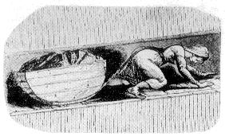
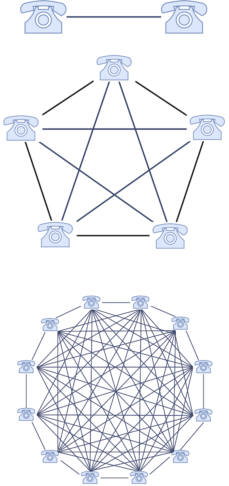
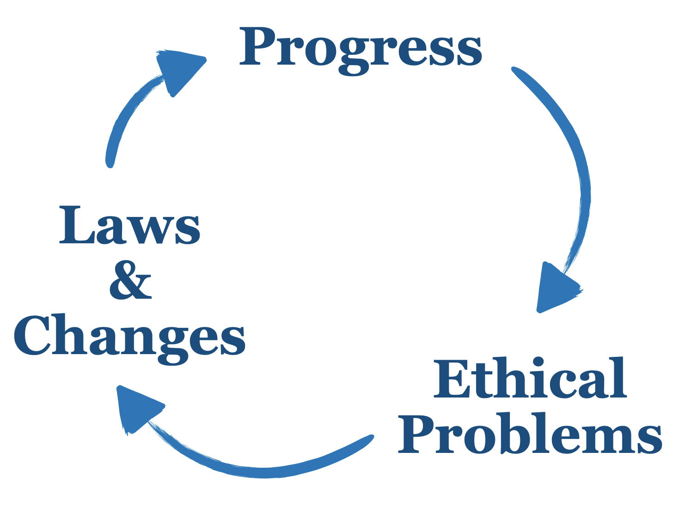
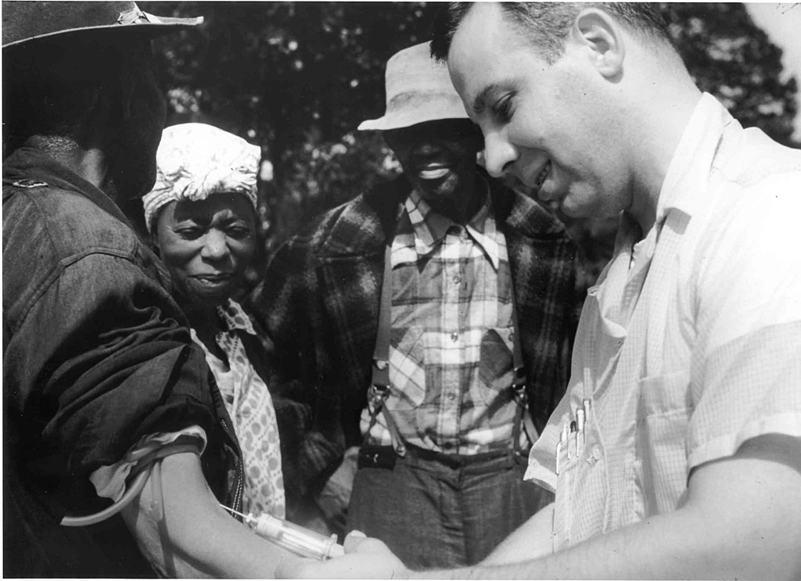
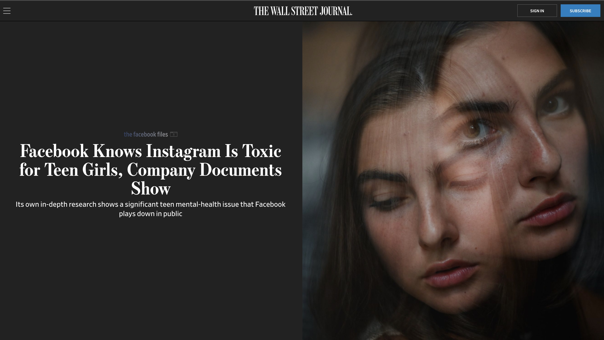
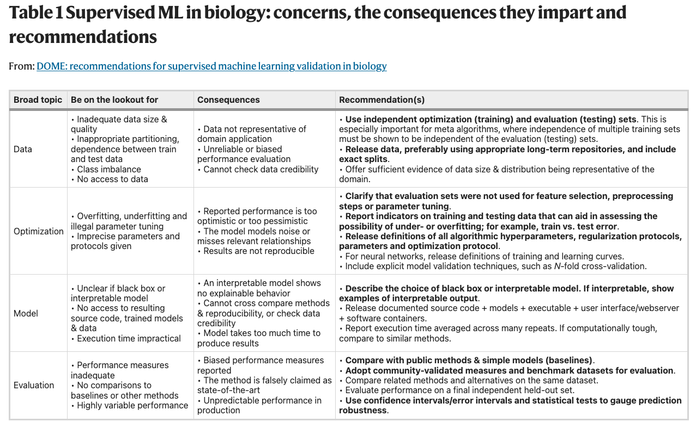
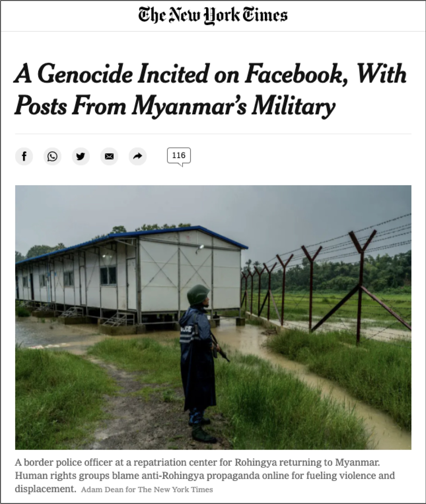
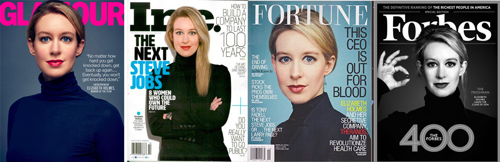

# Ethics and Responsibility


<!-- REPLACE WITH LOCAL FILE -->

<!--

- What are ethics (done)
- Ethical Frameworks (done)
- Informed Consent
- Data Repurposing
- Data Ownership
- - Data Curation, Limitations, Data Destruction
- Privacy
- Anonymity
- Validity
- - Sources of error, Gradual drift, Choice of Attributes, Errors in data processing
- Algorithmic Fairness
- - Proxy attributes, Diversity suppression, Geopricing


-->


## Overview

Very often, progress, ethics and laws go hand in hand. The industrial revolution increased the living standards but also brought new challenges, problems and ethical questions. Labour conditions were harsh, and child labour was common long before the industrial revolution. Progress and technology raise new ethical questions. Bit by bit certain practices and conditions became culturally unacceptable. Then a growing social consensus in the same direction eventually forced laws to reflect those changes. Nowadays, working rights such as office restrooms or the lunch break are widespread.

```{r coaltub, echo=F, out.width="25%", fig.align="center", fig.cap='A young drawer pulling a coal tub along a mine gallery.'}

```

Similarly, we live in the information revolution, which has transformed the way societies communicate in a way not seen since the Gutenberg printer revolution, enabling the world to transmit information worldwide almost instantaneously through the interconnection of computers. The information era brings ethical challenges to a new dimension. Gutenberg's print helped to spread literature and knowledge, but it also made it easier to spread hate and fake news (see [this article for some examples](https://www.politico.com/magazine/story/2016/12/fake-news-history-long-violent-214535/)). Today, tools like Facebook have been used to incite the [genocide of Rohingya in Myanmar](https://www.nytimes.com/2018/10/15/technology/myanmar-facebook-genocide.html). Every data scientist must understand the impact of their work for the good and the bad. Something as simple as a good visualization can be enlightening and convince people to get a vaccine or find the root of an outbreak (see the map of John Snow). But bad data science can have unexpected real-world consequences too.

In this chapter, we will not address all the philosophical questions regarding ethics, which are [lengthy](https://en.wikipedia.org/wiki/Ethics) but will try to focus on the ethical practice of data science. Many ethical questions affecting data ethics have already been tackled during this book. Such questions have been interleaved during this book together with other topics, e.g., algorithmic fairness, validity issues and their consequences. Therefore, this book provides a utilitarian framework of ethics. This chapter describes how ethical values, regardless of which they may be, affect the practice of data science, either because of the lack of commitment to them or to how data science is conditioned when abiding by them.

This chapter begins by delving into the definitions of ethics, some ethical frameworks and the values of science. Next, it will describe how ethics are meant to be articulated. Aferwards we will be ready to tackle data ethics and the topics affecting it. Finally, a short summary of the GDPR and examples affecting data ethics are provided to illustrate the impact and significance of this new field.

## Morality and Ethics

```{r, eval=knitr::is_html_output(excludes = "epub"), results = 'asis', echo = F}
cat(
'<figure class="wrap-figure">

<figcaption>2 phones can establish just one connexion, 5 may establish 10 connections, and 12 can set 66.</figcaption>
</figure>'
)
```

```{r, include=knitr::is_latex_output(), echo = F}
knitr::asis_output('\\begin{wrapfigure}{R}{.25\\textwidth}  
 \\begin{center}
    \\includegraphics[width=.22\\textwidth]{Figures/metcalfe.png}  
  \\captionsetup{labelformat=empty}
  \\caption{2 phones can establish just one connexion, 5 may establish 10 connections, and 12 can set 66.} 
\\end{center}
\\end{wrapfigure}
\\addtocounter{figure}{-1}')
```

Ethics comes from the Greek word *Ethos*, meaning habit or custom. Ethics are theories that offer normatively valid reasons to rationally endorsing a code of behaviour. In general, the cost of following an ethical rule is less than the benefit we obtain from others following the same rule (e.g. “not stealing does not require an effort from myself, and I get a huge benefit from others following the same rule”). In this sense, like many other social phenomena, ethical rules can be regarded as a network which follows Metcalfe’s Law, which implies a critical mass point in network size, after which network value begins to exceed its cost [@metcalfe2013metcalfe]. This behaviour explains why ethical or societal changes may often be adopted very quickly after a long *plateau*. However, this may happen bothways, either after reaching a certain mass point or receding from it. For example, feminist ethics aims to understand, criticise and correct how gender operates within our moral beliefs and practices [@sep-feminism-ethics]. Similarly, we can find environmental ethics and, of course, data ethics. In science, we often need to answer ethical questions like: 

- Is it right to use RCT in this specific scenario? 
- Under what conditions is justified to conduct animal experiments?

All ethics groups aim to understand, criticise and correct how certain actions impact a particular sphere. Similarly, **data ethics aim to understand, criticise and correct how our data practices (from collection, to processing, analysis) operate within our moral beliefs and impact our society**.

Descriptively, *morality* refers to a code of conduct that is put forward by a society or group (e.g. a religion), or accepted by an individual. In a normative sense, *morality* refers to a code of conduct that would be accepted by anyone who meets certain intellectual conditions (e.g. being rational) [@sep-morality-definition]. For example, a company is not a *moral agent* but it can encourage a certain *code of conduct* to their workers. Even though *morality* is the subject matter of ethics, it is most often used interchangeably with *ethics*. Finally, ethics are not laws but laws are often used to enforce certain shared social values.

In essence, ethics tell us about what is right and wrong. They are the cornerstone of civilisation and no human practice is foreign to ethical values, although these may vary from region to region or over time. Therefore, ethics are context dependent. For many, their moral principles stem from religious teachings, ideologies, philosophies, etc. These can promote ethical behaviour, but it does not mean that ethics should necessarily stem from a religion or belong to a particular ideology or philosophy. 

Finally, ethics are not laws but very often laws reflect the societal ethical consensus. Progress brings new ethical questions, resulting in a changing societal consensus that eventually translates into new laws. A notable example is the advent of the industrial era which radically reshaped the working methods and workers conditions. Workers fought to claim certain rights and conditions improvement (e.g. have a place to have lunch, time to have lunch, toilets, etc.). However, ethical changes may not always imply *replacing* a set of rules by another set, or *replacing* a code of conduct for another code of conduct. Back then when western countries forbid women from showing their bare legs, many women defended their right to wear whatever clothes they wanted and as short as they wanted. Clothes like the mini-skirt became a symbol because it challenged the established code of conduct. In the same way, trousers also became a symbol for women empowerment in the 1850s (see bloomers), also to show that they could also be part of the workforce. Nevertheless, **what is important about this** kind of changes is not that they were replacing their clothes for another set of clothes. They wanted to have the choice, to have control over their clothes. All in all, just because people could wear whatever they wanted it does not mean that they will wear it. But people now have the right to choose.

Exactly the same can be applied to data science in many scenarios. The most notable case affects browsing the internet and the recent regulations for cookies. Thanks to the new regulations, any website you browse should give you the choice to either accept analytics cookies or not. **Data ethics is about having control as data subjects over your data**. You have the choice to withdraw from a study or remove your data from Facebook or Twitter. **Data ethics extend your rights and those from which you may collect data**.

```{r ethics-cycle, echo=F, out.width="33%", fig.align="center", fig.cap='Ethics guide the creation of laws. Progress brings new ethical questions.'}

```

## Ethical Frameworks

In this book we will not delve into the different ethical frameworks. However, it is important to regard at least three of them superficially.

### Consequentialism 

In a consequential ethical framework, our choices are morally assessed only by their consequences (e.g. utilitarians may evaluate their choices based on the obtained pleasure, happiness, welfare, safety). People may obtain pleasure or satisfaction from a car based on different attributes. Speed may satisfy your need to arrive earlier to your destination. Public transport may be preferred in terms of safety or pollution. Similarly, there are consequences to consider in science and data science. Is your computer program faster although it requires 100 computers? 

Sometimes we need to trade off such consequences and for example trade off speed in exchange of a less costly solution (using 100 computers needs a lot of energy). Thus, science also deals with epistemic consequences, such as whether the model predictions are precise or accurate; or if the explanations of our scientific theories are successful. Other actions may affect institutions. If the scientific method and the appropriate means are not properly followed, errors may happen, damaging the trust of an institution, the impartiality of a jury, and so on.

The consequentialism framework is not exempt from issues. Consequentialism is very demanding since all acts are either required or forbidden because every choice has consequences. Importantly, consequences are not always clear and evident. For instance, sharing my medical records may improve general health care at the cost of losing my individual privacy.

### Deontology

> "Act as if the maxim of your action should become, by your will, the universal law of nature." --- Categorical Imperative of Immanuel Kant

For deontology, to choose morally is to satisfy relevant rules and duties. Deontology comes from the greek word *deon* (duty). Under this framework, some choices are not justified because of their effects. People's rights are a good example (e.g. right to demonstrate, expression). 

Some examples include the journalist deontology code which considers the right of people not to answer a question. Nurses have a deontology code under which they are required to obtain consent from the patient or its relatives. Note that the actions of a nursing team could have beneficial consequences for the patient but they need to wait for the consent. Of course, deontology codes always provide exceptions (e.g. an unconscious person in the sidewalk must be helped).

> "Some choices cannot be justified by their effects, no matter how good their consequences are, some choices are forbidden and others mandated." --- [@sep-ethics-deontological]

The advantages of deontology over consequentialism lie in the ability to create checklists and conduct codes without the need to consider all consequences. Some examples of such checklists exist in data science.

- [FAIR](https://www.go-fair.org/): Findability, Accessibility, Interoperability, and Reuse of digital assets [@wilkinson2016fair].
- DOME: recommendations for supervised machine learning validation in biology [@walsh2021dome].

Deontology issues relate to the blind compliance with deontological norms, which may bring disastrous consequences. This problem may lead to deontology fundamentalism that forbids questioning the rules. Categorical rules may lack degrees of wrongness.

There have been various attempts to reconcile deontology with consequentialism. The proposed "threshold deontology" indicates that rules must govern up to a certain point regardless of the adverse consequences. But once the consequences become so dire that they cross a stipulated threshold, consequentialism takes over.

### Virtues

Finally, we have virtue ethics. Defenders of this view argue that morality consists of having proper character traits, i.e. virtues, and to exemplify them through their use. Some argue that certain traits define humans, what we usually refer as humanity (hospitality, etc.). Philosophers like Aristotle argued that there are some traits that distinguishes us as humans (e.g. compassion, help, generosity).

In science, there are many virtues that we need to consider every day. Scientists need to defend their colleagues or find the courage to criticise them. Scientists need to be honest and sincere. The problem, as can be seen, is that virtue ethics is less demanding than a defined set of rules or codes of conduct. Virtues do not state any set of rules or quantities regarding the amount of your honesty or help. However, virtues are usually accompanied by justifications from a moral perspective. For instance, "I do help because I believe helping is good".

Importantly, deontology codes are better understood when they are properly justified. However, many prescriptions from deontology codes cannot be justified by virtues right away. For instance, helping is a strong virtue, but providing treatment without consent is not acceptable. Moral conflicts can be difficult to solve by reference to virtues alone. These conflicts are common in science and data science, e.g., should we employ animals for research?. 

## Values in Science 

> "One cannot deduce an 'ought' from an 'is'" --- David Hume

In his book "Philosophy of Science for Scientists" (Springer), Lars-Göran Johansson dedicates the 13th Chapter to discuss the role of values in science and to different views regarding the meaning of value-free science. I would like to superficially tackle this topic as I believe it to impact data science as it does for general science. As Johansson argues, a strong interpretation of value-free science would not contain any expression of values. However, as the author points out, this view ignores potential effects on some groups [@johansson2016philosophy]. For instance, such a view of data science would perhaps ignore fairness values, hence ignoring an appropriate data collection, including a diversity of individuals or a proper evaluation of the outcome performance (either of an analysis or a model) on different groups. Another alternative, perhaps more reasonable, is that researchers should not convey their values. However, a researcher could provide an accurate description of the effects of some measures and yet recommend a particular action based on its subjective analysis of the analysed effects. It is then up to the reader to distinguish between the first part and the prescription.

A third interpretation, the author adds, is that "one ought not to deduce value statements from premises that only contain descriptive statements" (see Hume's quote). However, very often, political argumentation breaks this rule, usually by jumping from descriptive statements to normative statements while leaving out (sometimes deliberately) an intermediate premise. This last issue stems from the [is-ought problem](https://en.wikipedia.org/wiki/Is%E2%80%93ought_problem) and [fact-value distinction](https://en.wikipedia.org/wiki/Fact%E2%80%93value_distinction). 

:::: {.tipbox data-latex=""}
::: { data-latex=""}
**Note for data scientists!**
:::

A **descriptive statement** gives an account of how the world is without stating whether that is good or bad. Thus, such statements describe in an objective or non-judgmental way. Conversely, a **normative statement** expresses an evaluation, stating that something is good or bad, better or worse, relative to some standard or alternative (i.e. norm).

::::

Regardless of the [interpretation debate](https://plato.stanford.edu/entries/hume-moral/#io) of Hume's words [@sep-hume-moral], it is never easy not to deduce normative conclusions from descriptive statements, specially in fields such as psychology, economics or political science. And very often, words such as prosperity, democracy are used to describe, but they are nonetheless normatively charged words. The important conclusion is to explicitly indicate the norm and definitions of such terms in our research, specially considering that definitions and norms may evolve over time.

Consider the following quotes regarding value-free and value-laden science.

> Everybody would agree that scientific knowledge has sometimes been used for unethical ends — to make nuclear and chemical weapons, for example. But such cases do not show that there is something ethically objectionable about scientific knowledge itself. It is the *use* to which that knowledge is put that is unethical. Indeed many philosophers would say that it makes no sense to talk about science or scientific knowledge being ethical or unethical *per se*. For science is concerned with facts, and facts in themselves have no ethical significance. It is what we do with those facts that is right or wrong, moral or immoral. On this view, science is essentially a *value-free* activity. --- [@okasha-pos]

> Research aimed at finding better treatment for diseases are certainly value-laden; we would give very high value to positive results in this area. But, of course, reports of such results, if they are found, should be value-free; we want objective knowledge about what to do for curing and/or preventing severe diseases. That is to say, scientific activity can be value-laden and value-free at the same time. --- [@johansson2016philosophy]

One takeaway message from this section is that science is driven by values. Science is, therefore, value-laden, but its results can, and should, be value-free. Whether a researcher comes to a conclusion that stands in line or that undermines the researcher's non-scientific interests, one must, under all circumstances, evaluate the matter itself, as such considerations are not relevant arguments for or against the scientific work at issue.

A relevant example is the feminist critique of science [@sep-feminist-science] and the existence of certain unconscious assumptions from which researchers might be unaware until recently. A notable example of this includes the research on [myocardial infarction](https://en.wikipedia.org/wiki/Cardiovascular_disease_in_women#History), which was mainly conducted on men. Today we understand symptoms vary between women and men. This issue resulted in underdiagnosis and mistreatment of infarction in women. Similarly, some assumptions derived from the modern state of society, have been employed to describe social patterns in prehistory in research. For instance, the division of labour between sexes with men dedicated to outdoor activities and women dedicated to home activities has conditioned the research about prehistoric humans. Recent studies [challenge the common assumption that prehistoric men hunted while women gathered](https://www.nationalgeographic.com/science/article/prehistoric-female-hunter-discovery-upends-gender-role-assumptions). The relevant conclusion is not whether the previous research is false but that unconscious norms regarding what we consider 'normal' may affect our criteria to focus on some circumstances and ignore others. What we consider 'normal' or 'common' may vary across regions and over time. All in all, humans are not neutral observers of the external world.

Sorting phenomena into categories is an interest-related task [@johansson2016philosophy] but is also unavoidable. Nevertheless, is important to make such interests explicit. An example of such categories defined by humans is diseases, which are progressively updated, hierarchized or redefined according to new knowledge. Diseases are not found in nature as entities *per se*; they refer to a definable deviation from a normal phenotype evident via symptoms and/or signs. The different sets of symptoms, pathologies and signs are grouped into diseases, and likewise diseases are grouped into categories, all of them organised into disease taxonomies (e.g. International Classification of Diseases). Thus, one disease can have more than one etiology, and one etiology can lead to more than one disease [@vega2021hume].

## Ethics in action

> "There are years, centuries, in which nothing happens, and there are days, like yesterday, into which a whole lifetime is compressed." --- The devil [@vanwestrum1908devil]

Some events in history completely changed how we see the world. Section \@ref(ethic-examples) will present some of these events and how they relate to data ethics. However, the consequences of these events share common aspects. In the case of data ethics and science, some events have reshaped the societal consensus and the conception of certain rights. For instance, the scandals and ban of Dichloro-diphenyl-trichloroethane ([DTT](https://www.nytimes.com/2004/04/11/magazine/what-the-world-needs-now-is-ddt.html)) as insecticide changed the cultural awareness regarding chemicals. In the USA, the [Tuskegee tragedy](https://en.wikipedia.org/wiki/Tuskegee_Syphilis_Study) raised ethical questions regarding voluntary informed consent, which led to the establishment of the [National Commission for the Protection of Human Subjects of Biomedical and Behavioral Research](https://en.wikipedia.org/wiki/National_Commission_for_the_Protection_of_Human_Subjects_of_Biomedical_and_Behavioral_Research) and the [National Research Act](https://en.wikipedia.org/wiki/National_Research_Act). Both were intended to shape bioethics policies in the USA and the establishment of institutional review boards for the studies. 

More recently, [IBM faced an scandal](https://www.nbcnews.com/tech/internet/facial-recognition-s-dirty-little-secret-millions-online-photos-scraped-n981921) in 2019 regarding the scrapping of millions of on-line pictures without consent for the development of facial recognition technology. Also, in 2019, [Project Nightingale](https://en.wikipedia.org/wiki/Project_Nightingale), was a data storage and processing project by Google and Ascension (one of the largest private healthcare systems in the United States), which involved the secret transfer of medical data of up to 50 million US Americans. The data was transferred without consent from doctors and patients containing full personal details, including name and medical history and could be accessed by Google staff ([The Guardian, 2019](https://www.theguardian.com/technology/2019/nov/12/google-medical-data-project-nightingale-secret-transfer-us-health-information)). The raw data included lab results, diagnoses, hospital records such as medical history, and personal details of patients. In the 2010s, the [Facebook-Cambridge Analytica scandal](https://en.wikipedia.org/wiki/Facebook%E2%80%93Cambridge_Analytica_data_scandal) involved the unconsented personal data collection from millions of Facebook users by British consulting firm Cambridge Analytica. This data was predominantly employed for political advertising. This event led to the development of the `#DeleteFacebook` movement, among other cultural and political consequences. The Federal Trade Commission fined Facebook with $5 billion. The cultural impact of these scandals was huge and led to massive media coverage, TV shows and films. Regulators and law makers also acted to further protect users data ownership. 

In this sense, **ethics are intended to be actionable**. For instance, environmental ethics [@sep-ethics-environmental] make considerations about the moral relationship of human beings to the environment and its non-human contents, e.g., "is it morally acceptable to pollute a river for the production of energy?". Once we answer such questions, actions need to *make a difference*, e.g., translating the answer into rules, laws or regulations to either allow, forbid or limit such practice. Answering ethical questions or showcasing a position to them is not enough. For example, if the societal consensus (either at a company level or country level) agrees on the need for toilets in the workplace (or kitchens), the next step is to provide such spaces to *make a change*.

However, it is not always clear how to articulate certain ethical positions. Consider the following ethical goal: "artificial intelligence models should be equally fair for everybody disregarding of their demographic characteristics". Then consider the following issue: "does preventing any data collection of demographic information avoid the development of biased machine learning models?". How do we test if the model is fair against different population groups (e.g. minorities) if we did not collect information that let us conduct such tests? 

Sometimes it may be impossible to act according to some ethical values. For instance, you may want to buy a t-shirt manufactured under some specific conditions that you find ethical, but you may find none. Therefore you are forced to take an unethical decision according to your values. Similarly, you may need your data to meet some conditions or requirements to avoid producing a biased output (such as an analysis or an ML model). But sometimes, such data might not exist or proving such an assumption becomes challenging. Garcia et al. showcase an example of this issue in their work addressing public Covid-19 X-Ray datasets. The authors highlight that the most popular datasets were found to have a very high risk of inducing bias in models. Importantly, some solutions employed datasets containing adult individuals for the unhealthy group and a paediatric population as the control group [@santa2021public]. Such an approach raises ethical concerns regarding the risk of harmful outcomes deriving from working with poor data. In this case, new data acquisition would be needed to improve data quality and reduce the risk of producing a biased solution.

Preventing issues such as **data drift** and **concept drift** require constant monitoring of the models. Unsurprisingly, any intelligent entity interacting with a changing world requires frequent re-training and re-education. Any job requires a similar knowledge update process, from medical doctors to computer scientists or pilots. Such jobs require learning new diseases, treatments, regulations, protocols, devices, technologies, etc. Similarly, constant model evaluation is paramount to maintain the appropriate performance and fairness. Regulations and guidelines help to operate ethical considerations. For instance, the recent document "Ethics Guidelines for Trustworthy AI " published by the "high-level expert group on artificial intelligence" group from the European Commission presents transparency as a requirement for trustworthy AI. This document recommends transparency of all elements relevant to an AI system: the data, the system and the business models [@ai2019high]. Abiding to this requirement entails designing solutions with traceability and explainability in mind (among other features) so that models can be properly audited and their decisions thoroughly traced.

Other actions that may help to prevent bias and/or external validation issues include accompanying the data with metadata describing acquisition details, causal models describing the assumptions taken during the design stages, and documentation, among others [@garcia2021need].

> “In many product design (and other) endeavors, there often comes a moment when the question is asked, “Are we doing the right thing?” or “Is this the right solution?” In this context, the word right can mean many things. It can mean: Are we meeting the customer’s expectations? Is the design solution appropriate to the problem? Are we honoring the scope of the work? Is this a profitable feature to add to our product? Will people buy this? It can also mean: Do we agree that this action is acceptable to perform based on our values?” --- [@davis2012ethics]

## Data Ethics

<!-- https://www.turing.ac.uk/research/data-ethics -->

We often face situations where we care about the privacy of our data, e.g., we do not want our location to be shared with certain companies, but we wish to benefit from the same data to see if the road is jammed on our way to work. Similarly, we want our medical records to remain private but also wish to benefit from the analysis of medical records to improve the care and treatment that we receive. Moreover, we aim to automate and ease decisions thanks to data-driven algorithms but we also worry about unintended bias. Getting to know the consequences of our actions make us aware of what is right or wrong. Without that, we lack any motivation to fix potential problems. Data science is a new field and we are still defining what is right and wrong. We are starting to experience certain consequences regarding privacy, fairness, equity, etc. In this sense, a social consensus is growing, with laws and regulations enacted to enforce such values.

In this section we will tackle the origins, and the specifics of data ethics, including topics such as informed consent, data ownership and privacy. They all affect anonymity of individuals, the validity of experiments as well as the algorithmic fairness of the developed solutions.

### Origins

```{r, eval=knitr::is_html_output(excludes = "epub"), results = 'asis', echo = F}
cat(
'<figure class="wrap-figure">

<figcaption>Norbert Wiener (1894-1964). Copyright MIT Museum.</figcaption>
</figure>'
)
```

```{r, include=knitr::is_latex_output(), echo = F}
knitr::asis_output('\\begin{wrapfigure}{R}{.36\\textwidth}  
 \\begin{center}
    \\includegraphics[width=.33\\textwidth]{Figures/Norbert Wiener.jpeg}  
  \\captionsetup{labelformat=empty}
  \\caption{Norbert Wiener (1894-1964). Copyright MIT Museum.} 
\\end{center}
\\end{wrapfigure}
\\addtocounter{figure}{-1}')
```

It is important not to confuse data ethics with computer ethics and information ethics. In the mid 1940s, developments in science and philosophy led to the creation of a new branch of ethics that would later be called "computer ethics" or "information ethics". The founder of this new philosophical field was the American scholar Norbert Wiener, a professor of mathematics and engineering at MIT [@sep-ethics-computer]. Moreover, other terms such as "cyberethics" and "Internet ethics" have been used to refer to computer ethics issues associated with the Internet.

> "Because of the breadth of Wiener’s concerns and the applicability of his ideas and methods to every kind of information technology, the term “information ethics” is an apt name for the new field of ethics that he founded. As a result, the term “computer ethics”, as it is typically used today, names only a subfield of Wiener’s much broader concerns." --- [@sep-ethics-computer]

These are variously termed "computer ethics", "information ethics", or "ICT ethics" (information and communication technology ethics). "Information ethics" is
perhaps the most appropriate name for Wiener’s field of ethical research, because it concerned all means of storing, transmitting and processing information, including, for example, perception, memory, printing, telephones, telegraph, recorders, phonographs, television, radio, computers, and so on. "Computer ethics" involves ethical questions and problems that are altered by the use of computers or that would not have existed if computers had not been invented.

Although these two branches of ethics are not handled in this course, they are tightly related to data ethics.

> Data ethics builds on the foundation provided by computer and information ethics but, at the same time, it refines the approach endorsed so far in this research field, by shifting the level of abstraction of ethical enquiries, from being information-centric to being data-centric. This shift brings into focus the different moral dimensions of all kinds of data, even data that never translate directly into information but can be used to support actions or generate behaviours, for example. It highlights the need for ethical analyses to concentrate on the content and nature of computational operations—the interactions among hardware, software and data—rather than on the variety of digital technologies that enable them. --- [@luciano2016data]

### What are data ethics?

As seen in the previous section, data ethics are tightly related to computer ethics and information ethics. Data ethics may be as well be found termed as [big data ethics](https://en.wikipedia.org/wiki/Big_data_ethics) which tackles data ownership, consent, privacy, and openness among other principles. To answer this question, we need to clarify what is data science. I like the answer given by Rachel Schutt and Cathy O'Neil in their book "Doing data science: Straight talk from the frontline" [@o2013doing] in which a list of data science tasks is given (see some below). However, it is important to remember some lessons from previous chapters when we address this question. **Data science is not just to solve problems using data**, but rather to solve problems *through* data by employing a series of guidelines, practices, methods and knowledge. Consider cooking, which may look as a series of ingredients and instructions. We need the ingredients, the tools, the recipe, but in order to come up with new recipes, or to understand previous recipes, we need knowledge.

- Exploratory data analysis
- Visualization
- Dashboards and metrics
- Find business insights
- Data-driven decision making
- Data engineering / Big Data 
- Get the data themselves
- Build data pipelines
- Build products instead of describing existing product usage
- Patent writing
- Detective work, ask good questions, make hypothesis, research
- Predict future behaviour or performance
- Write up findings in reports, presentations, and journals
- Programming (proficiency in R, Python, C, Java, etc.)
- Conditional probability, optimization, algorithms, statistical models, and machine learning
- Make inferences from data
- Build data products
- Find ways to do data processing, munging, and analysis at scale
- Sanity checking
- Interact with domain experts (or be a domain expert)
- Design and analyse experiments
- Find correlation in data, and try to establish causality

Data science is not limited to big technological companies, it affects other domains such as neuroscience, medicine, environmental sciences, and so on. This broad impact comes with ethical challenges that need to be addressed.

> Data ethics can be defined as the branch of ethics that studies and evaluates moral problems related to data (including generation, recording, curation, processing, dissemination, sharing and use), algorithms (including artificial intelligence, artificial agents, machine learning and robots) and corresponding practices (including responsible innovation, programming, hacking and professional codes), in order to formulate and support morally good solutions (e.g. right conducts or right values). This means that the ethical challenges posed by data science can be mapped within the conceptual space delineated by three axes of research: the ethics of data, the ethics of algorithms and the ethics of practices. --- [@luciano2016data]

Therefore, data ethics is a branch of ethics that tackles data practices involving the collection, generation, analysis and dissemination of data which have the potential to impact people and society. Data ethics provides guidelines regarding the concepts of right and wrong conduct within the scope of data management. **All in all, data lies at the core of most solutions and research, serving as evidence of the studied phenomena and it is employed accordingly to draw conclusions about hypotheses and build theories.**

**Whereas data is ethically neutral, the *use* of data is not** [@davis2012ethics]. The perception regarding a particular data practice, or in other words, the employment of data for a certain task, changes over time. What once was acceptable may become unnaceptable. A good example of this is the unsolicited email or SPAM. This was considered a great idea in the 1990s for marketing purposes. Overtime it became a problem and socially unacceptable. The [Can't SPAM act](https://en.wikipedia.org/wiki/CAN-SPAM_Act_of_2003) was created to regulate this practice (e.g. offering a method to unsubscribe).

> "Organizations that fail to explicitly and transparently evaluate the ethical impacts of the data they collect from their customers risk diminishing the quality of their relationships with those customers, exposing their business to the risks of unintended consequences." --- [@davis2012ethics]

For data science, data ethics asks questions such as: 

- Should I write the questions differently depending on the group of people they are addressed to?
- Should I reject data if I suspect it to be falsified?
- May I collect data from participants? 
- Which data should I collect exactly? 
- From what sample of people? 

<!-- http://theodi.org/wp-content/uploads/2021/07/Data-Ethics-Canvas-English-Colour.pdf -->
<!--
### Informed consent

Some of the issues affecting data ethics are not new or exclusive of this branch of ethics. An important one is informed consent which is of paramount importance in general science.

- History
- review board
- right to be informed
- must consent
- right to withdraw
- before things need to be implemented (a way to remove data, etc)
- IC Exceptions
- IC Limitations

### Data Ownership

Data ownership is the act of having legal rights and complete control over a single piece or set of data elements.

- Nature paper on data ownership
- github copilot and code ownership
- recording limits
- data destruction (data as an asset)
- GPDR note (backups?)

### Privacy

- human right (e.g. voting in elections)
- zero privacy
- sense of privacy
- degrees of privacy (DNA)
- collection vs use
- amazon vs correos

### Anonymity

- de-identification (limits)
- potential issues (agg. data)
- examples : credit card statements

### Validity

- consequences of errors (deny a loan, misdiagnose)
- soruces of error
  - choice of a representative sample
    - balance important attributes (race, age, gender)
    - project future population
    - gradual drift
  - choice of attributes and measures
    - limited to what's available
    - leavce out attrs
  - errors in data processing
    - first party error during processing
    - ...
  - errors in model design
    - model structure
    - extrapolation
    - ecological fallacy
    - simpson's paradox
  - managing change
    - google flu
    - campbell's law
    - studies balanced on gender

### Algorithmic Fairness

- p-hacking
- ex: high throughput biology
- geopricing
- your safety, my lost income
- correlated attributes
- correct but misleading results

### Reproducibility and FAIR Data

## Data Ownership and the Dilution of Responsibility

ETHICS GUIDELINES FOR TRUSTWORTHY AI
High-Level Expert Group on Artificial Intelligence
https://www.aepd.es/sites/default/files/2019-12/ai-ethics-guidelines.pdf 

ai2019high
-->

## General Data Protection Regulation (GDPR)  {#gdpr}

The General Data Protection Regulation (GDPR) represents an inflexion point in the way organizations handle personal data. This regulation represents an intersection between legal frameworks and the current societal consensus regarding moral values in the digital age. At its core, GDPR represents a commitment to safeguarding individual privacy and promoting transparency, principles that align closely with the  ethical values of autonomy, dignity, and personal rights. This regulation is a powerful reminder that in our increasingly data-driven society, ethics and data protection are inseparably linked, highlighting the need to consider the rights of data subjects in the digital realm.

The GDPR emphasizes individuals' rights to control their personal data, sets principles for lawful data processing, demands strong data security and accountability, regulates data transfers across borders, specifies the conditions to appoint Data Protection Officers, mandates reporting of data breaches, encourages privacy integration into system design, enforces accountability and governance through documentation and audits, imposes penalties for non-compliance, and emphasises the importance of obtaining clear consent for data processing. These pillars collectively form a robust framework aimed at safeguarding personal data and upholding individuals' privacy rights.

Here we will summarise some important aspects.

### Personal data

Any data containing any identifiable datum. It is also referred as **personal identifiable information** (PII).
Personal data is any data able to directly or indirectly (combined with other information) point to the individual. 
For instance, individually, information like university, date of birth or hair colour are not enough to directly identify anyone by themselves. But used in combination it is easily possible to find someone on social media, i.e., in combination with other databases, in this case, social media. It is difficult to provide a complete list and GDPR avoids doing so. However, some common examples include: on-line ids (e.g., IP address), names, addresses, e-mail, location information, etc. For more information, see definitions under [Art. 4 of the GDPR](https://gdpr-info.eu/art-4-gdpr/).

#### Special Category Data 

Some types of information require extra protection under GDPR. For instance, racial information, ethnic origin, political opinions, religious and philosophical beliefs, trade union membership, genetic and biometric data, health data, etc.

Apart from the lawful bases, 1 condition out of the following 10 must be met to process this type of data. (a) Explicit consent. (b) Employment, social security, and social protection. (c) vital interests. (d) Not for profit bodies. (e) Made public by the data subject. (f) Legal claims or judicial acts. (g) Reasons of substantial public interest. (h) Health or social care. (i) Public health. (j) Archiving, research and statistics. For example, we may need to collect ethnic data to ensure that an artificial intelligence solution has a similarly good performance across different subgroups (stratified performance assessment). This data will not be used to train the model, but rather for its evaluation. For more information see [Art. 9 of the GDPR](https://gdpr-info.eu/art-9-gdpr/).

#### Children’s data 

This kind of data is common in schools, hospitals, etc. Collection of children's data generally entails writing a privacy notice which can be understood by a child. Some additional steps may be needed to prove a person's age. For more information see [Art. 8 of the GDPR](https://gdpr-info.eu/art-8-gdpr/). 

### Principles GDPR

The following section is a very short summary from [Chapter 2 of the GDPR](https://gdpr-info.eu/chapter-2/).

#### Lawfulness, Fairness and Transparency

All data must be processed lawfully, fairly and transparently. **Lawfulness** means following the law (this may include other local or institutional laws apart from GDPR) and making sure that you have a lawful basis to process data. **Fairness** means that data was used as intended and expected by the data subject (an unfair use is to do SPAM without consent). **Transparency** entails honesty with the data subject by informing them (via Privacy Policy) who the data collector is, why data is needed, how it is processed, where it is stored, how it is kept safe, whether other organizations have access to the data and the rights of the data subjects.

The six lawful reasons included in the GDPR are: Consent. Necessary for contract. Legal obligation. Vital interest. Public Interest. Legitimate Interest.

#### Purpose Limitation 

The data controller must be clear and open about the purpose and not use it for anything else. It is key to plan and understand why people’s data is required. Under GDPR there is no “just in case” data collection. This helps avoiding function creep, i.e., when small changes add up over time until the way data is used changes from one purpose to another. Regular reviews. New purposes must be compatible with old ones. Three of them are automatically compatible: Archiving, scientific or historical research and statistical purposes.

#### Data Minimization

Adequate, relevant and limited. Only collect data necessarily for the purpose. E.g. Collect health data for job positions with both positions with added health risks and jobs without, goes against data minimization.
Accuracy: Data must be accurate and kept up to date. (The most recent address, or conditions such as allergies etc). But only if it helps to ensure the rights of the data subject. Otherwise pooling the data subject too frequently may result in annoyance.


#### Storage Limitation

Only keep data as long as needed for a purpose. For instance, the length of a study. For this we need to consider what the data is used for, under what lawful basis, its sensitivity and the safeguards taken to protect the data in the long term. Other reasons like accountability or legal requirements may justify storing data for longer. If data is kept for longer with the purpose of archiving, research or statistics, then this data cannot be used for other purposes than those. Once the limit is reached, data must be removed or anonymised. 

#### Integrity and Confidentiality

Data should be processed in a way that ensures appropriate security of the data (see AI examples). It is key to make sure that only authorized people can access data. Documentation regarding who has access to the systems with PII is advised. Similarly, procedures for removing users, updating passwords or expiration of permissions must be in place. Importantly, this also applies for physical security.

#### Accountability

This principle relates to demonstrating compliance with the other principles. It is also a way to avoid high penalties in case something goes wrong as it serves to demonstrate that best efforts were in place. Policies, guidelines, dedicated jobs (data stewards), training and tools like data catalogues help achieve high accountability. See the list of sanctions from the French organisation "Commission Nationale de l’Informatique et des Libertés" [CNIL](https://www.cnil.fr/en/sanctions-issued-cnil) for examples on penalties and their reasons.


### Controllers, Processors and Subjects. 

If a company is the main data decision making, when to collect data, what data to collect and how it should be processed, then this company is acting as **data controller**. Two companies sharing the same data for the same purposes are called **joint controllers** (e.g. two auditing companies). If a company processes data on behalf of another organization and acts under their instructions, then the company is acting as a **data processor**. Last, **data subjects** are physical living people, i.e., the person identified by personal data.

Data controllers bear the higher responsibility. They must comply with the regulation, demonstrate and document their compliance and ensure compliance of the data processors. Data processors must follow data controllers instructions and help the controller comply with the regulation and provide them with all necessary information. Ensure all sub-processors comply with GDPR.

### Rights of the data subject

The following is a very short summary of [Chapter 3 from the GDPR](https://gdpr-info.eu/chapter-3/).

- **Right to be informed**: The data subjects have the right to know what happens with their data, how is collected, etc. This should be found in the privacy policy.
- **Right to access**: Data subjects have the right to request a copy of their data held by the company. For exceptions, see Recital 73 of GDPR tackling restrictions of rights and principles.
- **Rectification**: This allows data subjects to correct their data and improves data accuracy. However, data subjects may be required to provide justification and proof before making changes so that mistakes are not made upon rectification. 
- **Erasure**: This right is also known as the right to be forgotten. This right has limitations. For instance, removing a data subject from all backups retrospectively. Should this be done they would not be backups any more. Therefore, a best effort must be made and in the case of backups, we should keep a list of removed data subjects to erase their records upon recovery should we need to restore a backup.
- **Right to restrict processing**: Data subjects can temporarily limit how their data is used.
- **Data portability**: Data subjects have the right to receive their data in a structured, common and machine readable format. They can also request to move their data from one data controller to another.
- **Right to object**: Allows data subject to object the processing of their data on the grounds that it is being done unlawfully.
- **Rights related to automated decision making**: Data subjects can contest automated decisions that did not involve humans with some exceptions.

### International transfers

The regulations regarding international transfers can be regarded as a 3 stage hierarchy listing the ways to safely transfer data. As a previous step, we need to consider whether we actually need to transfer data, e.g., can we transfer the computation instead? (1) The first stage is to find if the destination country is covered by an **adequacy decision** (check [EU list](https://commission.europa.eu/law/law-topic/data-protection/international-dimension-data-protection/adequacy-decisions_en)). If there is no adequacy decision, then stage (2) asks whether there are **appropriate safeguards** in place such as legally binding instruments, clauses, etc. (see GDPR Art 46). Stage 3 asks whether there is an **exemption** (e.g., explicit consent from data subject) in place which could allow you to transfer data but this is not suitable for regular data transfers. For more information see [Chapter 5 of the GDPR](https://gdpr-info.eu/chapter-5/).

### Data breaches

A breach does not only occur in the event of lost or stolen data. If data is lost, stolen, corrupted, destroyed, accessed without permission, sent to the wrong person or it becomes unavailable or unusable in any way, then we can say there has been a data breach. Under GDPR in case of a data breach, organisations must **notify** their supervisory authority (data protection officer or authority) within 72 hours. They should **communicate** to the data subjects in case the breach may result in a high risk to individuals' rights and freedoms. Finally, they should **keep record** of the breaches. Of course, they must **investigate and remediate** the root cause of the data breach.

## Examples {#ethic-examples}
<!--
### Tuskegee Tragedy

Before getting into the examples that affect the employment of data is important to tackle 

```{r tuskegee, echo=F, fig.align="center", out.width="80%", fig.cap='Doctor drawing blood from a patient as part of the Tuskegee Syphilis Study.'}

```

### The case of OkCupid

### Facebook Knew Instagram was Toxic for Teenager Girls

```{r fb-toxic, echo=F, fig.align="center",  out.width="80%", fig.cap='Headline of the article published in The Wall Street Journal regarding the impact of instagram recommendations on teenager girls.'}

```

### Bad practices can kill too

> Data glitch 'may have led to more than 1500 deaths in England

### Sharing your DNA

NYT article

### TikTok sued

https://www.theguardian.com/technology/2022/jul/05/tiktok-girls-dead-blackout-challenge

### DOME: recommendations for supervised machine learning validation in biology

[@walsh2021dome]

```{r dome-recommendations, echo=F, fig.align="center",  out.width="100%", fig.cap='Extracted from DOME paper. Supervised ML in biology: concerns, the consequences they impart and recommendations'}

```

### Evidence of Fraud in an Influential Field Experiment About Dishonesty

Renowned psychologist Dan Ariely literally wrote the book on dishonesty. Now some are questioning whether the scientist himself is being dishonest. Answer in your own words the following questions regarding the articles.
“A Famous Honesty Researcher Is Retracting A Study Over Fake Data”.
https://www.buzzfeednews.com/article/stephaniemlee/dan-ariely-honesty-study-retraction
“Evidence of Fraud in an Influential Field Experiment About Dishonesty”.
https://datacolada.org/98

### COMPAS case: Software to predict future criminals is biased against blacks.

2.	Consider the following article: “Machine Bias. There’s software used across the country to predict future criminals. And it’s biased against blacks.”. Answer in your own words the following questions regarding the article. https://www.propublica.org/article/machine-bias-risk-assessments-in-criminal-sentencing

response to propublica https://www.equivant.com/response-to-propublica-demonstrating-accuracy-equity-and-predictive-parity/

> We show, however, that the widely used commercial risk assessment software COMPAS is no more accurate or fair than predictions made by people with little or no criminal justice expertise. In addition, despite COMPAS’s collection of 137 features, the same accuracy can be achieved with a simple linear classifier with only two features. --- [@dressel2018accuracy]
-->

### A Genocide Incited on Facebook

```{r fb-genocide, echo=F, fig.align="center",  out.width="80%", fig.cap='Headline of the article published in The New York Times regarding the genocide of Rohingya people in Myanmar.'}

```


In 2018, a planned campaign from Myanmar military personnel turned the social network Facebook into a tool for encouraging ethnic cleansing and systematic targeting of the Muslim Rohingya minority group. The military exploited the wide reach of Facebook among Myanmar's internet users to propagate anty-Rohingya propaganda, inciting murders, rapes. In turn, this translated into the largest forced human migration events in recent history [@nytimesGenocide2018]. 700.000 Rohingya fled the country in a year.

The chairman of the U.N. Independent International Fact-Finding Mission on Myanmar stated that Facebook played a "determining role" in the Rohingya genocide, and Facebook has been accused of enabling the spread of Islamophobic content which targets the Rohingya people [@reutersUN2018]. In 2021, Facebook removed accounts which were owned by the Myanmar Armed Forces and banned the account from Myanmar military from their platform. In December 2021, a group of around one hundred Rohingya refugees launched a lawsuit against Facebook.

### The Theranos scandal - A drop of blood for hundreds of different assays

```{r theranos, echo=F, fig.align="center",  out.width="100%", fig.cap='Examples of news coverage and media praising.'}

```

Theranos' goal was to quickly conduct several disease tests with a single drop of blood in a way that could be done at a fraction of the costs and with unrivalled ubiquity levering the spread of pharmacies and supermarkets. 
Elizabeth Holmes and Ramesh Balwani raised more than US$700 million through "elaborate, years-long fraud in which they exaggerated or made false statements about the company’s technology, business, and financial performance", as the US Securities and Exchange Commission put it in March this year [@topol2018blood].

Holmes studied chemical engineering at Stanford University in California but dropped out in her second year to start the company that later became Theranos.
The company's board was crowded with political figures and relevant names. It included former secretaries of state George Shultz and Henry Kissinger, secretaries of defence, and former senators. It also managed to partner with companies such as the supermarket giant Safeway, and the pharmacy chain Walgreens. Channing Robertson, a professor of Holmes's at Stanford, was also a board member and adviser to the company. She was praised by then-president Barack Obama and then-vice-president Joe Biden.

The main mistakes made by the company and its founders included a complete oversell of the product. The idea was of course great, but good ideas (or desires) are not enough. For instance, it is rather easy to say “wouldn’t be nice to breathe underwater with cheap and light equipment that provided several days of autonomy?” or “wouldn’t be nice to produce energy at half the cost?”. Yes, it would be amazing. But the idea is not enough, we need to show *how* we reach the goal, idea or desire we propose. That is where the strength of the idea lies. Moreover, several investors made the mistake of not sufficiently checking the technology readiness of Theranos. Hidden behind non-disclosure agreements and secrecy, Theranos managed to grow and escape inspections. The key difference with other technological start-ups is that healthcare-related companies must undertake an even greater degree of quality control and validation, since lives may be at risk.

In particular, the solution of Theranos provided both false positives and false negatives, which put at risk the lives of many patients at. In the end, Theranos required more than a single drop of blood to conduct the tests, but still less amount than the competition. However, the company diluted blood and ran the tests in machines from a different manufacturer (hence not employing even their product). Their accuracy numbers were forged by removing anomalous data points to increase the apparent performance.

> [...] nearly 1 million lab tests had been run in California and Arizona. A significant proportion of these were erroneous; all had to be voided. An untold number of people were harmed by the erroneous results: some underwent unnecessary procedures, received misdiagnoses of serious conditions and experienced emotional turmoil. --- [@topol2018blood]

> For example, a test for Lyme disease claimed a 97% “true positive rate” – a phrase with no clear public health meaning – but actually yielded mostly inaccurate results, according to a 2015 FDA review. A false positive for Lyme disease could mean unnecessary medications and a delayed diagnosis of true underlying conditions. --- [The Conversation](https://theconversation.com/how-theranos-faulty-blood-tests-got-to-market-and-what-that-shows-about-gaps-in-fda-regulation-168050)

The Netflix show, [The Dropout](https://www.theguardian.com/tv-and-radio/2022/mar/09/how-theranos-drama-the-dropout-gets-scam-and-tech-culture-right), addresses the rise and fall of Theranos and its founder Elizabeth Holmes and provides some hints on the issues that led to the development of a scam that put the lives of real people at risk. The show is based on the podcast from [ABC News of the same name](https://abcaudio.com/podcasts/the-dropout/).

During the rise of Theranos, Elizabeth Holmes became famous and a symbol of enterprenaurship in the USA, with the technology and economic newspapers and magazines dedicating articles and covers to her. For instance, and article from Wired titled [This Woman Invented a Way to Run 30 Lab Tests on Only One Drop of Blood]](https://www.wired.com/2014/02/elizabeth-holmes-theranos/). In 2015, she was appointed a member of the Harvard Medical School Board of Fellows and was named one of Time magazine's "Time 100 most influential people".

> On January 3, 2022, **Holmes was found guilty on four counts of defrauding investors** – three counts of wire fraud, and one of conspiracy to commit wire fraud. She was found not guilty on four counts of defrauding patients – three counts of wire fraud and one of conspiracy to commit wire fraud. The jury returned a "no verdict" on three counts of wire fraud against investors – the judge declared a mistrial on those counts and the government soon after agreed to dismiss them. Holmes is awaiting sentencing while remaining 'at liberty' on $500,000 bail, secured with property. **She faces a maximum sentence of twenty years in prison, and a fine of $250,000, plus restitution**, for each count of wire fraud and for each conspiracy count. The sentences would likely be served concurrently thus an effective maximum of 20 years total. Sentencing is scheduled for October 17, 2022. --- [Wikipedia](https://en.wikipedia.org/wiki/Elizabeth_Holmes#U.S._v._Holmes,_et_al.)

The company and its founders broke several ethical principles and standards such as honesty, integrity, and credibility. False statements were provided to investors, employees, partners and customers (See more at [SF Magazine](https://sfmagazine.com/post-entry/june-2022-theranos-cautionary-tale-of-ethical-failings/)). Many Medical Doctors worked at Theranos, and one of their principles from the medical Hippocratic Oath is: *primum non nocere*, i.e. *first do not to harm* (or "I will abstain from all intentional wrong-doing and harm"). Wrong methodologies were employed, poor methods were used, and finally, wrong results were knowingly introduced on purpose into the system, reaching real people and jeopardising their lives.

<!-- Questions https://ethicsunwrapped.utexas.edu/video/theranos-bad-blood -->


<!--
## Takeaway Messages

-->


