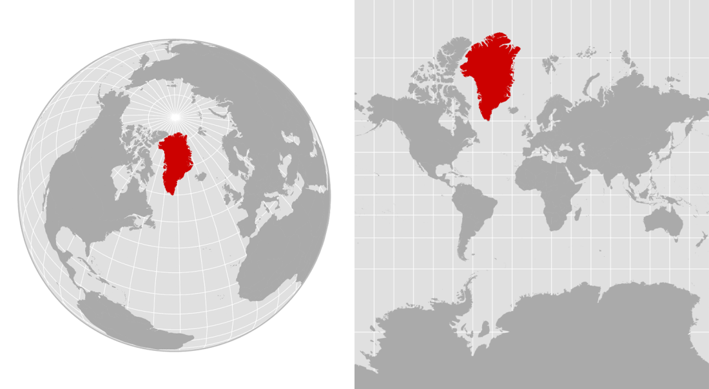
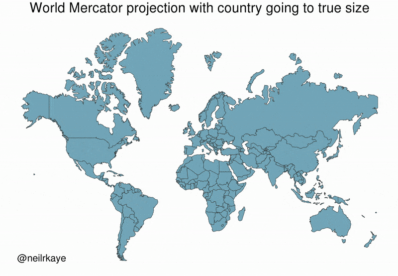
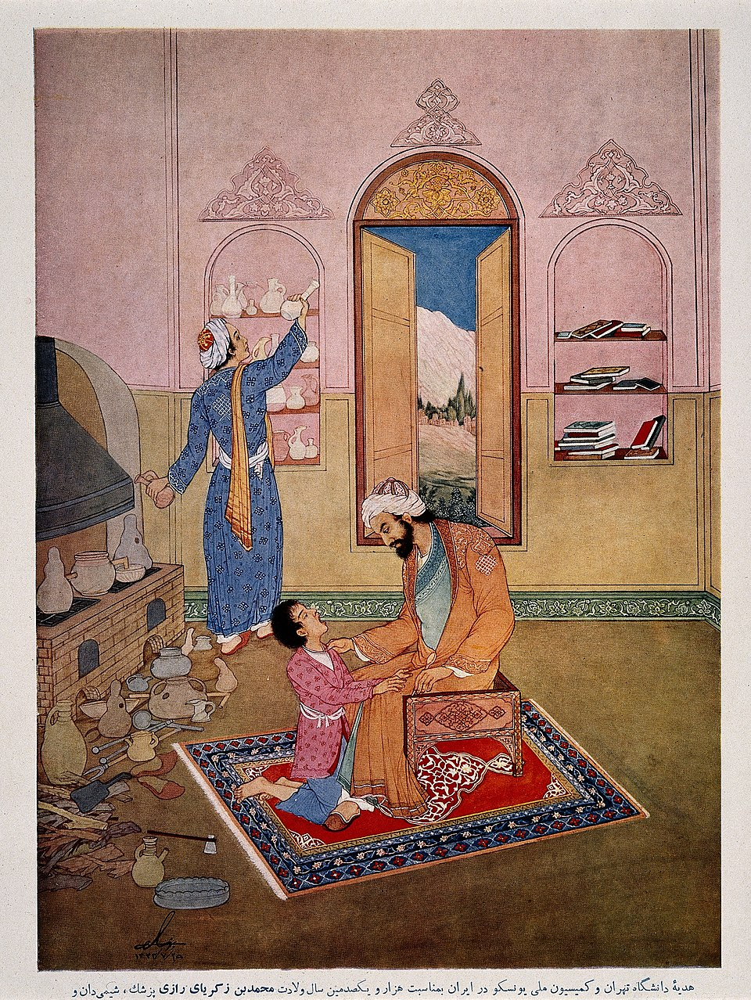
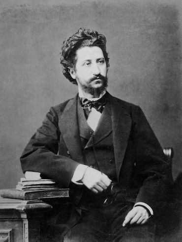
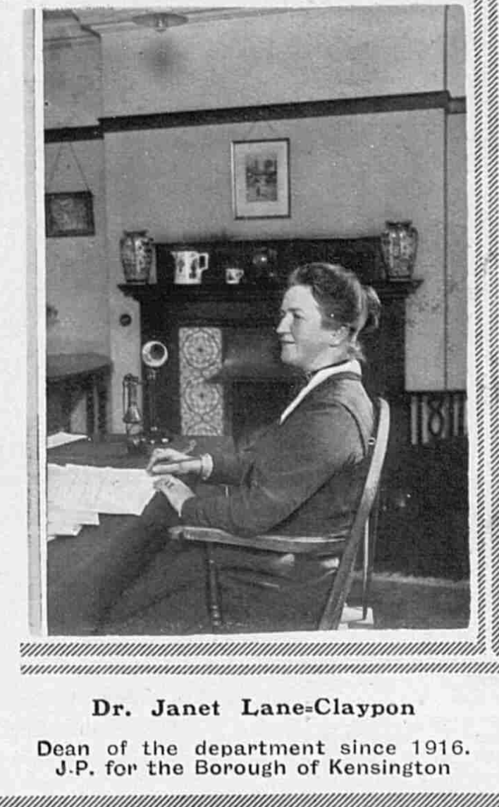

# Course Exercises


## The issues of data synthesis

### Greenland's size

(ref:greenland) The left map shows an orthographic projection, emulating a globe. The right map is a Mercator projection, which exaggerates the sizes of landmasses, including Greenland. Alyson Hurt / NPR

```{r greenland-map, echo=F, fig.align="center", out.width="75%", fig.cap='(ref:greenland)'}

```

Many people believe that Greenland is comparable in size to Africa or larger than South America. This belief is widespread in textbooks, news media, and online discussions. This belief is reinforced by commonly used world maps based on the Mercator projection, where Greenland appears vastly larger than it truly is.

In reality, Greenland’s surface area is approximately 2.1 million km², while Africa’s is about 30 million km². The apparent similarity in size is not due to incorrect measurements, but to a systematic distortion introduced by map projection and visual synthesis. In Fact, Greenland's size is comparable to countries like Saudi Arabia or Mexico.

This example illustrates how correct data, when transformed, aggregated, or visualised improperly, can generate persistent and intuitive false beliefs. Distortions from data synthetisation may be intentional or accidental, yet their effects are powerful, especially when visual representations are treated as neutral or self-explanatory.

```{r, eval=knitr::is_html_output(excludes = "epub"), results = 'asis', echo = F}
cat(
'<figure>

</figure>'
)
```

Answer the following questions:

1. Give one example in data science where aggregation or visualisation can similarly mislead interpretation without involving false data.
2. Explain why this example illustrates a problem of data synthesis and representation rather than incorrect data collection.
3. Briefly explain how similar distortions in data science can contribute to biased narratives, echo chambers, or misguided policy decisions.
4. When does data stop describing reality and start constructing it?

**How to approach the answers:**

This exercise is designed to help you reason about **distortion introduced by data synthesis and representation**, rather than errors in measurement or data collection. The goal is not to test geographical knowledge, but to see how *true data* can still lead to *false beliefs* once transformed or visualised.

When approaching the first question, focus on identifying an example where:

- the underlying data are correct,
- yet aggregation, scaling, or visual encoding changes how the data are perceived.

Typical candidates include averages hiding variability, misleading axes in charts, heatmaps without normalization, or global indicators masking regional disparities. The key is to show that *nothing is fabricated*, but interpretation is nonetheless skewed.

For the second question, clearly separate **data collection** from **data representation**. Ask yourself:

- Were the original quantities measured accurately?
- At what step does distortion enter?

Your explanation should make clear that the problem arises *after* data collection, during transformation, aggregation, or visualisation choices. This reinforces the idea that epistemic failure often occurs downstream from measurement.

The third question invites you to connect epistemic distortion to **social and ethical consequences**. When thinking about biased narratives or echo chambers, consider how repeated exposure to the same distorted representation can:

- legitimise certain interpretations,
- or marginalise alternative perspectives.

You are not asked for a detailed sociological theory, but for a plausible mechanism linking representation to belief and action.

The final question is intentionally reflective and normative. There is no single correct answer. Instead, you should:

- articulate a criterion or threshold (e.g. scale, repetition, authority, policy use),
- explain when representations cease to be descriptive tools and become *world-shaping constructs*.

This question tests your ability to integrate epistemology, data practice, and ethics, rather than recall factual content.

Overall, approach this exercise by keeping in mind that **data visualisations are not neutral windows onto reality**. They are models and syntheses that highlight some aspects while obscuring others, and this selective emphasis is precisely where both insight and distortion originate.

## Learning from History

These exercises explore how knowledge is produced, interpreted, and acted upon under conditions of uncertainty by examining historical cases that mirror core problems in modern data science. 

Across medicine, public health, history, and environmental management, the cases show how evidence is shaped by proxies, data-generating processes, missing controls, ethical constraints, and high-stakes decision-making. Rather than focusing on technical calculation, the questions invite you to reflect on reasoning: what data actually measure, what they fail to capture, how comparisons substitute for experiments, and why correct conclusions can sometimes emerge from weak or incomplete evidence. Together, the cases illustrate that epistemic judgement, not just data volume or statistical fit, is central to responsible inference and action 

```{=latex}
\newpage
```

### Al-Razi and Hospital Location

```{r, eval=knitr::is_html_output(excludes = "epub"), results = 'asis', echo = F}
cat(
'<figure class="wrap-figure">

<figcaption>Al-Razi examines a boy.</br></figcaption>
</figure>'
)
```

```{r, include=knitr::is_latex_output(), echo = F}
knitr::asis_output('\\begin{wrapfigure}{R}{.33\\textwidth}  
 \\begin{center}
    \\includegraphics[width=.30\\textwidth]{Figures/learning_from_history_al_razi.jpg}  
  \\captionsetup{labelformat=empty}
  \\caption{Al-Razi examines a boy.} 
\\end{center}
\\end{wrapfigure}
\\addtocounter{figure}{-1}')
```

In the 10th century, the Persian physician **Al-Razi** was tasked with selecting the most suitable location for a new hospital in Baghdad, a large and densely populated city. At the time, medical knowledge relied heavily on authority, tradition, and humoral theories, and there were no instruments to measure air quality, pollution, or disease risk.

Rather than choosing a location based on prestige, custom, or anecdotal reputation, Al-Razi sought a method that relied on observable differences across districts. He placed pieces of raw meat in several parts of the city and monitored how quickly they decayed. His reasoning was indirect: faster decay suggested environmental conditions that might also promote illness, while slower decay suggested cleaner air.

This approach did not involve experimental control, randomisation, or a causal theory of disease transmission. He could not isolate variables such as temperature, insects, or humidity, nor could he test alternative explanations. However, his method represented a deliberate attempt to *compare* environments systematically using a proxy rather than speculation, authority, or superstition.

**Questions**

1. What role does the meat play in Al-Razi’s reasoning?  
2. Is this an example of direct measurement of air quality?  
3. What experimental control is missing in this method? Name one.  
4. Why does the inference remain uncertain even if the method is systematic?  
5. Give a modern data-science analogy to Al-Razi’s approach.

**How to approach the answers:**

- Find the **epistemic role of a proxy** and distinguish it from direct measurement.
- Think about **what is being inferred vs. what is observed**.
- Reflect on missing controls (confounders, standardisation, replication).
- Emphasise why systematic comparison reduces arbitrariness but does not eliminate uncertainty.
- For the analogy, map *proxy to target* in modern data science (e.g., indirect indicators).

### Ibn Sina and Medical Evidence

```{r, eval=knitr::is_html_output(excludes = "epub"), results = 'asis', echo = F}
cat(
'<figure class="wrap-figure">

<figcaption>Modern portrait of Ibn Sina, US National Library of Medicine (1952).</br></figcaption>
</figure>'
)
```

```{r, include=knitr::is_latex_output(), echo = F}
knitr::asis_output('\\begin{wrapfigure}{R}{.33\\textwidth}  
 \\begin{center}
    \\includegraphics[width=.30\\textwidth]{Figures/learning_from_history_avicena.jpg}  
  \\captionsetup{labelformat=empty}
  \\caption{Modern portrait of Ibn Sina, US National Library of Medicine (1952).} 
\\end{center}
\\end{wrapfigure}
\\addtocounter{figure}{-1}')
```

In the 11th century, **Ibn Sina (Avicenna)** reflected critically on medical practice. He observed that physicians often inferred the effectiveness of treatments after witnessing a few apparent recoveries, without considering alternative explanations.

He warned that recovery could result from natural healing, coincidence, or concurrent interventions. He argued that without systematic comparison and repetition under similar conditions, physicians risked mistaking chance or background processes for causal effects.

Although formal experimental methods were not yet developed, Ibn Sina articulated a core insight of modern experimental reasoning: isolated success stories are epistemically weak. Reliable knowledge requires distinguishing treatment effects from background variation.

**Questions**

1. What epistemic problem does Ibn Sina identify in relying on individual treatment successes?  
2. Why is the argument “the patient recovered after treatment, therefore the treatment works” problematic?  
3. What core principle of experimental control is Ibn Sina implicitly advocating?  
4. Give one example of how Ibn Sina’s critique applies to modern data science.

**How to approach the answers:**

- Focus on **post hoc reasoning** and confounding.
- Identify the difference between **correlation, coincidence, and causation**.
- Find modern analogies like baselines, control groups, or validation.
- Use a contemporary example involving misleading performance claims.


### Florence Nightingale and Military Mortality

(ref:florence) Florence Nightingale’s 1858 'Rose Diagram'. It uses color-coded wedges to show that more soldiers died from preventable infections (blue) than from battlefield wounds (red). By comparing mortality before and after sanitary reforms, she visually proved that basic hygiene and ventilation drastically reduced death rates, transforming military healthcare forever.

```{r florence-pic, echo=F, fig.align="center", out.width="75%", fig.cap='(ref:florence)'}
knitr::include_graphics('Figures/learning_from_history_nightingale.png')
```


During the Crimean War in the 1850s, **Florence Nightingale** confronted widespread assumptions about military deaths. High mortality among soldiers was often attributed directly to battle injuries, reinforcing the belief that little could be done beyond improving combat medicine.

Nightingale collected detailed hospital records and noticed that most deaths occurred away from the battlefield. Rather than relying on total death counts, she reorganised the data by *cause of death* and *time period*. She then compared mortality patterns before and after sanitation reforms, using visualisations to communicate her findings.

Although Nightingale could not run controlled experiments or randomise conditions, she approximated control through structured comparison. Her work demonstrated how careful aggregation and disaggregation of observational data could reveal patterns that raw numbers concealed, and her analysis directly informed policy changes that saved lives.

**Questions**

1. Why were raw mortality numbers insufficient to support her conclusions?  
2. What form of experimental control was approximated in Nightingale’s analysis?  
3. What statistical issue would occur if deaths were not disaggregated by cause?  
4. Why was Nightingale’s use of data ethically significant?

**How to approach the answers:**

- Contrast **raw counts** with **structured comparisons**.
- Identify what was being held approximately constant across time periods.
- Consider aggregation bias and loss of explanatory resolution.
- Link ethics to **prevention capacity**, responsibility, and policy impact.


### The Collapse of Angkor

(ref:angkor-cap) Facade of Angkor Wat, a drawing by Henri Mouhot (1860)

```{r angkor-pic, echo=F, fig.align="center", out.width="75%", fig.cap='(ref:angkor-cap)'}
knitr::include_graphics('Figures/learning_from_history_angkor.jpg')
```

When French explorer **Henri Mouhot** encountered Angkor in the 19th century, he interpreted its overgrown monuments as evidence of sudden civilisational collapse. This interpretation relied heavily on visible ruins as proxies for societal vitality.

Later historical accounts and modern remote sensing revealed a different picture: Angkor declined gradually due to climatic stress and infrastructural strain, not sudden decay or invasion. Monument survival turned out to be a misleading proxy for social complexity and continuity.

**Questions**

1. Identify Mouhot’s main proxy and why it is epistemically risky.  
2. Explain why this is not a case where experimental control is feasible, and what “control” can mean instead.  
3. What statistical/causal error occurs if we infer societal vitality from monument survival alone?  
4. State one ethical risk of colonial knowledge production in interpreting Angkor’s past.  
5. Propose a data-science analogue where a convenient proxy drives a wrong narrative, and name one mitigation.

**How to approach the answers:**

- Identify proxy misuse and construct validity.
- Explain non-experimental forms of control (triangulation, comparison). 
- Triangulation means: Do different ways of measuring or analysing the same phenomenon point to a similar conclusion?
- Link epistemic error to narrative bias.
- Include ethical dimensions of power and representation.


### Goldziher: From Textual Corpora to Historical Claims

```{r, eval=knitr::is_html_output(excludes = "epub"), results = 'asis', echo = F}
cat(
'<figure class="wrap-figure">

<figcaption>Ignác Goldziher (1850 - 1921)</br></figcaption>
</figure>'
)
```

```{r, include=knitr::is_latex_output(), echo = F}
knitr::asis_output('\\begin{wrapfigure}{R}{.33\\textwidth}  
 \\begin{center}
    \\includegraphics[width=.30\\textwidth]{Figures/learning_from_history_Goldziher.jpg}  
  \\captionsetup{labelformat=empty}
  \\caption{Ignác Goldziher (1850 - 1921)} 
\\end{center}
\\end{wrapfigure}
\\addtocounter{figure}{-1}')
```

In the late nineteenth century, **Ignaz Goldziher** studied large corpora of Islamic legal and religious texts. Earlier scholars treated these texts as direct historical observations, assuming that many similar reports implied factual accuracy about early Islamic history.

Goldziher challenged this view by analysing how such texts were produced. He argued that legal debates, institutional incentives, and educational transmission shaped what texts were written, preserved, and repeated. As a result, strong regularities could emerge even when the texts were not direct measurements of the historical events they purported to describe.

Goldziher’s insight was not that the data were useless, but that they measured *something different* from what researchers often assumed. This distinction between data generation and target phenomenon is central to modern data science.

**Questions**

1. What is the core data-science error in treating these texts as direct observations of early historical events? Hint: The target variable here is "early historical events", and the observed variable "texts produced by later institutions".  
2. Explain how a shared generative process can produce strong statistical patterns without corresponding to the target phenomenon.  
3. Why can increasing dataset size increase confidence in the wrong conclusion in this case?  
4. Why is it ethically important, in data-driven research, to state clearly what a dataset does and does not measure?  
5. Give a modern data-science example where data accurately reflects a process but is commonly misinterpreted as measuring a different target.

**How to approach the answers:**

- Explicitly distinguish **observed variables** from **target constructs**.
- Use the idea of **generative processes** and feedback loops.
- Explain why more data can amplify bias rather than correct it.
- Link ethical responsibility to transparency and misuse prevention.

### Wu Lien-teh and the Manchurian Plague


(ref:manchuria-cap) Dr Wu Lien-Teh working in his laboratory in Harbin, China, 1911

```{r manchuria-pic, echo=F, fig.align="center", out.width="75%", fig.cap='(ref:manchuria-cap)'}
knitr::include_graphics('Figures/learning_from_history_wu.jpg')
```

In the early 1910s, during a plague outbreak in Manchuria, prevailing medical theories emphasised flea-borne transmission. **Wu Lien-teh** observed rapid spread among people with close contact, including medical staff, suggesting airborne transmission.

Without experimental confirmation or microbiological proof, Wu recommended face masks, quarantine, and burial reforms. These measures were controversial but likely contributed to controlling the outbreak.

The case exemplifies abductive reasoning under severe time pressure and highlights decision-making when experimental control is impossible.

**Questions**

1. Why was experimental confirmation impossible in this case?  
2. Why was this inference epistemically risky?  
3. Why would waiting for stronger statistical evidence be problematic?  
4. What lesson does this case provide for data science in crisis situations?

**How to approach the answers:**

- Emphasise constraints of time, ethics, and feasibility.
- Identify uncertainty and alternative explanations.
- Discuss asymmetric costs of delay.
- Generalise to modern crisis analytics and precautionary action.


### Janet Lane-Claypon and Breast Cancer Research

```{r, eval=knitr::is_html_output(excludes = "epub"), results = 'asis', echo = F}
cat(
'<figure class="wrap-figure">

<figcaption>Janet Lane-Claypon (1877 - 1967)</br></figcaption>
</figure>'
)
```

```{r, include=knitr::is_latex_output(), echo = F}
knitr::asis_output('\\begin{wrapfigure}{R}{.33\\textwidth}  
 \\begin{center}
    \\includegraphics[width=.30\\textwidth]{Figures/learning_from_history_janet.png}  
  \\captionsetup{labelformat=empty}
  \\caption{Dr Lane-Claypon (1877 - 1967)} 
\\end{center}
\\end{wrapfigure}
\\addtocounter{figure}{-1}')
```

In the early 20th century, **Janet Lane-Claypon** investigated possible causes of breast cancer. Many suspected factors were common among affected women, but this alone did not establish causation.

She introduced a systematic comparison between women with breast cancer and women without it. By examining how frequently exposures appeared in each group, she showed that some seemingly important factors were actually common in the general population.

This comparative approach marked an early form of case-control reasoning and laid the groundwork for modern epidemiology, allowing researchers to distinguish coincidence from potential causal influence.

**Questions**

1. Why were common exposures alone insufficient to identify causes of cancer?  
2. What methodological innovation distinguishes Lane-Claypon’s approach?  
3. How does this help avoiding misleading conclusions?  
4. What kind of causal reasoning becomes possible once this innovation is introduced?  
5. Why is this comparative approach ethically preferable to other types of experimentation?

**How to approach the answers:**

- Emphasise **base rates** and comparison groups.
- Identify the methodological shift from description to inference.
- Connect comparison to counterfactual reasoning.
- Discuss ethical constraints in medical research.


```{=latex}
\clearpage
```


### Terranova, the Northern Cod Collapse

From the late 1970s to the early 1990s, Canadian regulators relied on stock-assessment models to manage the Northern cod fishery. Indicators such as catch-per-unit-effort suggested stability, even as cod populations declined.

Industrial fishing fleets increasingly concentrated in remaining high-density areas, masking broader collapse. Models remained statistically well-fit, but their assumptions failed under ecological change. When the collapse became undeniable, the resulting moratorium caused widespread social and economic harm.

(ref:code-cap) Collapse of Atlantic cod stocks off Newfoundland (1992): Offshore trawling since the 1950s drove catches up but biomass down, and international and national quotas failed to stop the decline.

```{r code-pic, echo=F, fig.align="center", out.width="75%", fig.cap='(ref:code-cap)'}
knitr::include_graphics('Figures/learning_from_history_cod.jpg')
```

**Questions**

1. Explain how aggregation across space can hide collapse in sub-populations (name the general phenomenon).  
2. Give one experimental control substitute that regulators could have used.  
3. Why can a model be statistically well-fit yet epistemically unreliable here?  
4. What non-epistemic values were in tension when setting quotas (name two)?

**How to approach the answers:**

- Identify aggregation bias or Simpson-like effects.
- Think of monitoring designs as substitutes for experiments.
- Separate goodness-of-fit from validity of assumptions.
- Name economic, social, or political values explicitly.


### Li Wenliang and Early COVID-19 Signals

```{r, eval=knitr::is_html_output(excludes = "epub"), results = 'asis', echo = F}
cat(
'<figure class="wrap-figure">

<figcaption>Li Wenliang (1985 - 2020)</br></figcaption>
</figure>'
)
```

```{r, include=knitr::is_latex_output(), echo = F}
knitr::asis_output('\\begin{wrapfigure}{R}{.33\\textwidth}  
 \\begin{center}
    \\includegraphics[width=.30\\textwidth]{Figures/learning_from_history_li.jpg}  
  \\captionsetup{labelformat=empty}
  \\caption{Li Wenliang (1985 - 2020)} 
\\end{center} 
\\end{wrapfigure}
\\addtocounter{figure}{-1}')
```

In December 2019, **Li Wenliang**, an ophthalmologist in Wuhan, noticed several patients with unusual pneumonia symptoms resembling earlier SARS cases. At that stage, the number of cases was very small, no pathogen had been identified, and no epidemiological studies were available.

From a statistical perspective, the evidence was weak and noisy; from an experimental perspective, no controlled interventions were possible. Nonetheless, Li warned colleagues to take precautions, prioritising potential harm over evidential certainty.

In hindsight, his warning proved correct. The case highlights the tension between epistemic standards and ethical responsibility under uncertainty.

**Questions**

1. Why was it impossible, at the time Li raised concerns, to obtain the kind of evidence normally required for strong causal or statistical inference?  
2. Why did the available data fail to meet standard criteria for statistical reliability, despite later turning out to be correct?  
3. What epistemic risk exists in waiting for stronger evidence in situations like this?  
4. Why does this case raise an ethical duty to warn even when evidence is incomplete?  
5. What does this case teach about decision-making under uncertainty in high-stakes data-driven systems?

**How to approach the answers:**

- Contrast **ideal evidence** with **available evidence**.
- Explain retrospective validation vs prospective uncertainty.
- Identify asymmetric risks (false alarms vs delayed action).
- Link ethics to precaution and responsibility.
