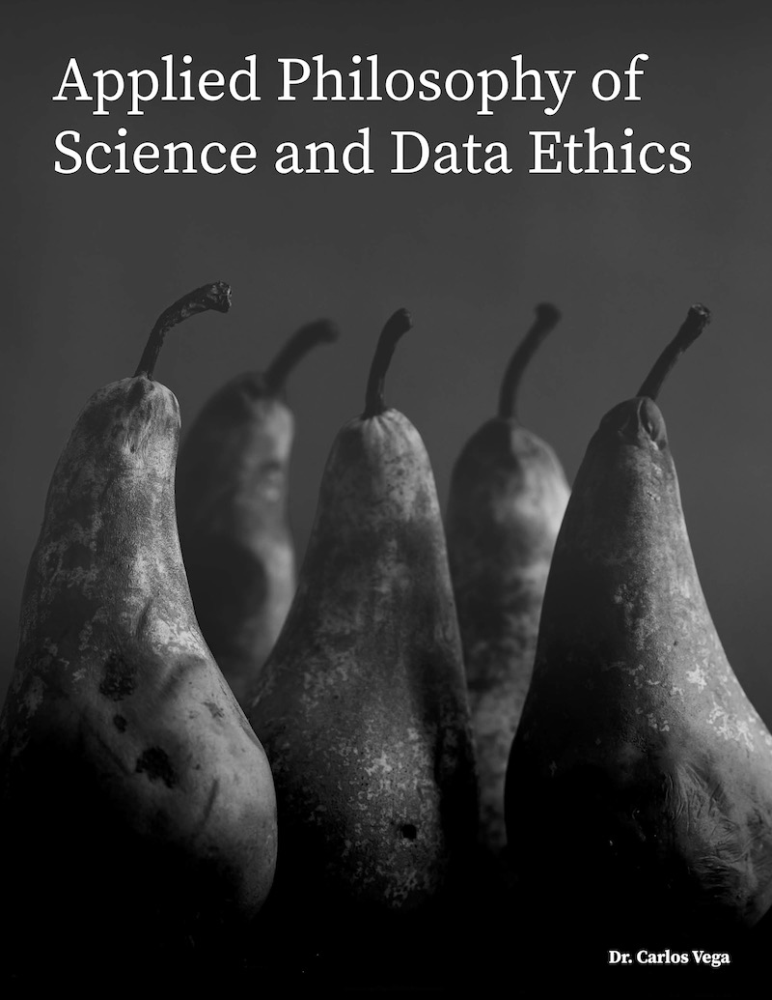

--- 
title: "Applied Philosophy of Science and Data Ethics"
author: ["Dr. Carlos Vega"]
date: "2021 - 2023: Last compiled: `r Sys.Date()`"
site: bookdown::bookdown_site
output: 
  bookdown::gitbook:
    includes:
      in_header: includeme.html
documentclass: book
bibliography: [book.bib, packages.bib]
biblio-style: apalike
link-citations: yes
github-repo: carlosvega/PoS-DE
description: "This class book gathers the contents addressed in the course Applied Philosophy of Science and Data Ethics from the Master of Data Science at the University of Luxembourg. This class book will introduce basic philosophical and scientific concepts supported by examples and discussion."
urlcolor: blue
linkcolor: red
---

# Preface {-}

This class book gathers the contents addressed in the course **Applied Philosophy of Science and Data Ethics** from the [Master of Data Science](https://wwwfr.uni.lu/formations/fstm/master_of_data_science) at the University of Luxembourg (UL). This course will introduce basic philosophical and scientific concepts supported by examples and discussion. The course expects pro-active participation from the students in the form of presentations and essays as well as open debates. 

```{r book-cover, eval=knitr::is_html_output(excludes = "epub"), echo=F, out.width="400px", fig.align="center", fig.cap=''}

```


## Course at UL {-}

The course related to this class book aims to provide the students with guidelines and methodologies to identify epistemic and ethical issues present in data science. We expect the students to develop a critical eye that helps them mitigate such problems in their daily work as data scientists.

During this course, students will learn by example different layers of the scientific method and how they relate to data science and data ethics. In particular, they will learn how the mechanisms behind the data affect the data analysis, and how the different types of scientific inference condition method choice and affect the conclusions drawn from the analysis. In this sense, examples of statistical abuse, misconduct and bad visualization will be shown together with their, sometimes catastrophic, collateral consequences.

## Disclaimer {-}

Although the impact and extension of the topics addressed in this class book (and the course) are broad and diverse, its length is limited. Hence the scope and depth of the contents are restricted. Consequently, several topics on Philosophy of Science  are tackled superficially while some others are completely ignored. Such philosophical questions are handled from a practical data science point of view. Similarly, Data Ethics is a relatively new matter in continuous evolution. Therefore we will try to cope with the main issues in the most practical way.

## Learning outcomes {-}

In line with the European Qualitity Framework, Bachelor degrees require a critical understanding of theories and principles, while Master degrees involve higher specialised knowledge and critical awareness of knowledge issues in a field. In this case, the field at issue is data science and the contents will tackle philosophical and ethical issues concerning data science. Therefore, the aim is to provide students with a better understanding of method justification, to increase their knowledge about such methods, their scope, purpose and relation to other practices.

- Get familiar with the scientific goals and methods.
- Learn the most common data science misconduct problems.
- Critically evaluate ethical issues and method choice.

## About this course {-}

Some sections from the first chapters of this course are inspired by the book from Prof. Dr Lars-Göran Johansson [@johansson2016philosophy] and the educational works of Prof. Dr Till Grüne-Yanoff [@grune2014teaching], such as his great course at EDX on "Philosophy of Science for Engineers and Scientists". Regarding the second part of the course, which covers data ethics, I would like to thank the Univerisity of Michigan, for their online courses (from which I was already a fan during my PhD) and especially Prof. Dr H. V. Jagadish for his course on Data Science Ethics which inspired me on the contents and examples of this course. Moreover, this last part of the course would not have been possible without many relevant books on the topics tackled in this course (see References). Including The Book of Why [@book-of-why]; Ethics and Data Science [@loukides2018ethics]; Philosophy of Natural Science [@hempel-pos]; How charts lie [@cairo2019charts]; Automating inequality [@eubanks2018automating] and many others. I hope any resemblance or imitation is seen as an act of flattery.

## About this class book {-}

This class book was made thanks to the great tutorial available on the book ["Open tools for writing open interactive textbooks (and more)"](https://www.crumplab.com/OER_bookdown).

### License {-}

**Licensed under CC BY-NC-ND 4.0**

The book is released under [CC BY-NC-ND 4.0](https://creativecommons.org/licenses/by-nc-nd/4.0/) license. This means that you are free to: 

- **Share**: copy and redistribute the material in any medium or format.

Under the following terms:

- **Attribution**: You must give appropriate credit, provide a link to the license, and indicate if changes were made. You may do so in any reasonable manner, but not in any way that suggests the licensor endorses you or your use.
- **Non-Commercial**: You may not use the material for commercial purposes.
- **No Derivatives**: If you remix, transform, or build upon the material, you may not distribute the modified material.
- **No additional restrictions**: You may not apply legal terms or technological measures that legally restrict others from doing anything the license permits.

## About the author {-}
Since October 2023 [Carlos Vega](https://researchportal.lih.lu/en/persons/carlos-vega) works as a Research Engineer in Digital Health at the **Luxembourg Institute of Health** (LIH) in the IT Expertise in Health Data team of the Data Integration and Analysis Unit led by the CMIO (Chief Medical Information Officer) Dr. Maximilian Fünfgeld.

From 2018 until September 2023, he worked as a postdoctoral researcher in the Bioinformatics Core Group led by Prof. Dr Reinhard Schneider at the **Luxembourg Centre for Systems Biomedicine** (LCSB) at the University of Luxembourg. 

Previously, he worked at the Autonomous University of Madrid (UAM) researching high-performance solutions for big data analysis as well as anomaly detection methodologies. He received his B.Sc (2013), M.Sc (2014) and PhD (2018 with *cum laude* and industrial mentions) degrees in Computer Science Engineering from UAM. In 2012 he joined the High-Performance Computing and Networking Research Group (HPCN) led by Prof. Dr Javier Aracil, first as a student and later as a researcher as part of the Network of Excellence InterNet Science European project. During his PhD (2014 - 2017), he continued his work at the HPCN group as a technical researcher for the project TRÁFICA and the European projects Fed4Fire and dReDBox, among others. At the same time, he worked at [Naudit](https://www.naudit.es/en) (2015 - 2018) applying his research in computer network auditing projects with different enterprises. In 2022, he became a senior member of the Institute of Electrical and Electronics Engineers (IEEE).

Additionally, his teaching experience includes several courses on computer networks, such as Multimedia Networking, Network Planning and Network Management, taught during his time at UAM. Since 2021, he is the main teacher of the course "Applied Philosophy of Science and Data Ethics" for the Master of Data Science at the Faculty of Science, Technology and Medicine (FSTM) of the University of Luxembourg.

### Contributing to the book {-}

Contributions are welcomed, feel free to open a pull-request in github for small changes and it will be reviewed as soon as possible. However, for larger contributions (e.g. sections, chapters) please contact the main author at carlos.vega [at] uni.lu .
